# KD11-E Data Path

Source: EK-KD11E-TM-001, Chapter 4, Sections 4.1–4.2

## 4.1 Introduction

The following paragraphs contain a detailed circuit description of the KD11-E
Central Processing Unit (CPU), which is used in the PDP-11/34 Computer.
Segments of the CPU, shown in Figure 4-1, are analyzed separately, using the
block diagrams contained in this manual and the KD11-E circuit schematics.

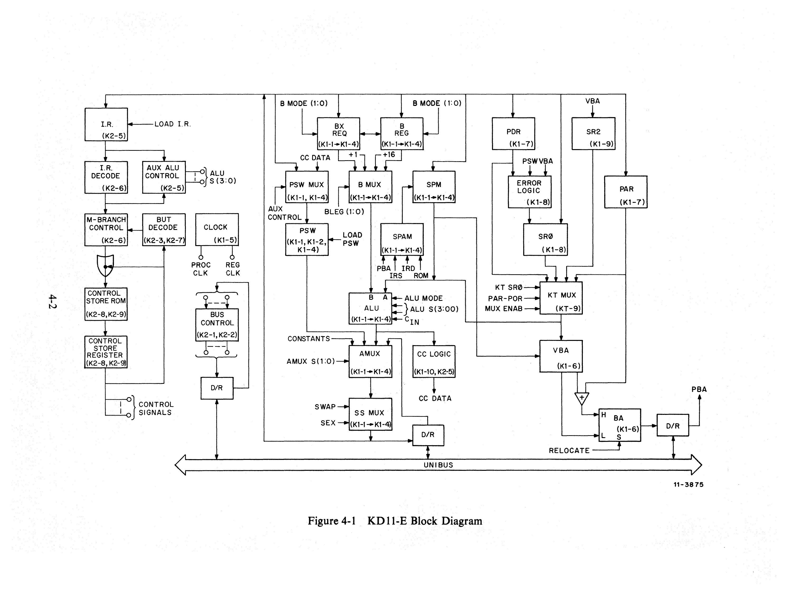

## 4.2 Data Path

### 4.2.1 General Description

The simplified KD11-E data path consists of six function units, as shown in
Figure 4-2. Circuit schematics K1-1 through K1-4 (D-CS-M7265-0-1) each contain
one 4-bit slice of the data path. Table 4-1 briefly describes the function of
each of the six function units.

Data flow through the data path is controlled, directly or indirectly, by the
Control Store circuitry on the control module (M7266). Each Control Store ROM
location (microinstruction) generates a unique set of outputs capable of
controlling the data path elements and determining the ALU function to be
performed. Sequences of these ROM microinstructions are combined into
microroutines, which perform the various PDP-11 instruction operations.

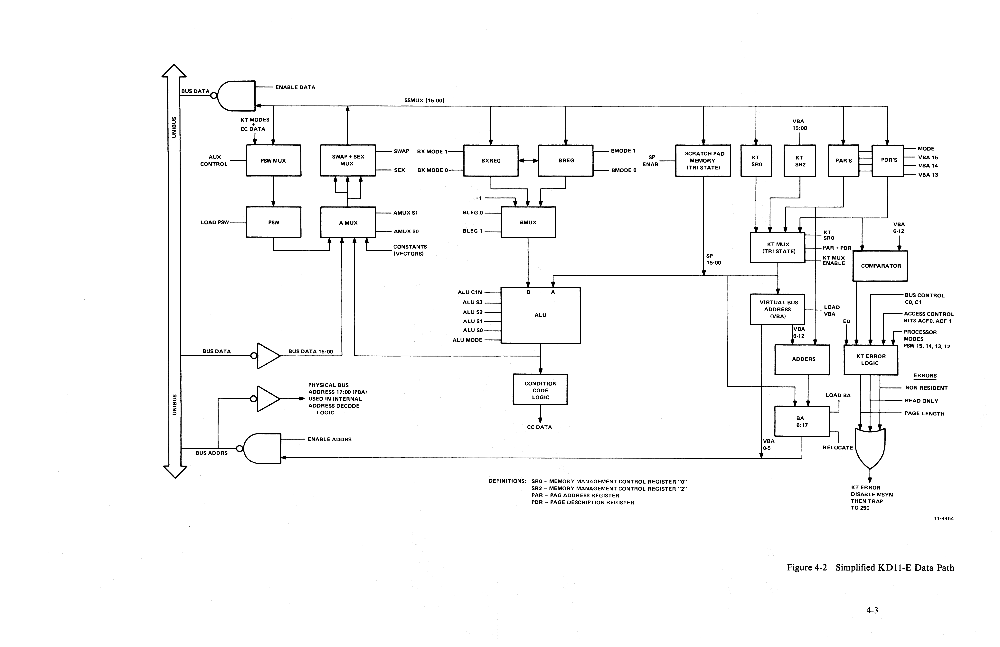

#### Table 4-1 Function Units of the KD11-E Data Path

| Unit                                 | Function                                                                                                                                                                                                                                                                                                                                                                                                                                                                                                                                                                                                                                                                                      |
| ------------------------------------ | --------------------------------------------------------------------------------------------------------------------------------------------------------------------------------------------------------------------------------------------------------------------------------------------------------------------------------------------------------------------------------------------------------------------------------------------------------------------------------------------------------------------------------------------------------------------------------------------------------------------------------------------------------------------------------------------- |
| Arithmetic Logic Unit (ALU)          | The heart of the data path is the ALU, which is the logic element that manipulates the data. It is capable of performing 16 arithmetic or 16 logic (Boolean) operations on two 16-bit operands to produce a 16-bit result. The A input comes from either the scratchpad memory or the memory management system; the B input comes from the B leg. The ALU output is sent to the AMUX.                                                                                                                                                                                                                                                                                                         |
| ALU Multiplexer (AMUX)               | The AMUX is a 4-to-1 multiplexer that controls the introduction of new data and the circulation of available data through the data path. Input to the AMUX is both external (from the Unibus data lines) and internal (from the ALU, PSW, or constants). The AMUX output is sent to the SSMUX.                                                                                                                                                                                                                                                                                                                                                                                                |
| Processor Status Word Register (PSW) | The PSW register is a 12-bit register that contains information on the current processor priority, condition codes (C, V, Z, and N) which indicate the results of the last instruction, a "trap" bit (TBIT) which causes automatic traps after each fetch instruction used during program debugging, and both the current and previous memory management modes (Kernel or User). PSW input comes from the SSMUX or from condition code logic; PSW output is sent to the AMUX.                                                                                                                                                                                                                 |
| Swap Sign Extend Multiplexer (SSMUX) | This multiplexer controls the form in which data is output from, or recirculated into, the data path. The SSMUX can pass the data unchanged, swap the high and low bytes, sign-extend the low byte into the entire word, or simultaneously swap high and low bytes while sign-extending the high byte (which becomes the new low byte) into the entire word. SSMUX input comes from the AMUX. SSMUX output goes to either the rest of the computer system (via the Unibus), the other sections of the processor (the control section, via the Instruction register, and the memory management system), or to other portions of the data path (the PSW, the B leg, and the scratchpad memory). |
| B Leg                                | The B leg of the ALU consists of two 16-bit registers (B and BX) and a 4-to-1 multiplexer (BMUX). Both registers can shift left or right independently, or together they can perform full 32-bit shifts. The BMUX selects one of the four functions (BREG, BXREG, +1, +16) and connects to the B input of the ALU. The B leg is used to store operands for the ALU, to implement rotate and shift instructions, and to implement Extended Instruction Set (EIS) instructions. B leg input comes from the SSMUX. B leg output goes to the B input of the ALU.                                                                                                                                  |
| Scratchpad Memory (SPM)              | This random access memory can store sixteen 16-bit words in eight processor-dedicated registers and eight general-purpose (user available) registers. One of the general-purpose registers is used as a stack pointer, another as the program counter. Input to the scratchpad memory is from the SSMUX. Output, which can be buffered and latched to enable reading from one address and modifying another during the same cycle, goes to the A input of the ALU and to the Virtual and Physical Bus Address registers.                                                                                                                                                                      |

---

### 4.2.2 Arithmetic Logic Unit (ALU)

The ALU (Figure 4-3) is divided into four 4-bit slices (K1-1, K1-2, K1-3, and
K1-4 each contain a slice), with each slice consisting of one 4-bit ALU chip
(74S181) and part of a Look-Ahead Carry Generator chip (74S182).

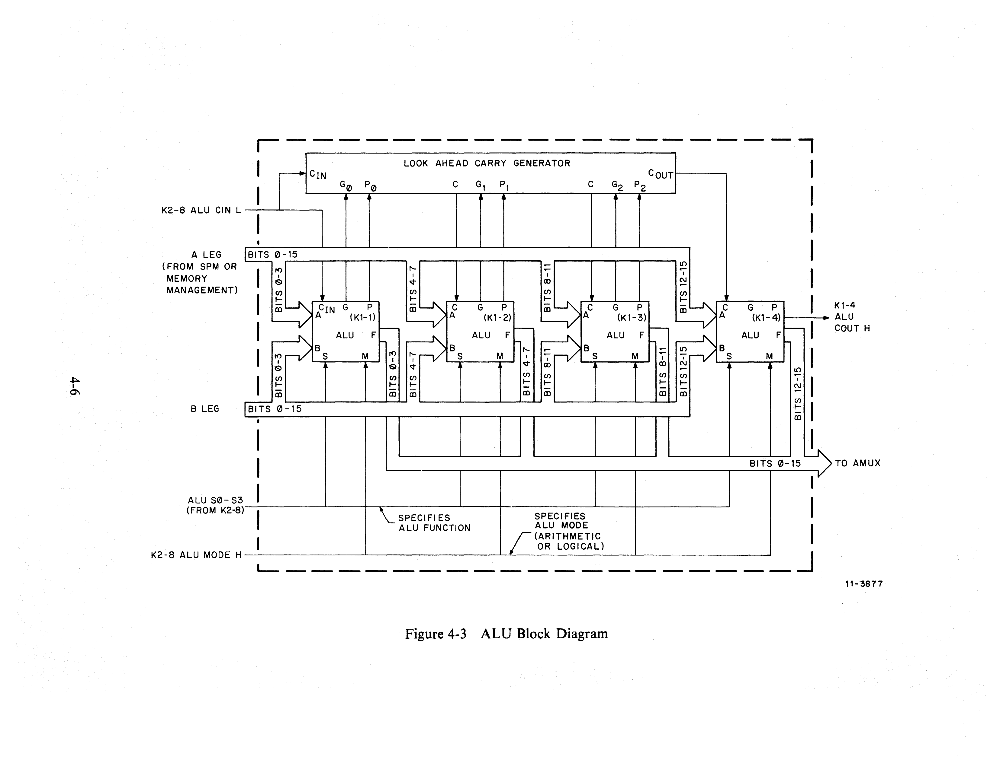

**ALU Inputs.** The A input to each ALU chip comes from one of the scratchpad
memory (SPM) registers or from the KTMUX, as specified by the Control Store
microinstruction being performed. (Refer to Paragraph 4.2.3 for details.) The B
input comes from the B leg multiplexer (BMUX) logic, and can take the form of
the B register contents, the BX register contents, a constant 0, a constant 1,
or a constant 16. (Refer to Paragraph 4.2.4 for details.)

**ALU Functions.** The function performed by the ALU is controlled by the four
Selection bits (S3, S2, S1, S0), the Mode bit (M), and the Carry-In bit (CIN).
Table 4-2 lists the ALU functions of the KD11-E and the corresponding bit
patterns for the six control signals.

#### Table 4-2 ALU Functions and Control Signals

| ALU Function      | S3  | S2  | S1  | S0  | CIN | M   |
| ----------------- | --- | --- | --- | --- | --- | --- |
| ZERO              | 0   | 0   | 1   | 1   | 0   | 1   |
| A                 | 0   | 0   | 0   | 0   | 0   | 1   |
| A plus 1          | 0   | 0   | 0   | 0   | 0   | 0   |
| A minus 1         | 1   | 1   | 1   | 1   | 1   | 0   |
| A minus B         | 0   | 1   | 1   | 0   | 0   | 0   |
| NOT A             | 1   | 1   | 1   | 1   | 0   | 1   |
| B                 | 1   | 0   | 1   | 0   | 0   | 1   |
| A plus B          | 1   | 0   | 0   | 1   | 1   | 0   |
| A AND B           | 1   | 0   | 1   | 1   | 0   | 1   |
| A AND NOT B       | 0   | 0   | 1   | 0   | 0   | 1   |
| A plus B plus 1   | 1   | 0   | 0   | 0   | 0   | 0   |
| A plus A          | 1   | 1   | 0   | 0   | 1   | 0   |
| NOT B             | 0   | 1   | 0   | 1   | 0   | 1   |
| A OR NOT A plus 1 | 1   | 1   | 0   | 0   | 0   | 0   |
| A XOR B           | 0   | 1   | 1   | 0   | 0   | 1   |

---

### 4.2.3 Scratchpad

The scratchpad consists of a random access memory that can store sixteen 16-bit
words, and can be used for various functions. Scratchpad operation is divided
into four 4-bit slices, with K1-1, K1-2, K1-3, and K1-4 (D-CS-M7265-0-1) each
containing one slice. The scratchpad address multiplexer circuitry is shown on
K2-4.

**Data Input.** Data to be written into the scratchpad is channeled from the SSMUX
and clocked into the scratchpad registers.

**Addressing the Scratchpad.** The address of the scratchpad memory register to be
accessed is generated by the scratchpad address multiplexer (SPAM), located on
the control module (K2-4). Depending on the state of the select lines to the
SPAM, the source of the address can be any of the following:

1. The Control Store ROM (ROMSPA03:ROMSPA00).
2. Instruction Register Source Field (IR08:IR06)
3. Instruction Register Destination Field (IR02:IR00)
4. Bus Address (PBA03:00)

**Reading from the Scratchpad.** If the Control Store circuitry forces a low on
the K1-10 ENAB OR L line at the beginning of a machine cycle, the tristate
outputs of the scratchpad will be enabled. Ninety or 120 nanoseconds after the
cycle begins (allows the scratchpad address to set up), K1-5 TAP 30 H goes low,
allowing data stored in the selected scratchpad register to be latched in the
output buffer SP15:SP00 lines. This data will continue to be read during the
rest of the machine cycle. (See Figure 4-4.)

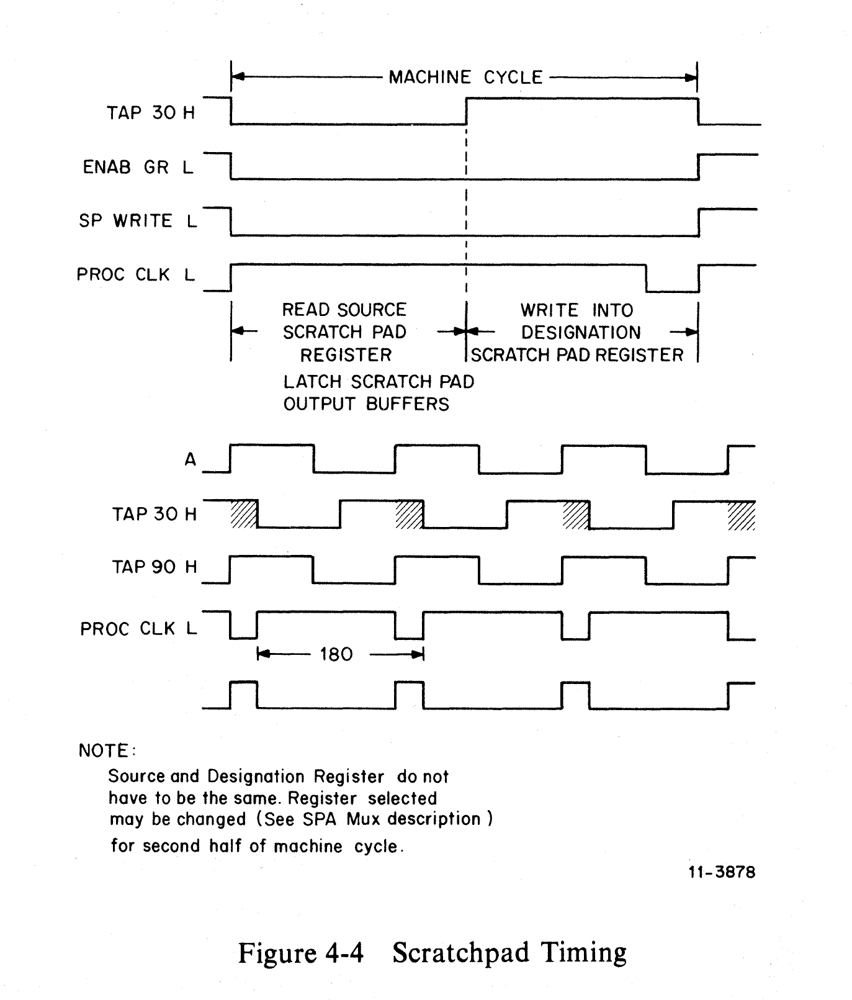

#### Table 4-3 Scratchpad Enabling Configurations and Modes

| OD  | WE  | CLK    | OS  | Mode           | Outputs                                   |
| --- | --- | ------ | --- | -------------- | ----------------------------------------- |
| L   | X   | X      | L   | OUTPUT STORE   | Data from last addressed location         |
| X   | L   | rising | X   | WRITE DATA     | Data being written (if OD = L and OS = H) |
| L   | X   | X      | H   | READ DATA      | Data stored in addressed location         |
| H   | X   | X      | L   | OUTPUT STORE   | High-impedance state                      |
| H   | X   | X      | H   | OUTPUT DISABLE | High-impedance state                      |

**Latching of Outputs.** When the OD (pin 12) and OS (pin 13) inputs are both low,
the data being read from the scratchpad that is addressed is latched into the
buffers on the output of scratchpad memory (SP15-00). Once those outputs are
stabilized, they are not affected by any modifications to the scratchpad memory
address lines for the remainder of the cycle.

**Clocking the Scratchpad.** The REG CLK H clock signal clocks data from the SSMUX
lines into the scratchpad register and writes that data into scratchpad memory.
TAP 30 H unasserted, placing a high at the OS input (pin 13) of the scratchpad,
is all that is required for a read operation. Both a read and a write can take
place during the same machine cycle. Figure 4-4 shows the scratchpad timing for
one machine cycle.

**Scratchpad Address Multiplexer (SPAM).** The SPAM (Figure 4-5) generates the four
address signals that select the desired scratchpad register, or word. The SPAM
(shown in print K2-4 of D-CS-M7266-0-1) consists of two 74S153 dual 4-line-to-
1-line data multiplexers, or a total of four 4-to-1 multiplexers, all with a
common strobe input signal (GND) and common address input signals (S1 and S0).
Four data input sources are connected so that, when the SPAM is addressed and
strobed, it generates one 4-bit output, selected from one of the four sources.

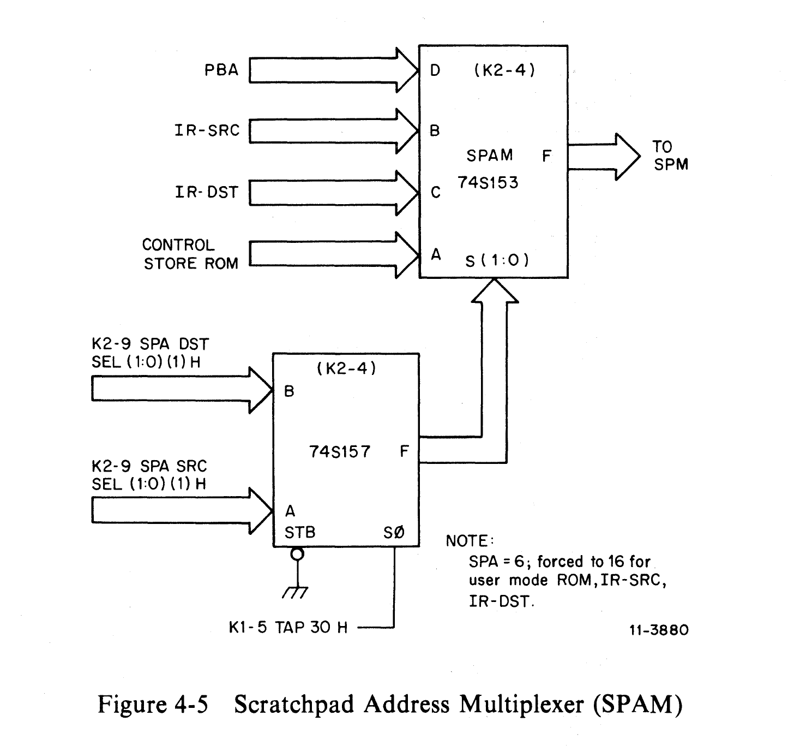

#### Table 4-4 SPAM Input Data Sources

| Function                                        | SPAM Input | Source                          | Source Print | S1  | S0  |
| ----------------------------------------------- | ---------- | ------------------------------- | ------------ | --- | --- |
| Source Operand Register Selection               | B          | Instruction Register Bits 08:06 | K2-5         | L   | H   |
| Destination Operand Register Selection          | C          | Instruction Register Bits 02:00 | K2-5         | H   | L   |
| General-Purpose Register Selection from Console | A          | ROM SPA Bits 03:00              | K2-10        | L   | L   |
| Register Selection by Microprogram              | D          | PBA Bits 03:00                  | K1-6         | H   | H   |

**Scratchpad Memory Organization.** The scratchpad memory (SPM) is a 16-word-by-
16-bit random access read/write memory composed of four 16-word-by-4-bit bipolar
(85S68) memory units (K1-1 through K1-4). The 16-word-by-16-bit organization of
this memory provides 16 storage registers that are utilized as shown in Table
4-5.

#### Table 4-5 SPM Register Utilization

| Register Number | Description                                           |
| --------------- | ----------------------------------------------------- |
| R0              | General-Purpose Register                              |
| R1              | General-Purpose Register                              |
| R2              | General-Purpose Register                              |
| R3              | General-Purpose Register                              |
| R4              | General-Purpose Register                              |
| R5              | General-Purpose Register                              |
| R6              | Processor Stack Pointer                               |
| R7              | Program Counter                                       |
| R10             | Temporary Storage                                     |
| R11             | Unused                                                |
| R12             | Temporary Storage                                     |
| R13             | Temporary Storage                                     |
| R14             | Unused                                                |
| R15             | Temporary Storage                                     |
| R16             | Processor Stack Pointer (Memory Management User Mode) |
| R17             | Temporary Storage                                     |

**Scratchpad Outputs.** Data outputs from the scratchpad are fed to the ALU as the
A leg input and to the memory management system.

---

### 4.2.4 B Leg

The B leg (Figure 4-6) of the ALU consists of three components: the B register,
the BX register, and the B leg multiplexer (BMUX). Each of these components is
divided into four 4-bit slices, with circuit schematic prints K1-1, K1-2, K1-3,
and K1-4 each containing a slice. Data from the SSMUX can be clocked into either
register. Register contents can be shifted either individually as 16-bit words
or together as a double (32-bit) word.

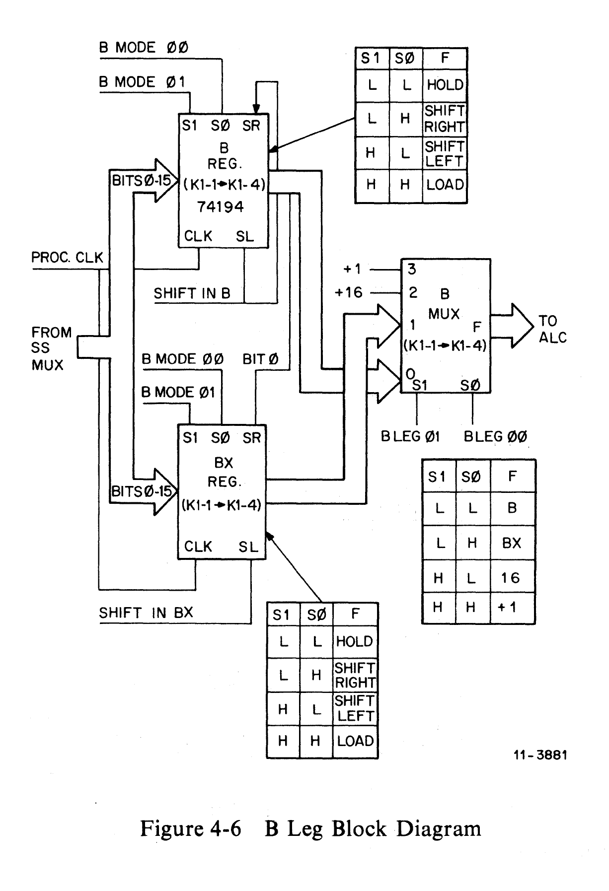

**B Register.** The B register (B REG) is a general-purpose storage register
(Figure 4-7) on the B leg of the ALU, consisting of four 4-bit bidirectional
universal shift registers (74194). The mode control lines of the four 4-bit
registers are connected in parallel, so that the signals K2-8 B MODE 00 L and
K2-8 B MODE 01 L select the function that will be performed by the B register
when clocked by K1-5 PROC CLK L.

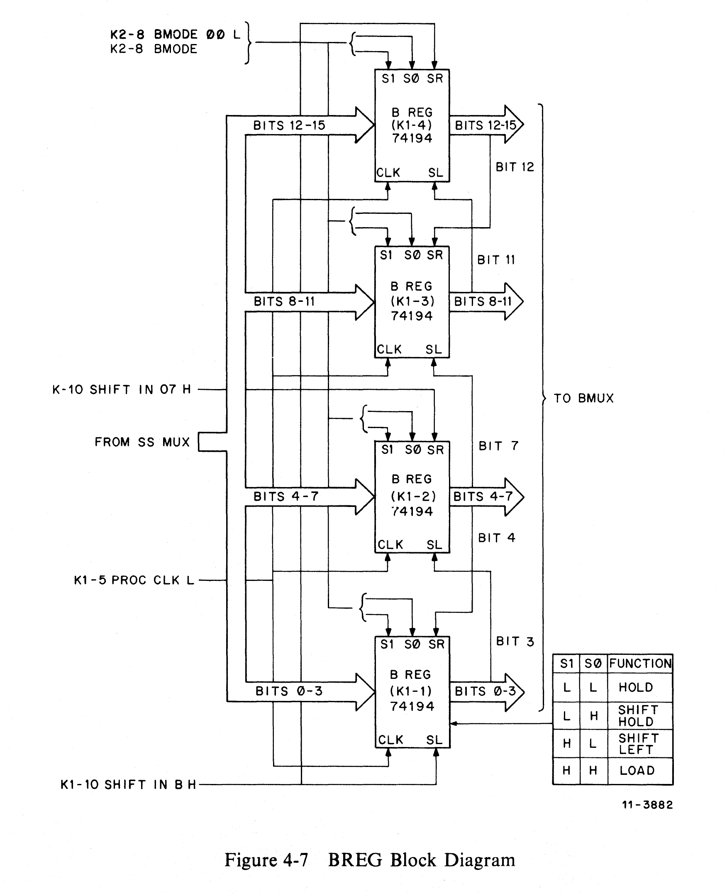

#### Table 4-6 B and BX Register Enabling Configurations and Modes

| Mode 01 | Mode 00 | Function (when PROC CLK L goes high)                                           |
| ------- | ------- | ------------------------------------------------------------------------------ |
| L       | L       | Hold — Contents of register do not change.                                     |
| L       | H       | Shift Right — Contents are shifted right one bit.                              |
| H       | L       | Shift Left — Contents are shifted left one bit.                                |
| H       | H       | Parallel Load — Data from SSMUX is loaded into register and appears at output. |

The B register can be shifted as an 8-bit byte or a 16-bit word. The signal
K1-10 SHIFT IN B determines what is shifted into the B register. When the
contents of this register and the BX register are combined into a 32-bit word,
the B register contains the upper 16 bits.

**BX Register.** The BX register (BX REG) is a general-purpose storage register
(Figure 4-8) on the B leg of the ALU, consisting of four 4-bit bidirectional
universal shift registers (74194), similar to the B register. The mode control
lines of the four 4-bit registers are connected in parallel, so that the signals
K2-8 BX MODE 00 L and K2-8 BX MODE 01 L select the function to be performed
when the BX REG is clocked by K1-5 PROC CLK L. The BX register can be shifted
as a 16-bit word or, in conjunction with the B register, as a 32-bit word. In
the latter case, the BX register contains the lower 16 bits of the 32-bit word,
and the shift right (SR) input of the most significant register in the BX
register is connected to the zero bit of the B register. Table 4-6 shows the
various functions and the shift configurations of K2-8 BX MODE 00 L and K2-8 BX
MODE 01 L that select them.

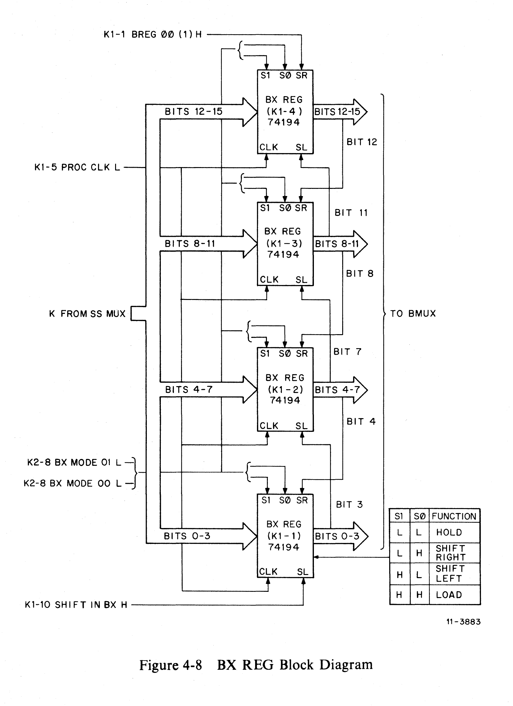

**B Leg Multiplexer (BMUX).** The BMUX (Figure 4-9) consists of three 2-to-1
multiplexers and a 4-to-1 multiplexer, and is used to select the proper input to
be used as an operand on the B leg of the ALU. The BMUX can select the contents
of either the B REG or BX REG, or can act as a constant generator (constants 16,
1, or 0), depending on the configuration of signals K2-8 B LEG 00 H and B LEG 01
H (Table 4-7) and the state of K2-4 DISAB MSYN + 1 L.

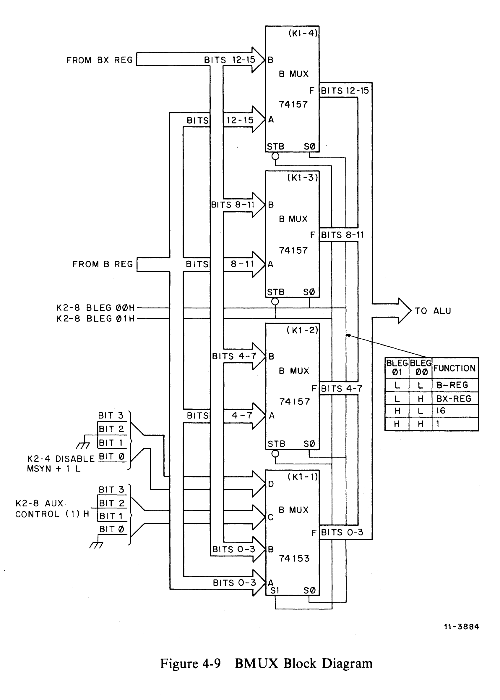

#### Table 4-7 BMUX Enabling Configurations and Modes

| B Leg 01 | B Leg 00 | Function | Description                                                                                                                                                                                                                                                                         |
| -------- | -------- | -------- | ----------------------------------------------------------------------------------------------------------------------------------------------------------------------------------------------------------------------------------------------------------------------------------- |
| L        | L        | BREG     | Passes data from the B register to the BMUX outputs. This is the most common configuration.                                                                                                                                                                                         |
| L        | H        | BXREG    | Passes data from the BX register to the BMUX outputs. This is used principally for EIS instructions.                                                                                                                                                                                |
| H        | L        | +16      | Forces the constant +16 into the BMUX outputs to preset a counter that is used for EIS instructions.                                                                                                                                                                                |
| H        | H        | +1       | Forces the constant +1 into the BMUX outputs during operations in which the contents of a register are being incremented or decremented by two.                                                                                                                                     |
| (H)      | (H)      | 0        | By asserting DISABLE MSYN + 1 L, this configuration forces the constant 0 into the BMUX outputs during operations in which the contents of a register are being incremented or decremented by one. (The signal K2-8 ALU CIN L to the ALU from the control module provides the one.) |

**B Leg Shift Capabilities.** Each of the four shift registers (74194) that make
up each register (B REG and BX REG) has the capability of being shifted left or
right, as indicated in Table 4-6 and Figure 4-10. The B register can be shifted
as an 8-bit byte or a 16-bit word; the BX register can be shifted as a 16-bit
word or, in conjunction with the B register, as a 32-bit word.

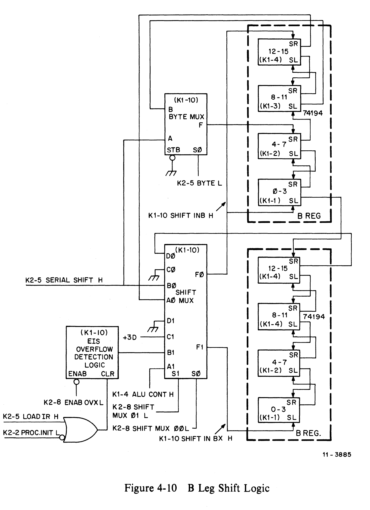

**Constants +16, +1, and 0.** The purpose of generating the constants +1 and 0 on
the B leg input of the ALU is to aid the processor to perform autoincrement and
autodecrement operations. During either operation, if a word instruction is being
performed, the specified register is incremented or decremented by two; if a byte
instruction is being performed, the register is incremented or decremented only
by one. The actual ALU operation is:

    RESULT = A LEG DATA + B LEG DATA + ALU CIN.

The ALU always uses the K2-8 ALU CIN L signal to increment or decrement the A
leg input by one; thus, the B leg input must provide the constant +1 or 0 to
obtain the correct autoincrement or autodecrement result for both byte and word
instructions. A B leg constant of +1 is generated by enabling the least
significant bit of the BMUX output (bit 00) and forcing all other bits (15:01)
to 0. To generate a constant 0, even bit 00 is cleared. The actual constant
generated is defined by the state of the K2-4 DISABLE MSYN + 1 L signal, which
is determined by the Control Store.

---

### 4.2.5 ALU Multiplexer (AMUX)

The AMUX (Figure 4-11) consists of three 4-to-1 multiplexers (74S153s) and one
2-to-1 multiplexer (74S157), each one dedicated to a 4-bit slice of the AMUX.
The 2-to-1 multiplexer (E14 on print K1-3) switches AMUX bits 11:08 according
to the state of the STB and S0 inputs. If the STB input is high, the multiplexer
is disabled, and the output is forced low. If the STB input is low, the
multiplexer is enabled, and the output depends on the state of the S0 input and
the appropriate data input. Thus, if the S0 input is low, the A data input will
be gated through to the AMUX output; if the S0 input is high, the B data input
will be gated through. Because the 4-to-1 multiplexer does not have an enable
input, the output always follows one of the inputs, corresponding to the binary
value of select lines S1 and S0 (K1-10 AMUX S1 H and K1-10 AMUX S0 H,
respectively), as follows:

1. **Unibus Data Function** — If both S1 and S0 are low (binary 0), the 4-to-1
   multiplexers select input A and the 2-to-1 multiplexer selects input A. Thus,
   each 4-bit slice of the AMUX switches Unibus data into the data path.

2. **Constant's Function** — Certain operations require the introduction of
   specific numbers into the data path. (For example, the data path must generate
   a vector of 24 for a power-fail trap, or 114 for a parity trap.) Access to
   these and other numbers is facilitated by storing certain constants in a
   read-only memory and presenting them to the constant's input of the AMUX. If
   S1 is low and S0 is high (binary 1), the 4-to-1 multiplexers select input B
   (the constant's input). Bits 11:08, which are controlled by the 2-to-1
   multiplexer, are not used.

3. **ALU Input** — If S1 is high and S0 is low (binary 2), the 4-to-1
   multiplexers select ALU inputs (input C) and the 2-to-1 multiplexer is
   enabled, also selecting ALU inputs, so that the ALU lines are selected for
   all 16 bits.

4. **PSW Inputs** — If both S1 and S0 are high (binary 3), the 4-to-1
   multiplexers select the PSW input (input D). The 2-to-1 multiplexer is
   disabled, as bits 11:08 are not used.

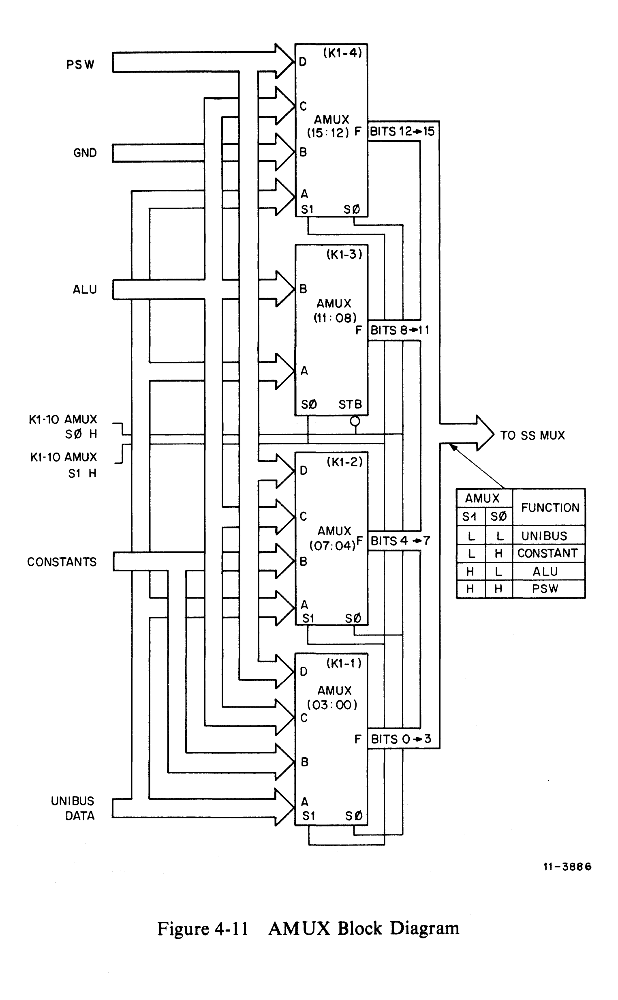

---

### SSMUX Control

| SS 01 H | SS 00 H | Function         |
| ------- | ------- | ---------------- |
| 0       | 0       | Straight through |
| 0       | 1       | Sign Extend      |
| 1       | 0       | Swap Bytes       |
| 1       | 1       | External Data    |

---

### 4.2.6 Processor Status Word

The Processor Status Word (PSW) register contains information on the current and
previous memory management mode, the current processor priority, a processor trap
for debugging, and the condition code results of the previous operation. The PSW
bit assignments and uses are shown in Table 4-8.

#### Table 4-8 Processor Status Word Register Bit Assignments

| PSW Bit | Name                            | Use                                                                                               |
| ------- | ------------------------------- | ------------------------------------------------------------------------------------------------- |
| 15:14   | Memory Management Current Mode  | Contain the current memory management modes.                                                      |
| 13:12   | Memory Management Previous Mode | Contain the previous memory management modes.                                                     |
| 11:08   | Unused                          |                                                                                                   |
| 07:05   | Priority                        | Set the processor priority.                                                                       |
| 04      | Trace                           | When this bit is set, the processor traps to the trace vector. Used for program debugging.        |
| 03      | N                               | Set when the result of the last data manipulation is negative.                                    |
| 02      | Z                               | Set when the result of the last data manipulation is zero.                                        |
| 01      | V                               | Set when the result of the last data manipulation produces an overflow.                           |
| 00      | C                               | Set when the result of the last data manipulation produces a carry from the most significant bit. |

The PSW (Figure 4-12) is a 12-bit register composed of three quad D-type
flip-flops (74175s) and one separate D-type latch. The first of these (E95 on
print K1-1) stores the condition code bits (N, Z, V, and C), and derives its
input from the PSW MUX, a quad 2-line-to-1-line multiplexer (E96 on K1-1)
according to the state of the S0 select line. When high, S0 selects the B inputs
(SSMUX bits 03:00); when low, S0 selects the A inputs, which come from the
condition code logic (print K1-10). The selected inputs are passed to the
f-outputs of the multiplexer and into the PSW.

A second quad D-type flip-flop (E97 on K1-2) is used to store the three KD11-E
processor priority bits, which it obtains from SSMUX bits 07:05. A separate
74S74 (E107 on K1-2) is needed to store the Trace Trap flag (T-bit), which can
be loaded from the K1-2 SSMUX 04 H line.

The third quad D-type flip-flop (E80 on K1-4) stores the bits containing the
current and previous status of the memory management mode. SSMUX bits 15 and 14
provide the input for PSW bits 15 and 14, which are then rerouted through a quad
2-line-to-1-line multiplexer (E90 on K1-4) and multiplexed with SSMUX bits 13
and 12 according to the state of the S0 select signal [K2-9 FORCE KERNEL (1) H]
to provide the input for PSW bits 13 and 12. Thus, PSW bits 15 and 14 reflect
the current status of the memory management mode, while PSW bits 13 and 12
indicate the previous status.

All flip-flops in the PSW are clocked, directly or indirectly, by clocking
signal K1-5 REG CLK L. All of the enabling signals come from the Control Store.

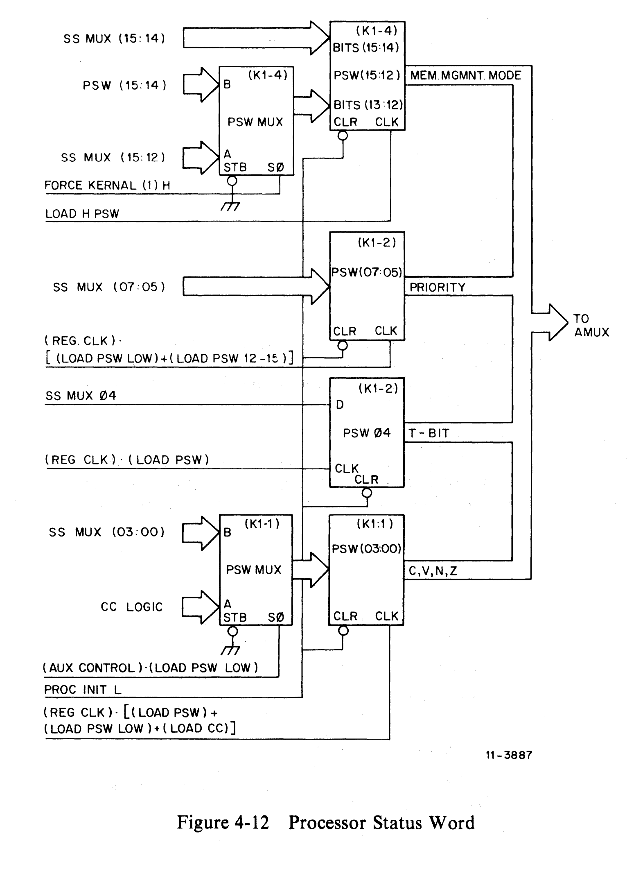
