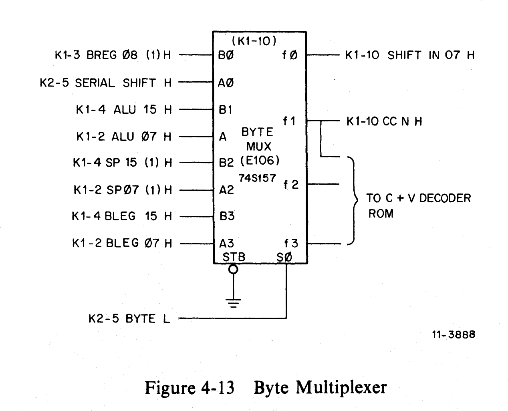
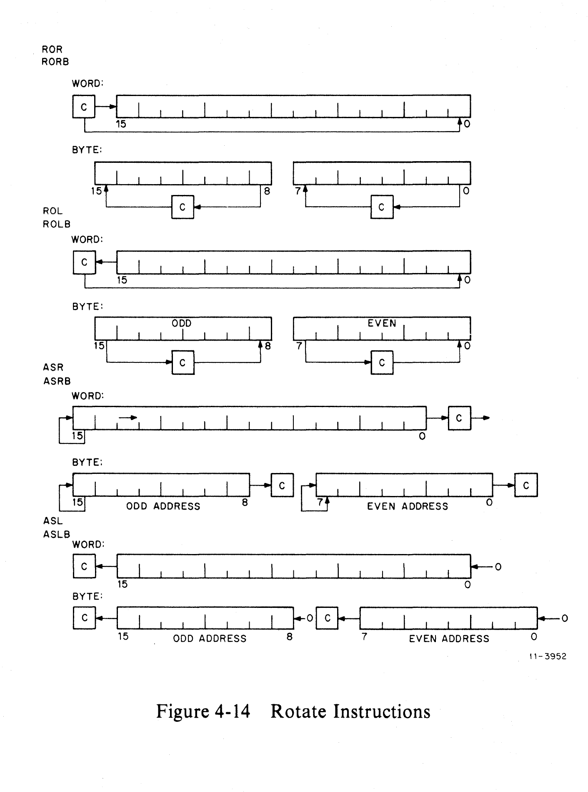
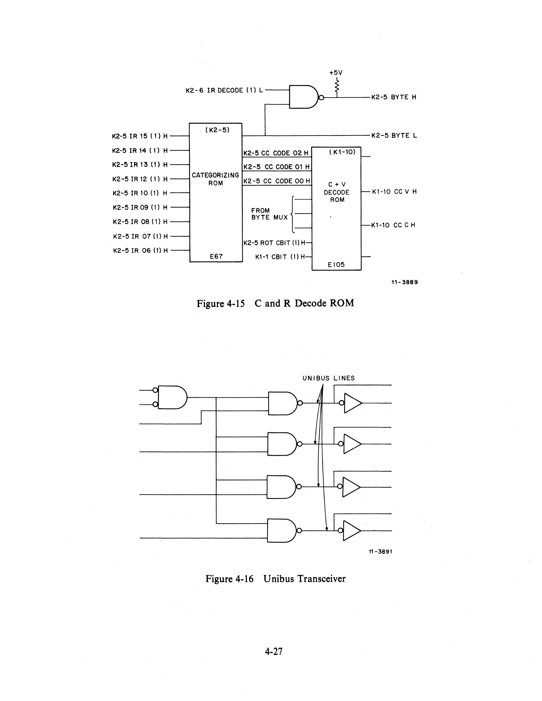

# Condition Codes

Source: EK-KD11E-TM-001, Chapter 4, Section 4.3

The logic necessary for determining the condition codes is shown on sheets K1-10
and K2-5, and can be subdivided into three parts, each of which is discussed in
some detail in this section. Constraints for each condition code bit are shown in
the instruction set specifications (Chapter 2).

## 4.3.1 Instruction Categorizing ROM

The Categorizing ROM (E67 on sheet K2-5) decodes the instructions in the IR and
categorizes them into eight groups, based on their effect on the carry and
overflow condition codes. These groups are as follows:

| Group | Instructions                                    |
| ----- | ----------------------------------------------- |
| 1     | MOV, BIT, BIS, BIC, and non-PDP-11 instructions |
| 2     | INC, DEC                                        |
| 3     | CLR, TST, SWAB                                  |
| 4     | ADD, ADC                                        |
| 5     | NEG, CMP, COM                                   |
| 6     | SUB, SBC                                        |
| 7     | Rotate instructions                             |
| 8     | Unused                                          |

Three of the four outputs of the Categorizing ROM are used to provide a binary
representation of one of the above instruction categories for the C and V Decode
ROM (E105 on K1-10). The fourth output (K2-5 BYTE L) decodes the fact that the
instruction in the IR is a byte instruction and is fed to the select input of the
BYTE MUX (E106 on K1-10).

## 4.3.2 Byte Multiplexer (BYTE MUX)

The BYTE MUX (E106 on K1-10) is a quad 2-line-to-1-line multiplexer (74S157)
that determines the N condition code bit and the K1-10 SHIFT IN 07 H signal for
the B REG (Figure 4-13). A single select input (K2-5 BYTE L) selects the A
inputs when a byte operation is performed, and the B inputs when the operation is
not a byte.

Output signal K1-10 CC N H assumes the level of K1-4 ALU 15 H when the
instruction being performed is a word operation, and the level of K1-2 ALU 07 H
when the instruction is a byte operation. Byte operations may be performed on
either the high or low bytes of the input word, depending on whether the
processor microcode has already swapped bytes before the condition codes are
detected.

For shift right operations, the K1-10 SHIFT IN 07 H output assumes the level of
the K1-3 BREG 08 (1) H input when a word instruction is performed, and the level
of the K2-5 SERIAL SHIFT H output of the ROT/SHFT ROM (E61 on print K2-5) for a
byte operation. The diagrams in Figure 4-14 indicate the operations performed by
various instructions.

## 4.3.3 C and V Decode ROM

The C and V Decode ROM (E105 on K1-10) determines the values of the carry and
overflow condition code bits as a function of the instruction being performed
(Figure 4-15). Inputs to this ROM come from the ROT SHIFT ROM (E61 on K2-5),
the PSW [K1-1 CBIT (1) H], the BYTE MUX, and the Categorizing ROM (E67 on
K2-5). Outputs K1-10 CC V H and K1-10 CC C H are fed via the PSW MUX (E96 on
K1-1) to the PSW register.

## 4.3.4 Condition Code Signal CC Z H

Each 4-bit slice of the data path contains an ALU output via a gate (type 881S)
reflecting whether all four of the bits in that slice are ZERO. If the
instruction being performed is a byte operation, condition code signal K1-10 CC Z
H assumes the combined state of signals K1-1 0-3=0 H and K1-2 4-7=0 H; for a
word operation, K1-10 CC Z H assumes the combined state of those signals together
with K1-3 8-11=0 H and K1-4 12-15=0 H. Thus, K1-10 CC Z H is asserted if bits
00 through 07 = 0 for a byte operation and if bits 00 through 15 = 0 for a word
operation. Assertion of K2-5 BYTE L selects byte operation.
