# Data Transfer, Bus Control, Clock, and Priority

Source: EK-KD11E-TM-001, Chapter 4, Sections 4.4, 4.7–4.10

## 4.4 Unibus Address and Data Interface

### 4.4.1 Unibus Drivers and Receivers

Standard bus transceiver circuits (type 8641) are used to interface the processor
data path to the Unibus address (BUS A00:A15) and data (BUS D00:D15) lines. These
circuits are shown on prints K1-1 through K1-4, and on K1-6.

### 4.4.2 Unibus Address Generation Circuitry

A unique feature of the KD11-E is that KT11-D equivalent memory management
capability is built into the 2-board processor. During Unibus transfers, virtual
bus addresses are obtained from the scratchpad memory (SPM) and the Physical Bus
Address (PBA) register, if relocation is not enabled, and latched in the Virtual
Bus Address (VBA) register shown on print K1-6. Figure 4-17 shows the actual VBA
clock timing, while Figure 4-18 shows Unibus address logic in block diagram form.

If the memory management circuit is not enabled (K1-8 RELOCATE H is not
asserted), the address that was clocked into the Physical Bus Address register is
used as address data for the 8641 transceivers and driven onto the Unibus address
lines.

When the memory management circuit is enabled (K1-8 RELOCATE H asserted), a
selected relocation constant (detailed description in Paragraph 4.12) is added to
the contents of the VBA before it is latched into the BA and driven onto the
Unibus.

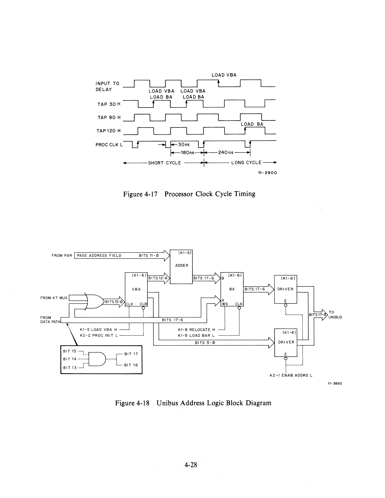

### 4.4.3 Internal Address Decoder

The receiver half of the bus transceivers continually monitors the Unibus address
lines. If the processor is running (HALT RQST L or BUS SACK L are not asserted),
these transceivers allow the Internal Address Decoder circuit (print K1-10) to
detect transfers to or from the PSW and memory management registers. Note,
however, that the CPU does not allow access to its general registers through
their Unibus addresses while it is running.

While the processor is halted (BUS SACK L is asserted), this decoder circuit
enables data transfers between CPU registers and Unibus peripheral devices. A
list of these CPU registers and their Unibus addresses is shown below; the
registers are discussed in Paragraph 4.12.

| Register | Address | Register | Address |
| -------- | ------- | -------- | ------- |
| PSW      | 777776  | R10      | 777710  |
| R0       | 777700  | R11      | 777711  |
| R1       | 777701  | R12      | 777712  |
| R2       | 777702  | R13      | 777713  |
| R3       | 777703  | R14      | 777714  |
| R4       | 777704  | R15      | 777715  |
| R5       | 777705  | R16      | 777716  |
| R6       | 777706  | R17      | 777717  |
| R7       | 777707  |          |         |

---

## 4.7 Data Transfer Circuitry

### 4.7.1 General Description

All Unibus data transfers are controlled by the DAT TRAN circuitry on K2-1. This
logic monitors the busy status of the Unibus, controls the processor bus control
lines BBSY, MSYN, C1, and C0, and detects parity errors (PE), and bus errors
(BE).

### 4.7.2 Control Circuitry

#### 4.7.2.1 Processor Clock Inhibit

All processor data transfers on the Unibus are initiated by K2-8 BUF DAT TRAN
(1) H. When K1-5 TAP 30 H goes high, the signal combines with the signal K2-1
EOT L (normally a logic 1 between transfers) to create K2-1 TRAN INH L, shutting
off the processor clock until the transfer is completed.

#### 4.7.2.2 Unibus Synchronization

The synchronizer logic shown in Figure 4-19 (from K2-1) arbitrates whether the
processor or some other Unibus peripheral will control the Unibus. A logic 1
level (+3 V) at the set input of the E31 flip-flop on K2-1 specifies that the
bus is presently in use. Each of the inputs that combine to create this level
monitors a specific set of bus conditions.

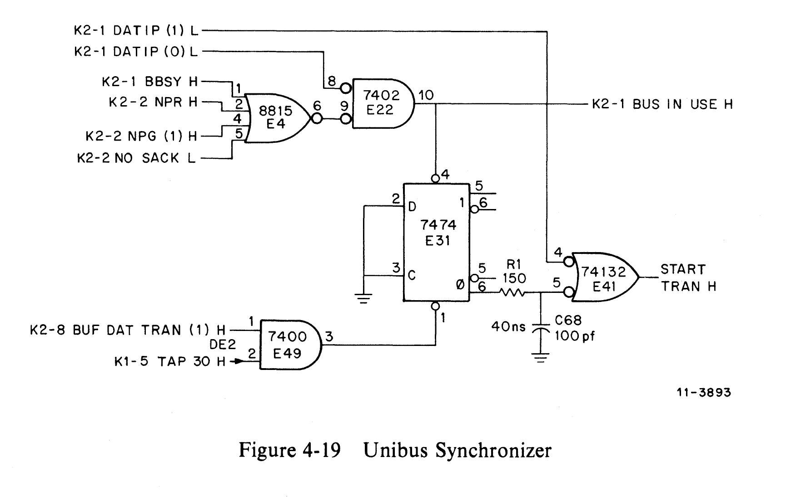

Bus-in-Use conditions:

| Signal                         | Condition                                                                                                                                                                                                                                                                                                                                                                                             |
| ------------------------------ | ----------------------------------------------------------------------------------------------------------------------------------------------------------------------------------------------------------------------------------------------------------------------------------------------------------------------------------------------------------------------------------------------------- |
| NPR (K2-2 NPR H)               | A Unibus peripheral has asserted a nonprocessor request (NPR) and wishes to gain control of the bus immediately.                                                                                                                                                                                                                                                                                      |
| BBSY (K2-1 BBSY H)             | Another Unibus peripheral already has control of the bus, and is asserting a bus busy (BBSY) signal.                                                                                                                                                                                                                                                                                                  |
| NPG [K2-2 NPG (1) H]           | An NPR device has requested control of the Unibus and the KD11-E processor has issued a nonprocessor request grant (NPG). The condition may exist where the NPR device has already recognized the NPG and has dropped its NPR signal, while not yet having asserted a SACK or BBSY.                                                                                                                   |
| NO SACK L (K2-2 NO SACK)       | A device has requested control of the Unibus. The KD11-E processor has issued a grant, and the device has returned SACK L, causing NO SACK L to go high. The condition may exist where only SACK L remains on the Unibus for a period of time before the peripheral asserts BBSY.                                                                                                                     |
| DATIP (0) L [K2-1 DATIP (0) L] | When this input is true, all of the above signals are overridden. It indicates that the processor is performing a DATIP (Read/Modify/Write) operation, and has control of the Unibus (BBSY asserted). NPR devices may, however, be granted bus control, but must wait until the processor releases BBSY before asserting theirs. (DATIP operations dictate worst-case bus latencies for NPR devices.) |
| BUS SSYN L                     | A data transfer is still being completed; therefore, the processor must wait before initiating another.                                                                                                                                                                                                                                                                                               |

If none of the above Bus-in-Use conditions exist, the K2-8 BUF DAT TRAN (1) H
signal sets the E31 flip-flop on K2-1 when K1-5 TAP 30 H goes high, and
activates K2-1 START TRAN H to start the transfer.

#### 4.7.2.3 Bus Control

Once the K2-1 START TRAN H signal is activated, the DAT TRAN circuitry begins a
Unibus data transfer operation by asserting K2-1 ENAB ADDRS L, triggering the
following actions:

1. Enables the bus address drivers (BUS A15:A00 on K1-6).
2. Enables the BBSY driver (K2-1).
3. Enables the bus control signals BUS C0 and BUS C1, which determine the kind
   of transfer being performed.

| C1  | C0  | Operation |
| --- | --- | --------- |
| 0   | 0   | DATI      |
| 0   | 1   | DATIP     |
| 1   | 0   | DATO      |
| 1   | 1   | DATOB     |

The actual condition of these control lines is determined by K2-8 BUF C0 (1) H
and K2-8 BUF C1 (1) H.

4. Enables the bus data drivers (BUS D00-BUS D15) if the operation being
   performed is a DATO.

#### 4.7.2.4 M8264 NO-SACK Timeout Module

The M8264 is a quad-height module containing circuitry that asserts BUS SACK L on
the Unibus if a device requesting Unibus control does not assert SACK within 10
us after a grant line has been enabled (Figure 4-20).

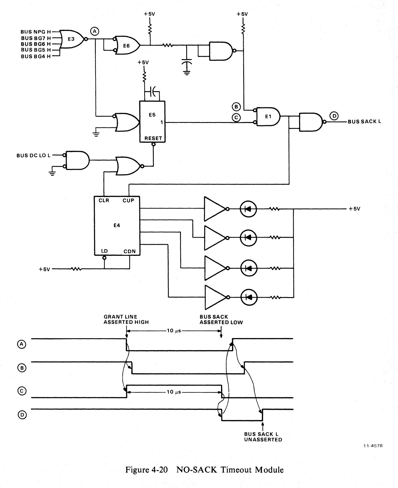

#### 4.7.2.5 MSYN/SSYN Time-Out Circuitry

Unibus specifications require that the BUS MSYN L control signal be enabled no
sooner than 150 ns after the bus address, data, and control lines have been
asserted. To meet this requirement, the circuitry in Figure 4-21 has been
incorporated into the DAT TRAN logic (K2-1).

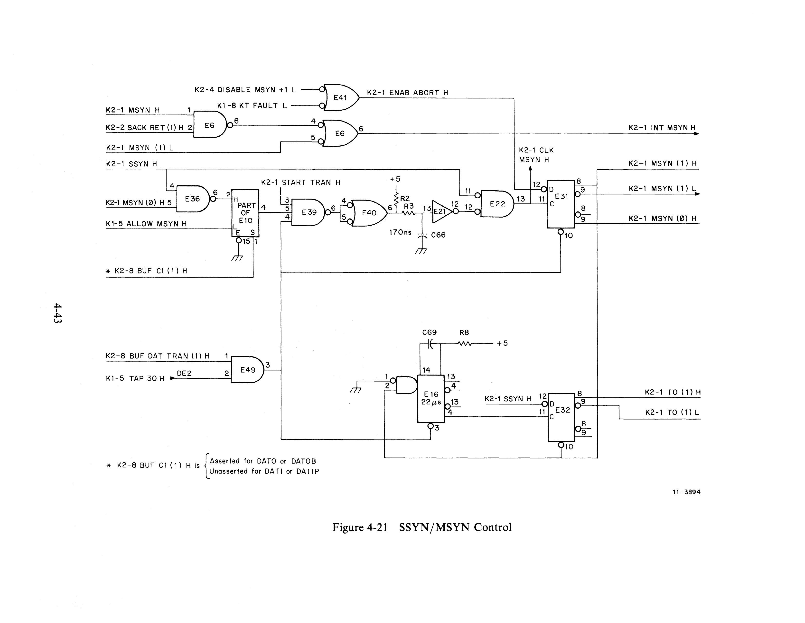

The multiplexer (E10) shown in Figure 4-22 helps adapt the DAT TRAN circuitry to
the type of bus operation being performed (DATI or DATO). Specific functions
performed are as follows:

1. Generates the correct Unibus control signals [K2-1 UBUS C0 (1) H and K2-1
   UBUS C1 (1) H].
2. Inhibits the detection of parity errors during DATO operations.
3. Generates an End of Transfer (EOT L) signal as soon as BUS SSYN is returned
   by an addressed peripheral.
4. Delays the assertion of BUS MSYN, using the clock signal K1-5 ALLOW MSYN H,
   which does not become asserted until the Physical Bus Address register has
   been loaded.

NOTE: Item 4 applies only to DATI or DATIP. During DATO or DATOB, the bus
address is never loaded in the same micro cycle that does the DATO or DATOB.

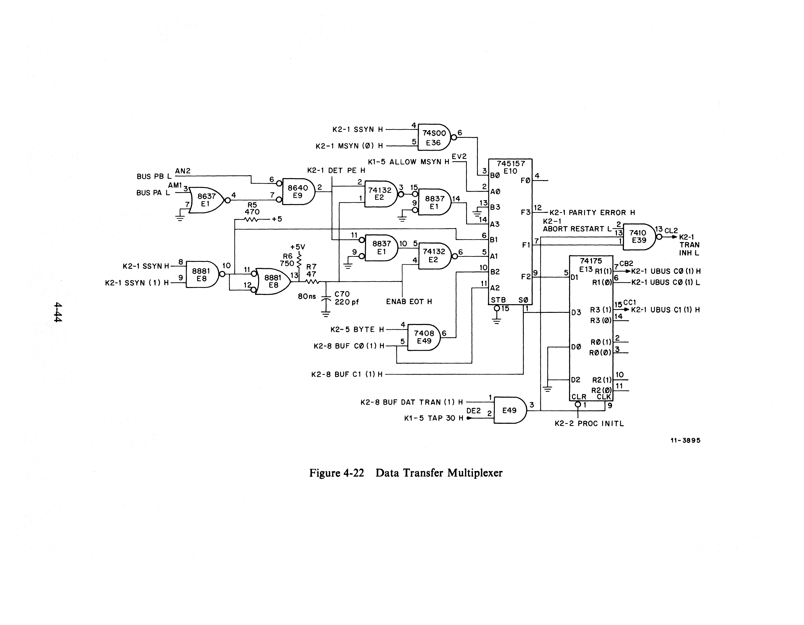

The RC circuit shown in Figure 4-21 prevents the MSYN flip-flop (E31) from being
clocked until approximately 150 ns after the bus address and control lines are
placed on the bus. Once this latch is set, BUS MSYN L is activated and the SSYN
TIMEOUT one-shot E16 is triggered. When SSYN is returned by the addressed
peripheral, both the MSYN flip-flop (E31) and the SSYN TIMEOUT one-shot are
cleared. The processor clock is then freed by the release of K2-1 TRAN INH L.

#### 4.7.2.6 Bus Errors

Once the SSYN TIMEOUT one-shot is triggered, SSYN must be returned within 22 us.
If SSYN is not returned in this time, E16 times out, setting the TIMEOUT flip-flop
(E32). The output of this latch then generates the signal K2-1 ABORT RESTART L
and pulse K2-1 ABORT H. K2-1 ABORT RESTART L reenables the PROC CLK and K2-1
ABORT H sets the Bus Error flip-flop (E33). This same pulse that sets the Bus
Error flip-flop also clears the micro-PC address latches (MPC00 through MPC08)
on K2-7, forcing the processor to enter the service microroutine on the next
PROC CLK L low-to-high transition.

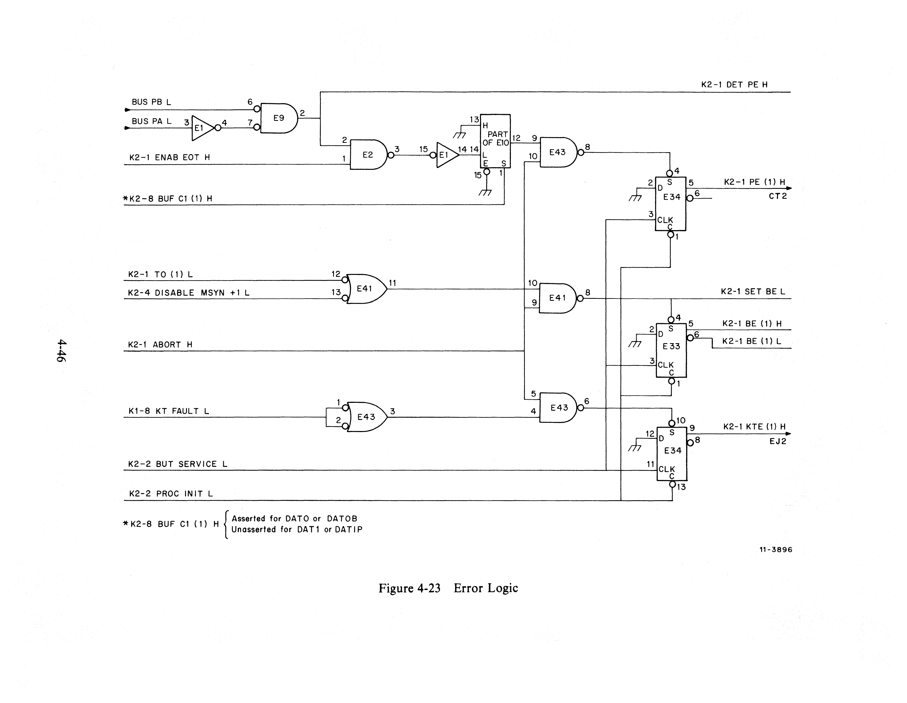

#### 4.7.2.7 Parity Errors

If a data transfer is being performed with a parity memory (e.g., MS11-JP or
MM11-DP), all parity errors detected by the memory will be reflected back to the
KD11-E on the Unibus lines BUS PA L and BUS PB L on K2-1 (Figure 4-23).

| PA  | PB  | Error Description       |
| --- | --- | ----------------------- |
| 0   | 0   | No Parity Error         |
| 0   | 1   | Parity Error on DATI    |
| 1   | 0   | Reserved for future use |
| 1   | 1   | Reserved for future use |

Errors detected while performing a DATIP or DATI [K2-8 BUF C1 (1) H unasserted]
will result in the Parity Error flip-flop (E34) being set when SSYN is returned
to the processor. Processor operations resulting from Parity Error will be
discussed further in Paragraph 4.11, Service Traps.

#### 4.7.2.8 End of Transfer Circuitry

To synchronize the DAT TRAN logic with the main KD11-E processor clock, the End
of Transfer (EOT) circuitry (Figure 4-24) has been incorporated into the CPU
(K2-1). During a DATI or DATIP, an EOT L signal is generated approximately 100
ns after SSYN is returned to the processor. That EOT L removes the processor
clock disabling signal (Paragraph 4.7.2.1), K2-1 TRAN INH L. During a DATO or
DATOB, K2-1 TRAN INH L is unasserted immediately when SSYN is returned.

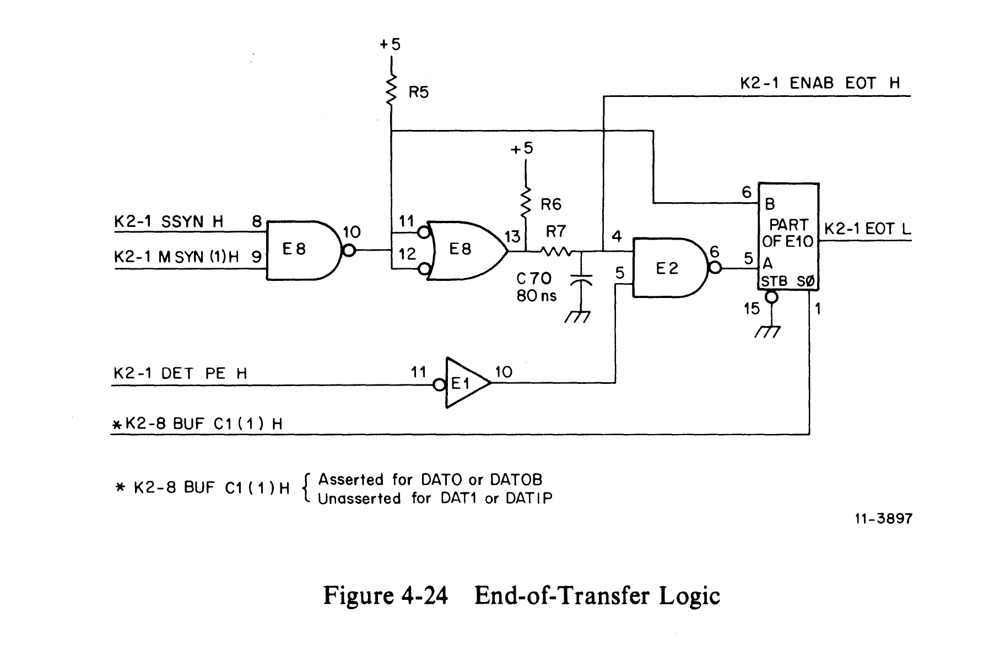

#### 4.7.2.9 Data-in-Pause Transfer

Another circuit included in the DAT TRAN logic detects Data-in-Pause (DATIP)
transfers and controls the bus control signal BBSY. When a DATIP
(Read/Modify/Write) bus operation is initiated, the flip-flop (E32) is latched,
forcing the processor to hold BBSY L until the DATO portion of the routine has
been completed. While BBSY is asserted, no other Unibus peripheral can seize
control of the bus. This feature often determines the maximum bus latency for NPR
devices (K2-1).

#### 4.7.2.10 Odd Address Detection

The circuitry shown in Figure 4-25 is incorporated in the KD11-E to detect odd
address errors. ROM E78 (print K2-8) monitors the signals K2-8 BUF DAT TRAN (1)
H, K2-5 BYTE H, and K1-6 VBA00 (1) H, and asserts K2-8 DISABLE MSYN L when an
odd address is detected. The multiplexer circuit (E38 on K2-4) forces the
processor to always autoincrement or autodecrement the PC (R7) or the SP (R6)
scratchpad registers by two, regardless of the type of instruction being
performed. This is done by preventing the K2-4 DISABLE MSYN + 1 L signal from
being asserted.

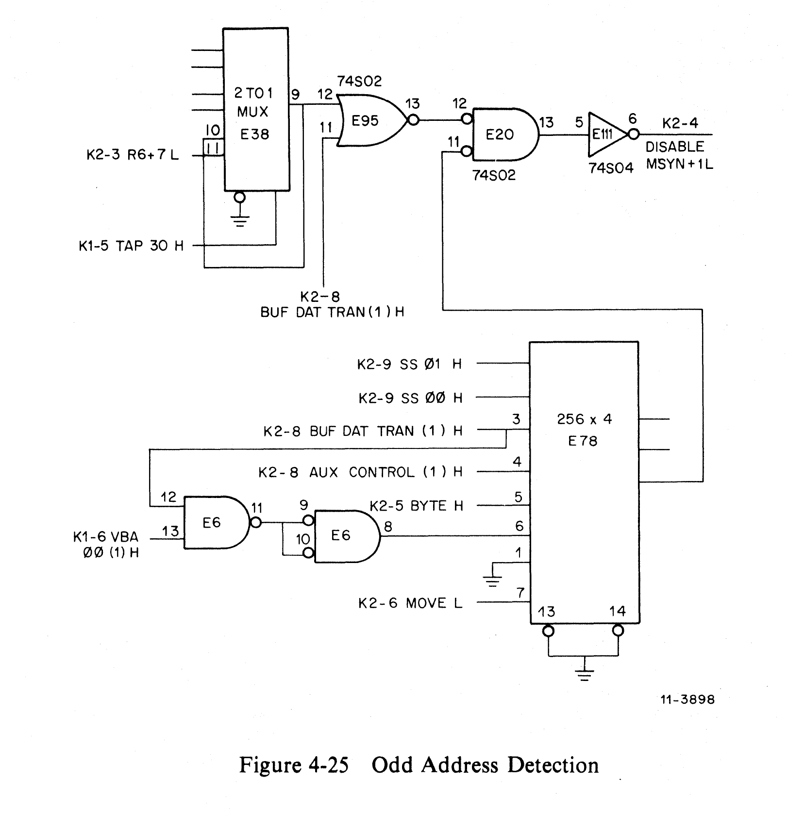

---

## 4.8 Power Fail/Auto Restart

The KD11-E power fail/auto restart circuitry (K2-3) serves the following
purposes:

1. Initializes the microprogram, the Unibus control, and the Unibus to a known
   state immediately after power is applied to the computer.
2. Notifies the microprogram of an impending power failure.
3. Prevents the processor from responding to an impending power failure for 2 ms
   after initial startup.

The actual power fail/auto restart sequences are microprogram routines.

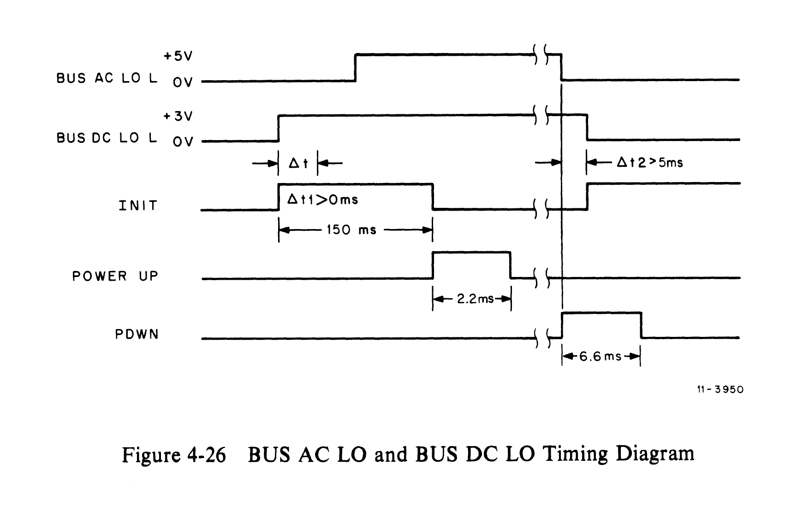

The power-up sequence (Figure 4-26) shows that BUS DC LO L is unasserted before
BUS AC LO L is unasserted. When BUS DC LO L is not asserted, it is assumed that
the power in every component of the system is sufficient to operate. When BUS AC
LO L is not asserted, there is sufficient stored energy in the regulator
capacitors of the power supply to operate the computer for 5 ms, should power be
shut down immediately.

One-shot E14 generates a 150-ms processor INIT pulse as soon as BUS DC LO L is
nonasserted after power is applied to the processor. At the end of 150 ms, the
PUP one-shot (E7) is fired if BUS DC LO L is not asserted and the processor
begins the PC and PSW load routine. The PUP one-shot generates a 2-ms pulse,
during which the assertion of BUS AC LO L is ignored.

When a Reset instruction is decoded by ROM E53, the ROM output signal START RESET
H is clocked into the Start Reset flip-flop (E54 on K2-2). This flip-flop output
triggers a 100-ms INIT, after which the processor continues operation.

---

## 4.9 Processor Clock

The processor clock circuitry for the KD11-E is shown in Figure 4-27 and on print
K1-5. A delay line is used to generate a pulse train, to which the entire
processor is synchronized. Because the KD11-E is a fully clocked processor,
events that result in the alteration of storage registers occur only on defined
edges of the processor clock.

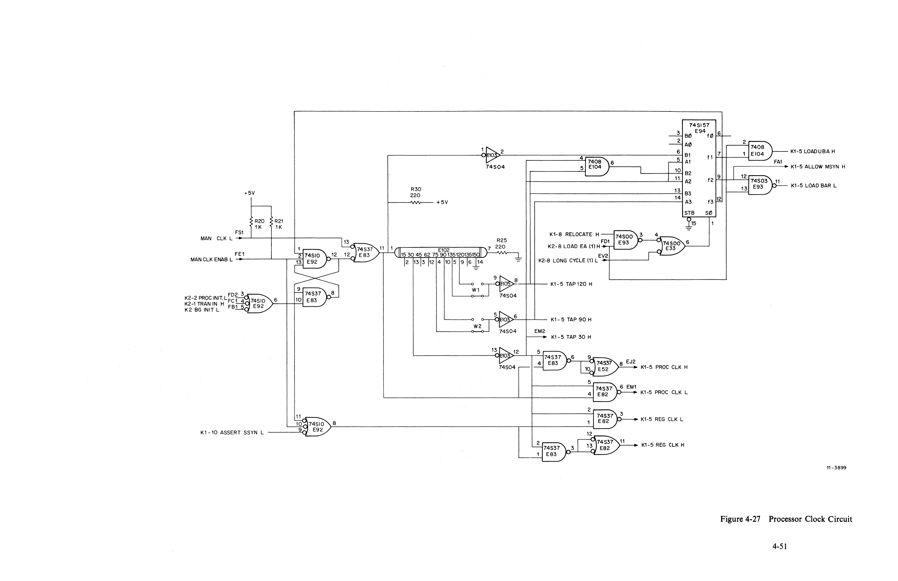

If all clock disable inputs are unasserted, the clock will begin running as soon
as +5 V is applied. The length of an operating cycle can be either **180 ns** or
**240 ns**, depending on the nature of the instruction being performed. Most
microinstructions employ the shorter cycle, with the longer one only necessary
when the machine is performing a DATO or DATOB, or in situations where the
condition code must be determined before an operation can be performed. Long
cycles are also used in loading the Bus Address register when memory management
is turned on.

The clock is turned on and off by the gating of the feedback through the delay
line. Taps of 120 ns, 90 ns, and 30 ns make it possible to vary the length of
the cycle, according to a signal input [K2-8 LONG CYCLE (1) L] from the Control
Store, as the processor clock timing diagrams in Figure 4-17 show.

The clock is turned off by the appropriate signal under the following conditions:

1. During a BUS INIT that is not caused by a RESET
2. During the INIT portion of the power-up routine
3. During the INIT portion of the power-down routine
4. During a Reset
5. During the BUT Service arbitration delay
6. During a priority interrupt
7. While BUS SACK is asserted by an interrupting device (not for NPR transfers)
8. During bus data transfers
9. After a Halt instruction is executed
10. When the manual clock is enabled

---

## 4.10 Priority Arbitration

### 4.10.1 Bus Requests

The KD11-E responds to bus requests (BRs) in a manner similar to that of the
other PDP-11 processors. Peripherals may request the use of the Unibus in order
to make data transfers or to interrupt the current processor program by asserting
a signal on one of the four BR lines, numbered BR4, BR5, BR6, and BR7 in order of
increasing priority.

#### Table 4-10 Priority Service Order

| Priority | Service Order           |
| -------- | ----------------------- |
| Highest  | Halt Instructions       |
|          | Odd Address             |
|          | Memory Management Error |
|          | Time-Out                |
|          | Parity Error            |
|          | Trap Instruction        |
|          | Trace Trap              |
|          | Stack Overflow          |
|          | Power Fail              |
|          | Halt from Console       |
|          | BR7                     |
|          | BR6                     |
|          | BR5                     |
|          | BR4                     |
| Lowest   | Next Instruction Fetch  |

Because a BR can cause a program interrupt, it may be serviced only after
completion of the current instruction in the IR.

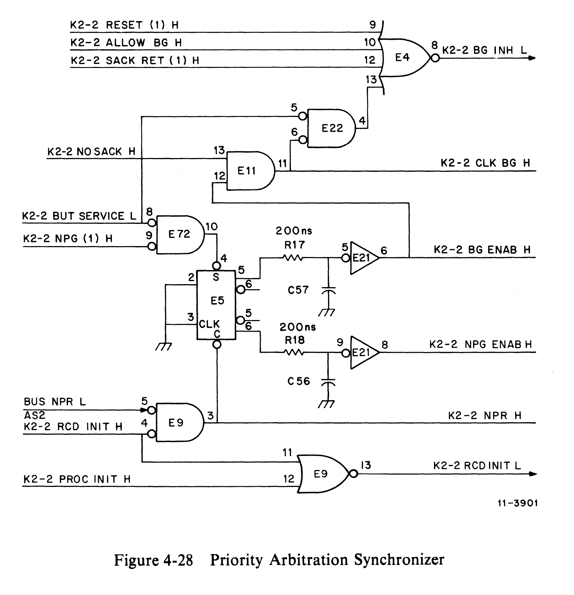

Arbitration logic for BRs is contained on print K2-2 and in Figure 4-28. All BRs
are received directly from the Unibus (Unibus receivers E17), and latched into
register E19 (quad D-type latch, 74S174) when the microprogram enters the next
service state [K2-9 BUT SERVICE (1) H is true]. The BR Priority Arbitration ROM
(E29) then determines whether the present processor priority [PSW (7:4)] is
higher than the highest BR received and, if not, which BR received has the
highest priority. Arbitration performed by E29 in the order of priority are shown
below.

    HLT RQST
    PSW7
    BR7
    PSW6
    BR6
    PSW5
    BR5
    PSW4
    BR4

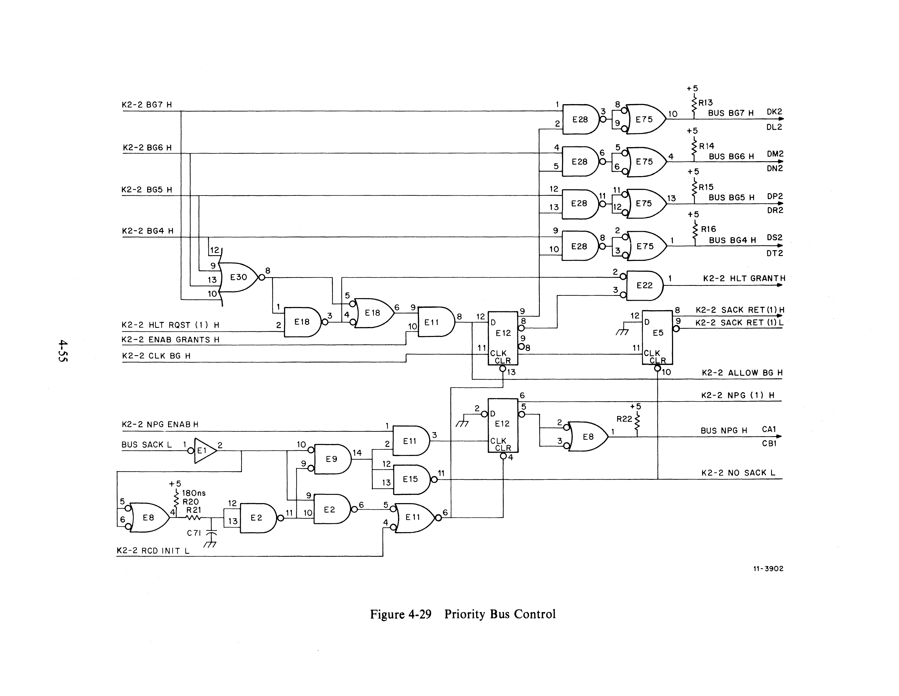

### 4.10.2 Nonprocessor Requests (NPRs)

NPRs are a facility of the Unibus that permit devices on the Unibus to
communicate with each other with minimal participation of the processor. The
function of the processor in servicing an NPR is to yield control of the bus in a
manner that does not disturb the execution of an instruction by the processor.
For example, the processor will not relinquish the bus following the DATI portion
of a DATIP transfer.

### 4.10.3 Halt Grant Requests

The KD11-E implements what is, in effect, another priority level by monitoring
the HALT/CONTINUE switch on the front panel. When a Halt is detected (HLT RQST L
asserted), the processor recognizes it as an interrupt request (refer to priority
levels in Paragraph 4.10.1) upon entering the next service microstate. The
processor then inhibits the processor clock and returns a recognition signal
(K2-2 HLT GRANT H), causing the console to drop HLT RQST L and assert BUS SACK
L, gaining complete control of the Unibus and the KD11-E.

The user can maintain the processor in this inactive state (Halted) indefinitely.
When the HALT switch is released, the user's console releases BUS SACK L, and
the processor continues operation as if nothing had happened.
