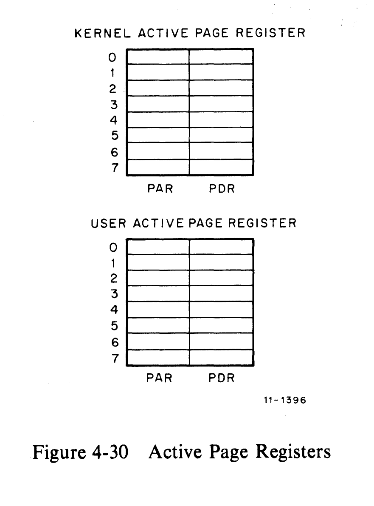
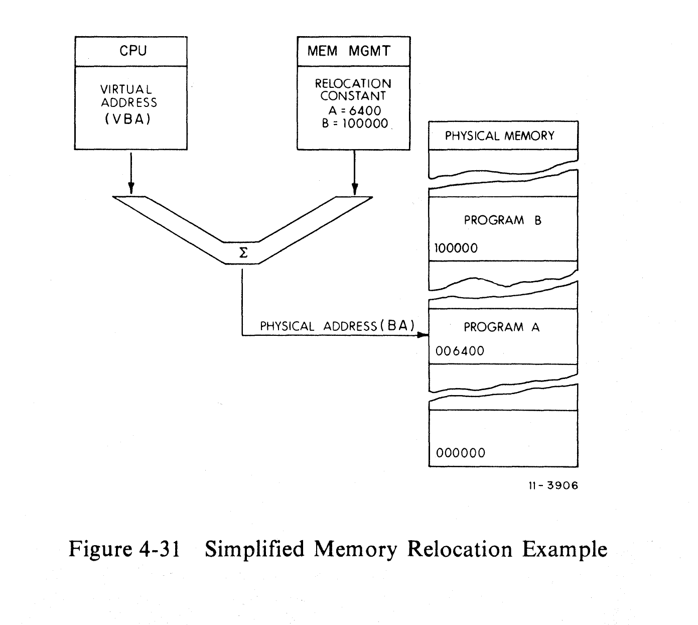
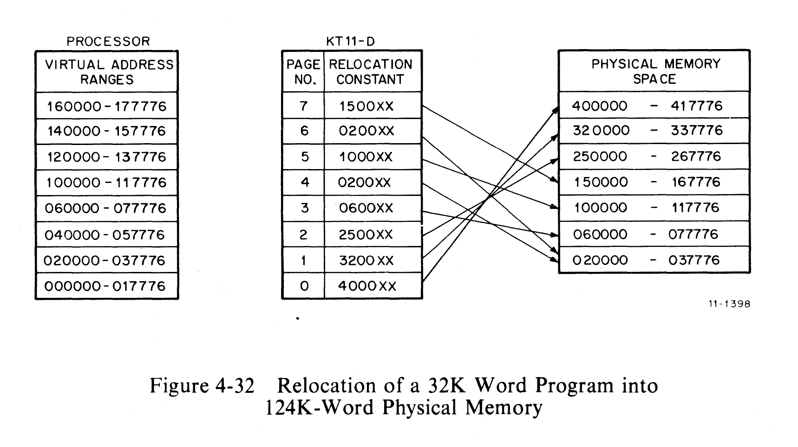
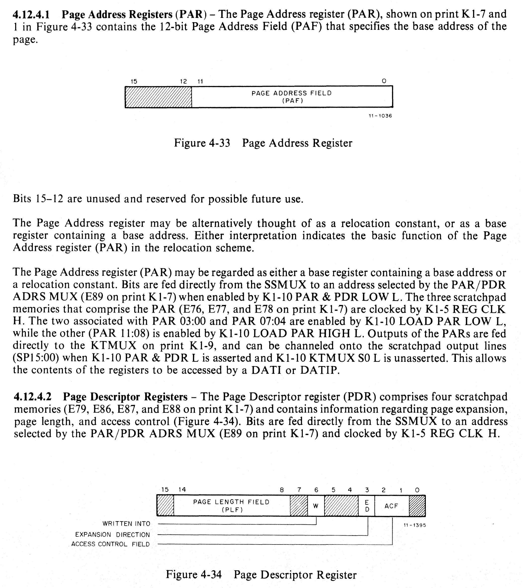
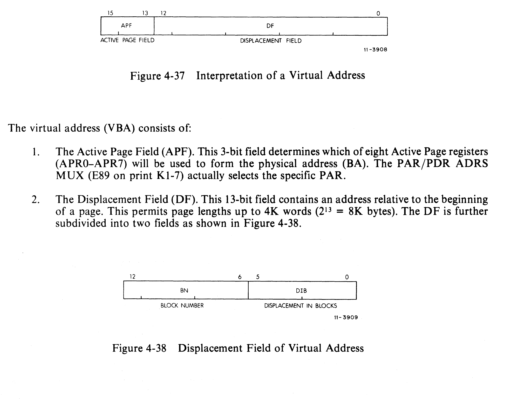
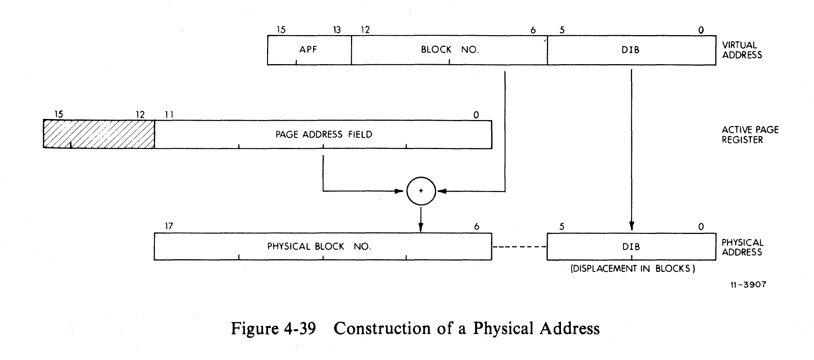
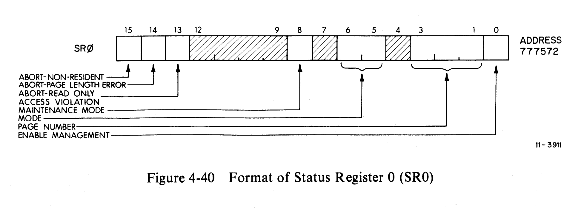
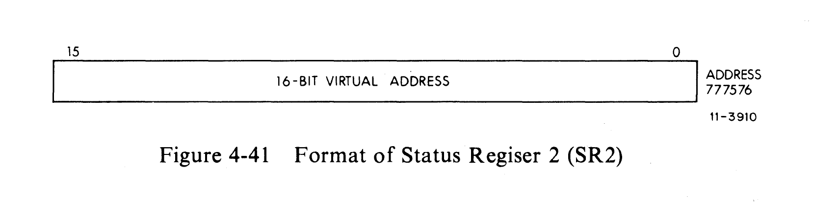

# Service Traps and Memory Management

Source: EK-KD11E-TM-001, Chapter 4, Sections 4.11–4.12

## 4.11 Service Traps

### 4.11.1 General Description

All interrupts, error traps, and instruction traps are recognized and serviced by
the KD11-E when the processor enters what is called the service microinstruction
state. The functions performed during this state are most critical to the
operation of the processor.

When the service state is entered, all bus interrupts, error traps, and
instruction traps realized during the performance of the last instruction are
arbitrated by the service ROMs (E50 and E51 on print K2-3). Each trap condition
is then serviced according to its priority, as listed in Table 4-10 (see
bus-control.md).

### 4.11.2 Circuit Operation

The service ROMs (E50 and E51 on print K2-3) service a specific trap by
generating a vector address unique to that trap condition (Table 4-11). Upon
leaving the service state, the processor is forced to push its present program
counter (PC) and processor status word (PSW) onto its memory stack and fetch a
new PC from the location specified by the vector address. A new PSW is then
obtained from the next memory location after the vector.

The various trap conditions that cause the processor to vector are as follows:

- **Bus Errors** — The processor has attempted to access nonexistent memory or odd
  address (non-byte), or a memory location that did not return BUS SSYN within
  22 us. Detection circuitry described in Paragraph 4.7.2.6.

- **Stack Overflow Error** — Any attempt by the processor to decrement the
  contents of the Stack Pointer register (R6) below the 400-location stack limit
  (K1-10 8-15 = 0 H) will result in the Stack Overflow flip-flop (E24 on K2-3)
  being set on the next transition of K1-5 PROC CLK L. [Note that this does not
  apply to user stack (R16).]

- **Parity Error** — Detection circuitry described in Paragraph 4.7.2.7.

- **Power Failure** — Circuitry described in Paragraph 4.8.

- **Trace Trap** — Program-controlled by the user, allowing insertion of a
  processor/user interactive subroutine into the main program. Circuitry
  described in Paragraph 4.2.6.

- **Reserved Instructions, Illegal Instructions, EMT Instructions, Trap
  Instructions** — Signals IR CODE 00 L through IR CODE 02 L are generated by
  the IR Decode ROMs on K2-6. Decoding discussed in Paragraph 4.5.3.

#### Table 4-11 Vector Addresses

| Octal Unibus Vector Address | Trap Conditions                                  |
| --------------------------- | ------------------------------------------------ |
| 004                         | Time-Out, Odd Address, and Stack Overflow Errors |
| 010                         | Illegal and Reserved Instructions                |
| 014                         | T-Bit Trap (BPT)                                 |
| 020                         | Input/Output Trap (IOT)                          |
| 024                         | Power Fail                                       |
| 030                         | Emulator Trap (EMT)                              |
| 034                         | Trap Instruction                                 |
| 114                         | Memory Parity Errors                             |
| 250                         | Memory Management Errors                         |

Upon entering the service microinstruction state, the service ROMs (E50 and E51
on K2-3) monitor any combination of the above trap conditions which, if true,
cause the assertion of microprocessor address line K2-7 MPC 00 L. While still in
the service state, the ROM also generates a specific vector address (Table 4-11),
using outputs K2-3 C2 H, K2-3 C3 H, and K2-3 C4 H, and channels it onto the
processor AMUX lines to the SSMUX by activating K1-10 AMUX S0 H.

Before leaving the service state, the service ROMs also clear the condition that
caused the original trap. This is done either by asserting K2-3 STOV SERV H or
K2-3 PFAIL SERV H, or by performing the steps in the trap service routine. For
those traps specified by the IR Code lines, however, it is necessary to remove
the instruction in the IR. This is done through microcode output K2-9 BUT
SERVICE (1) H, which ORs with K2-2 PROC INIT H to generate K2-3 SERV IR H and,
hence, K2-3 SERV IR (1) L, removing the trap instruction from the IR. This
prevents the processor from looping on the same trap condition.

For bus requests (BRs), the BUS INTR L control signal is allowed to force K2-7
MPC 00 L during service, provided that there are no other traps of higher
priority. By enabling this line, the processor will branch to the trap routine.
Higher priority BR interrupts are prevented from receiving BG by K2-9 BUT SERVICE
(1) H.

---

## 4.12 Memory Management

### 4.12.1 General

#### 4.12.1.1 Introduction

The KD11-E provides the hardware facilities necessary for complete memory
management and protection. It is designed to be a memory management facility for
systems where the memory size is greater than 28K words and for multiuser,
multiprogramming systems where protection and relocation facilities are necessary.

#### 4.12.1.2 Programming

The memory management hardware has been optimized toward a multiprogramming
environment and the processor can operate in two modes, Kernel and User. When in
Kernel mode, the program has complete control and can execute all instructions.

When in User mode, the program is prevented from executing certain instructions
that could:

1. Cause the modification of the Kernel program.
2. Halt the computer.
3. Use memory space assigned to the Kernel or other users.
4. Issue a Reset.

#### 4.12.1.3 Basic Addressing

The addresses generated by all PDP-11 family central processor units (CPUs) are
18-bit addresses. Although the PDP-11 family word length is 16 bits, the Unibus
and CPU addressing logic actually is 18 bits. Thus, while the PDP-11 word can
only contain address references up to 32K words (64K bytes) the CPU and Unibus
can reference addresses up to 128K words (256K bytes).

In addition to the word length constraint on basic memory addressing space, the
uppermost 4K words of address space are always reserved for Unibus I/O device
registers. In a basic PDP-11 memory configuration (without management), all
address references to the uppermost 4K words of 16-bit address space
(160000-177777) are converted to full 18-bit references with bits 17 and 16
always set to 1. Thus, a 16-bit reference to the I/O device register at address
173224 is automatically internally converted to a full 18-bit reference to the
register at address 773224. Accordingly, the basic PDP-11 configuration can
directly address up to 28K words of true memory, and 4K words of Unibus I/O
device registers.

#### 4.12.1.4 Active Page Registers

The memory management unit uses two sets of eight 32-bit Active Page registers
(shown on print K1-7). An APR is actually a pair of 16-bit registers: a Page
Address register (PAR) and a Page Descriptor register (PDR). These registers are
always used as a pair and contain all the information needed to describe and
relocate the currently active memory pages (Figure 4-30).

One set of APRs is used in Kernel mode, and the other in User mode. The choice of
which set to be used is determined by the current CPU mode contained in the
processor status word.

#### 4.12.1.5 Capabilities Provided by Memory Management

| Feature             | Value                                     |
| ------------------- | ----------------------------------------- |
| Memory Size (words) | 124K, max (plus 4K for I/O and registers) |
| Address Space       | Virtual (16 bits), Physical (18 bits)     |
| Modes of Operation  | Kernel and User                           |
| Stack Pointers      | 2 (one for each mode)                     |
| Number of Pages     | 16 (8 for each mode)                      |
| Page Length         | 32 to 4096 words                          |
| Memory Protection   | No access, Read-only, Read/write          |

### 4.12.2 Relocation

#### 4.12.2.1 Virtual Addressing

When the memory management unit is operating, the normal 16-bit direct address is
no longer interpreted as a direct physical address (BA) but as a virtual address
(VBA) containing information to be used in constructing a new 18-bit physical
address. The information contained in the VBA is combined with relocation and
description information contained in the Active Page register (APR) to yield an
18-bit BA.

#### 4.12.2.2 Program Relocation

The Page Address registers are used to determine the starting address of each
relocated program memory. Figure 4-31 shows a simplified example of the
relocation concept as implemented by the circuitry on print K1-6.

A program is relocated in pages consisting of from 1 to 128 blocks. Each block
is 32 words in length. Thus, the maximum length of a page is 4096 (128 x 32)
words. Using all of the eight available Active Page registers in a set, a maximum
program length of 32,768 words can be accommodated.

#### 4.12.2.3 Memory Units

| Unit                       | Size                               |
| -------------------------- | ---------------------------------- |
| Block                      | 32 words                           |
| Page                       | 1 to 128 blocks (32 to 4096 words) |
| No. of Pages               | 8 per mode                         |
| Size of Relocatable Memory | 27,768 words max (8 x 4096)        |

### 4.12.3 Protection

#### 4.12.3.1 Inaccessible Memory

Each page has a 2-bit access control key associated with it. When the key is set
to 0, the page is defined as non-resident. Any attempt by a user program to
access a non-resident page is prevented by an immediate abort.

#### 4.12.3.2 Read-Only Memory

The access control key for a page can be set to 2, which allows read (fetch)
memory references to the pages, but immediately aborts any attempt to write into
that page.

#### 4.12.3.3 Multiple Address Space

There are two complete, separate PAR/PDR sets provided: one set for Kernel mode
and one set for User mode.

PSW (Bits 15,14) and PAR/PDR Set Enabled:

| PSW 15:14 | Mode                                       |
| --------- | ------------------------------------------ |
| 00        | Kernel mode                                |
| 01        | Illegal (all references aborted on access) |
| 10        | Illegal (all references aborted on access) |
| 11        | User mode                                  |

### 4.12.4 Active Page Registers

The memory management unit provides two sets of eight Active Page registers
(APRs). Each APR consists of a Page Address register (PAR) and a Page Descriptor
register (PDR).

#### 4.12.4.1 Page Address Registers (PAR)

The PAR contains a 12-bit Page Address Field (PAF) which specifies the starting
address of the page as a block number in physical memory. Because block numbers
are used, the page may start at any multiple of 32-word boundary in physical
memory.

#### 4.12.4.2 Page Descriptor Registers (PDR)

The PDR contains information describing the page for relocation and protection.

#### Table 4-12 PAR/PDR Address Assignments

| Register | Kernel Address | User Address |
| -------- | -------------- | ------------ |
| PAR 0    | 772340         | 777640       |
| PAR 1    | 772342         | 777642       |
| PAR 2    | 772344         | 777644       |
| PAR 3    | 772346         | 777646       |
| PAR 4    | 772350         | 777650       |
| PAR 5    | 772352         | 777652       |
| PAR 6    | 772354         | 777654       |
| PAR 7    | 772356         | 777656       |
| PDR 0    | 772300         | 777600       |
| PDR 1    | 772302         | 777602       |
| PDR 2    | 772304         | 777604       |
| PDR 3    | 772306         | 777606       |
| PDR 4    | 772310         | 777610       |
| PDR 5    | 772312         | 777612       |
| PDR 6    | 772314         | 777614       |
| PDR 7    | 772316         | 777616       |

#### Table 4-13 Access Control Field Keys

| ACF Key | Function                                             |
| ------- | ---------------------------------------------------- |
| 00      | Non-resident — Abort on any attempt                  |
| 01      | Read-only (no trap on read) — Abort on write attempt |
| 10      | Unused — Abort on any attempt                        |
| 11      | Read/write — No abort                                |

Note: ACF values 01 and 10 are also described with additional trap-on-read
variants in some implementations. The KD11-E implements the above four keys.

### 4.12.5 Virtual and Physical Addresses

#### 4.12.5.1 Construction of a Physical Address

The virtual address is interpreted as follows:

- Bits 15:13 — Active Page Field (APF): selects one of 8 APRs
- Bits 12:06 — Block Number within the page
- Bits 05:00 — Displacement within the block (Displacement Field)

The physical address is constructed by adding the Page Address Field (PAF) from
the selected PAR to the Block Number from the virtual address, producing an
18-bit physical address.

#### Table 4-14 Relating Virtual Address to PAR/PDR Set

| Virtual Address Range | Page Number | Bits 15-13 |
| --------------------- | ----------- | ---------- |
| 000000-017776         | 0           | 000        |
| 020000-037776         | 1           | 001        |
| 040000-057776         | 2           | 010        |
| 060000-077776         | 3           | 011        |
| 100000-117776         | 4           | 100        |
| 120000-137776         | 5           | 101        |
| 140000-157776         | 6           | 110        |
| 160000-177776         | 7           | 111        |

### 4.12.6 Status Registers

#### 4.12.6.1 Status Register 0 (SR0)

SR0 address: **777572**

SR0 is the control and status register for memory management. Its bits are:

| Bit(s) | Name                 | Description                                               |
| ------ | -------------------- | --------------------------------------------------------- |
| 15     | Abort — Non-resident | Set when page with ACF = 0 or 10 is accessed              |
| 14     | Abort — Page length  | Set when block number exceeds page length                 |
| 13     | Abort — Read-only    | Set when attempt to write to read-only page               |
| 12:06  |                      | Reserved                                                  |
| 05     |                      | Not used                                                  |
| 04     | Enable management    | Enables memory management when set                        |
| 03:01  | Page Number          | Page number of last abort (bits 15:13 of virtual address) |
| 00     | Mode                 | Current mode at time of abort (0=Kernel, 1=User)          |

Bits 15-13 are the abort flags. They may be considered to be in a "priority
queue" in that flags to the right are less significant and should be ignored.

#### 4.12.6.2 Status Register 2 (SR2)

SR2 address: **777576**

SR2 is a 16-bit register that is loaded with the virtual address at the
beginning of each instruction fetch.

### 4.12.7 Mode Description

User Processor Status (PS) operates as follows:

| PSW Bits | Function                                                                                                       |
| -------- | -------------------------------------------------------------------------------------------------------------- |
| 15:14    | Current Mode — set to 11 for User mode                                                                         |
| 13:12    | Previous Mode                                                                                                  |
| 07:05    | Priority — may be set by user but user programs will always be interrupted by device priority level 4 or above |
| 04       | T-bit — may be set or cleared                                                                                  |
| 03:00    | Condition codes — affected normally by instructions                                                            |

### 4.12.8 Interrupt Conditions

Memory management traps are generated when an access violation occurs. The trap
vector is at address **250**. The processor pushes the current PC and PSW onto the
kernel stack and loads a new PC from location 250 and a new PSW from location 252.
