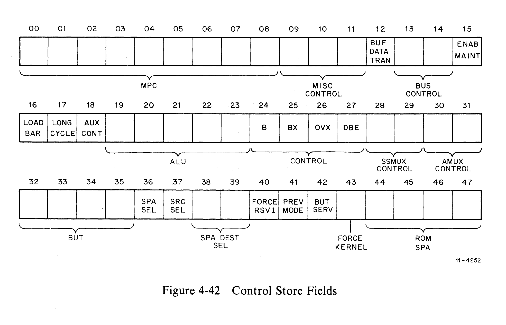
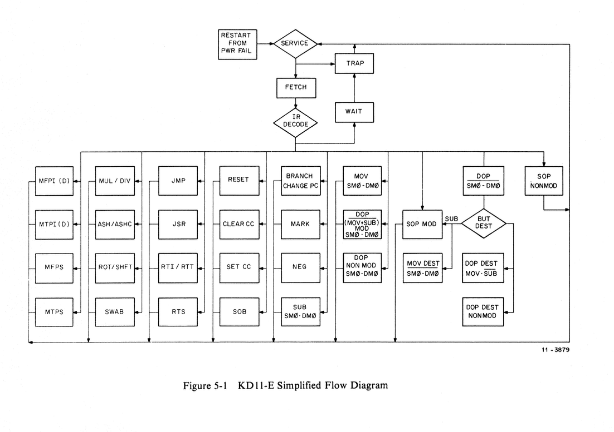

# Control Store

Source: EK-KD11E-TM-001, Chapter 4, Section 4.13, and Chapter 5

## 4.13.1 General Description

The Control Store circuit (prints K2-7 through K2-10) consists of twelve
512-word by 4-bit bipolar ROMs, eight hex D-type flip-flops, and an assortment of
multiplexers and gates. This logic operates in a fashion similar to a
microprocessor having 9 address lines and 48 data output lines with a fixed set
of ROM program routines.

Each Control Store ROM location can generate a specific set of outputs capable of
configuring the data path, determining the function performed by the
arithmetic/logic unit (ALU), influencing the DAT TRAN circuitry, or exercising
general control over the total KD11-E operation. The contents of each location
are configured in such a way that sequences of locations can be combined into
microroutines that perform the various PDP-11 instruction operations. Each ROM
location is, therefore, considered as a microinstruction or microstep.

## 4.13.2 Branching Within Microroutines

Each microinstruction in the Control Store specifies the location of the next
microstep in a sequence. After the execution of a microstep, the outputs of ROMs
E107, E108, and E109 are latched into E89 and E91 (microprogram counter latch) to
specify the location of the next microstep. Conditional branching within a
microroutine is accomplished by wire-ORing signals generated by external hardware
onto the MPC lines when directed by some other Control Store output. Typical
wire-ORed signals include the following:

- **Instruction Decode** — The microroutines contained in the Control Store are
  designed to perform efficiently the operations specified by the various PDP-11
  instructions. Specific microroutines are implemented for specific
  instructions. The main purpose of the IR Decode circuitry is to translate the
  PDP-11 instruction in the IR to a set of bits that can be wire-ORed onto the
  MPC lines upon request (IR DECODE L), developing the next control word. A
  description of the specific addresses for each instruction is included in
  Paragraph 4.5.3.

- **Trap Decode** — A routine has also been included in the Micro Store to
  implement an error routine that pushes and pops the PC and PSW onto or off the
  processor stack. Upon request of the Control Store [K2-9 BUT SERVICE (1) H],
  the MPC 00 line can be enabled by the Service ROM (E50), causing a microbranch
  to this microroutine.

- **PWR Restart** — Upon performing a power restart, the MPC is cleared by an
  Initialize signal (INIT). The power-up circuitry on print K2-3 then enables
  the MPC 00 line, forcing the Control Store to perform the power-up routine
  beginning at MPC address 001.

In general, microsteps are not executed from numerically sequential locations in
the Control Store; therefore, care should be taken in following the flows
described in Chapter 5.

## 4.13.3 Control Store Fields

Use the KD11-E flow diagrams as reference for actual control field bit patterns.

### Field Definitions

| Field                   | Bit(s) | Length | Description                                                                                                                                                                           |
| ----------------------- | ------ | ------ | ------------------------------------------------------------------------------------------------------------------------------------------------------------------------------------- |
| MPC                     | 00-08  | 9      | Nine-bit micro-PC address, which specifies the ROM location of the next microstep to be performed.                                                                                    |
| Misc Control            | 09-11  | 3      | Three multiplexed control lines (see below).                                                                                                                                          |
| BUF DAT TRAN            | 12     | 1      | Enables the data transfer circuitry (print K2-1). Indicates that the processor is performing a Unibus transfer during this microstep.                                                 |
| Bus Control             | 13-14  | 2      | Enables the Unibus control lines BUS C0 L and BUS C1 L (see below).                                                                                                                   |
| ENAB MAINT              | 15     | 1      | Enables the memory management maintenance relocation feature.                                                                                                                         |
| LOAD BAR                | 16     | 1      | Allows the Physical Bus Address register (BA on print K1-6) to be loaded during this microstep.                                                                                       |
| LONG CYCLE              | 17     | 1      | Forces the processor to perform a longer (240 ns) machine cycle during this microstep. Typically done during bus DATOs.                                                               |
| AUX CONTROL             | 18     | 1      | Enables the Auxiliary Control ROMs during operate instruction microsteps.                                                                                                             |
| ALU S3-S0, MODE, CIN    | 19-23  | 5      | Determine the operation performed by the 16-bit ALU according to Table 4-2. These lines are also wire-ORed, allowing the Auxiliary Control circuitry to determine the ALU operations. |
| B LEG 01:00             | 24-25  | 2      | Control the BMUX select lines.                                                                                                                                                        |
| B, BX, OVX, DBE Control | 26-27  | 4      | These multiplexed outputs control the operation of the B register and BX register during each microstep and detect overflow or double bus errors.                                     |
| SSMUX Control           | 28-29  | 2      | Controls the select lines of the SSMUX (see below).                                                                                                                                   |
| AMUX Control            | 30-31  | 2      | Controls the select lines of the AMUX (see below).                                                                                                                                    |
| ROM SPA                 | 32-35  | 4      | Allows the microinstructions from the Control Store to determine which scratchpad register will be addressed during the next microstep.                                               |
| FORCE KERNEL            | 36     | 1      | Forces the processor to perform this microstep in the memory management Kernel mode.                                                                                                  |
| PREVIOUS MODE           | 37     | 1      | Allows the processor to perform this microstep using the previous memory management mode [PSW (13:12)].                                                                               |
| FORCE RSV1              | 38     | 1      | Controls which source register will be selected by the scratchpad address multiplexer. If RS = even, then RSV1 = Register+1. If RS = odd, then RSV1 = same register.                  |
| BUT SERVICE             | 39     | 1      | Indicates that the processor has entered the Service microstep. Enables the Service ROM (E50), causing the processor to recognize any pending errors or interrupts.                   |
| BUT BITS                | 40-43  | 4      | Encoded control lines that select the specific microbranch condition that can occur during this microstep.                                                                            |
| SPA SRC SEL             | 44-45  | 2      | Controls the SPAM select lines during the first half of this microstep (see below).                                                                                                   |
| SPA DST SEL             | 46-47  | 2      | Controls the SPAM select lines during the second half of this microstep (see below).                                                                                                  |

### Miscellaneous Control Field (bits 09-11)

The three multiplexed control lines generate the following enable signals:

- LOAD IR L — Allows loading of the Instruction register (print K2-5).
- LOAD PSW L — Allows the PSW register to be loaded upon completion of this
  microstep (prints K1-1 through K1-4).
- LOAD CC L — Allows the condition codes N, Z, V, and C to be loaded upon
  completion of this microstep (print K1-1).
- BUT DEST L — Enables microbranch to destination operand microcode sequence
  (print K2-6).
- ENAB STOV L — Enables the stack overflow detection circuit (print K2-3).
- LOAD COUNT L — Allows the counter circuit (print K2-10) to be loaded upon
  completion of this microstep.
- CLK COUNT L — Enables the counter clock circuit (print K2-10).

### Bus Control Field (bits 13-14)

| C1 (1) H | C0 (1) H | Transfer |
| -------- | -------- | -------- |
| 0        | 0        | DATI     |
| 0        | 1        | DATIP    |
| 1        | 0        | DATO     |
| 1        | 1        | DATOB    |

### SSMUX Control Field (bits 28-29)

| SS 01 H | SS 00 H | Select        |
| ------- | ------- | ------------- |
| 0       | 0       | Straight      |
| 0       | 1       | Sign Extend   |
| 1       | 0       | Swap Bytes    |
| 1       | 1       | External Data |

### AMUX Control Field (bits 30-31)

| AMUX S1 | AMUX S0 | Data   |
| ------- | ------- | ------ |
| 0       | 0       | PSW    |
| 0       | 1       | ALU    |
| 1       | 0       | Vector |
| 1       | 1       | Unibus |

### SPA SRC SEL / SPA DST SEL Fields (bits 44-47)

| SEL1 | SEL0 | Field Select |
| ---- | ---- | ------------ |
| 0    | 0    | ROM          |
| 0    | 1    | RS           |
| 1    | 0    | RD           |
| 1    | 1    | RBA          |

---

## Chapter 5 — Microcode

### 5.1 Microprogram Flows

A complete set of microinstruction flows is shown in block diagram form in the
KD11-E print set. Figure 5-1 is a simplified version that provides an overview
and aids in using the detailed flows.

### 5.2 Flow Notation Glossary

| Designation | Definition                                                                                                                                                                                                                                                     |
| ----------- | -------------------------------------------------------------------------------------------------------------------------------------------------------------------------------------------------------------------------------------------------------------- |
| BA          | Unibus Bus Address lines                                                                                                                                                                                                                                       |
| -           | Minus the operator                                                                                                                                                                                                                                             |
| .           | Separator                                                                                                                                                                                                                                                      |
| DATI        | Initiate DATI operation on Unibus                                                                                                                                                                                                                              |
| +           | Plus the arithmetic operator                                                                                                                                                                                                                                   |
| PC          | Program Counter = scratchpad register 7 (R7)                                                                                                                                                                                                                   |
| B           | B register                                                                                                                                                                                                                                                     |
| IR          | Instruction register                                                                                                                                                                                                                                           |
| BX          | BX register                                                                                                                                                                                                                                                    |
| RS          | Scratchpad register specified by the source portion of the current instruction [IR (08:06)]                                                                                                                                                                    |
| RD          | Scratchpad register specified by the destination portion of the current instruction [IR (02:00)]                                                                                                                                                               |
| RN          | Scratchpad register n specified by the Control Store ROM SPA lines                                                                                                                                                                                             |
| ENAB STOV   | Enable the stack overflow detection logic                                                                                                                                                                                                                      |
| ENAB DBE    | Enable the double bus error detection logic                                                                                                                                                                                                                    |
| DATO        | Initiate DATO operation on Unibus                                                                                                                                                                                                                              |
| DATIP       | Initiate DATIP operation on Unibus                                                                                                                                                                                                                             |
| Rn OP B     | ALU function determined by the auxiliary ALU control logic as a function of the instruction currently in the Instruction register                                                                                                                              |
| BUT         | Branch on microtest                                                                                                                                                                                                                                            |
| LOAD CC     | Set condition codes (N, Z, V and C) according to the result of operation being performed by the ALU                                                                                                                                                            |
| UDATA       | Data being received from the Unibus data lines BUS D00 L through BUS D15 L                                                                                                                                                                                     |
| RSV1        | Source register specified by source portion of current instruction [IR (08:06)] ORed with a logical 1. Example: If RS is even, RSV1 would be the next highest register (RS=4, RSV1=5); if, however, RS is odd, RSV1 would be the same register (RS=5, RSV1=5). |
| <-          | Assignment operator                                                                                                                                                                                                                                            |
| MAINT       | Indicates that the memory management Maintenance feature is enabled                                                                                                                                                                                            |
| Previous    | Indicates that this microstep is using the previous memory management mode                                                                                                                                                                                     |
