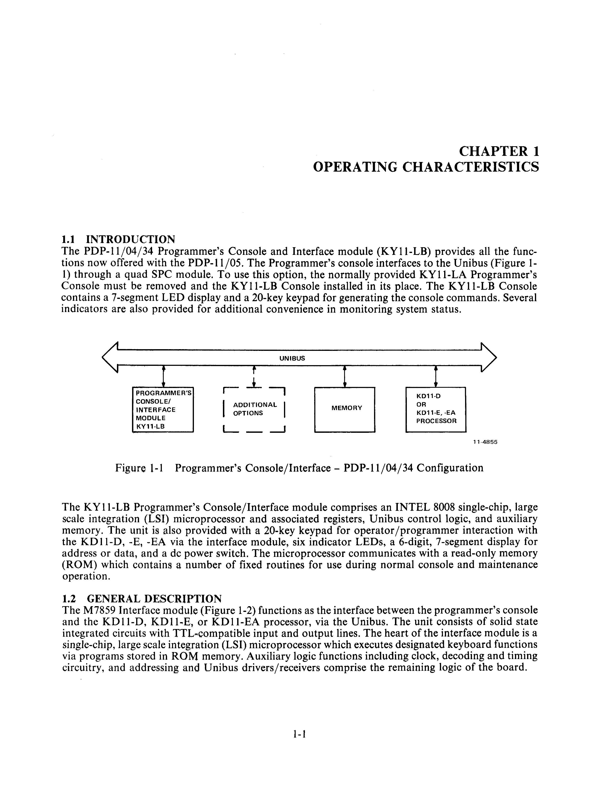
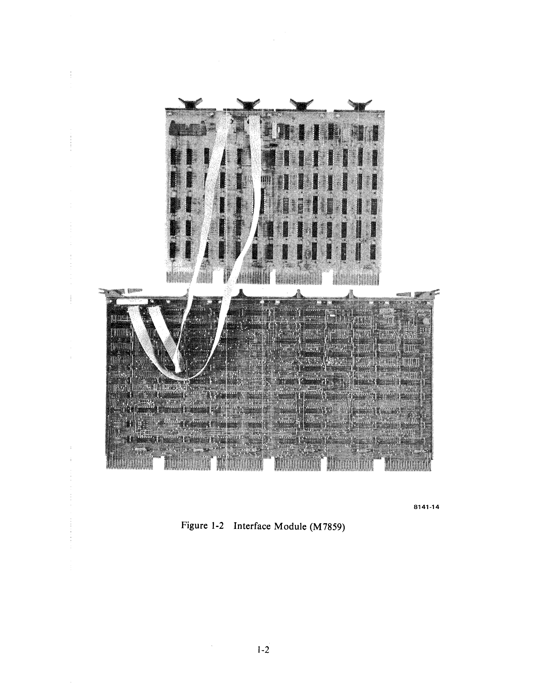

# Chapter 1 -- Operating Characteristics

## 1.1 Introduction

The PDP-11/04/34 Programmer's Console and Interface module (KY11-LB) provides all the functions now offered with the PDP-11/05. The Programmer's console interfaces to the Unibus (Figure 1-1) through a quad SPC module. To use this option, the normally provided KY11-LA Programmer's Console must be removed and the KY11-LB Console installed in its place. The KY11-LB Console contains a 7-segment LED display and a 20-key keypad for generating the console commands. Several indicators are also provided for additional convenience in monitoring system status.

The KY11-LB Programmer's Console/Interface module comprises an INTEL 8008 single-chip, large scale integration (LSI) microprocessor and associated registers, Unibus control logic, and auxiliary memory. The unit is also provided with a 20-key keypad for operator/programmer interaction with the KD11-D, -E, -EA via the interface module, six indicator LEDs, a 6-digit, 7-segment display for address or data, and a dc power switch. The microprocessor communicates with a read-only memory (ROM) which contains a number of fixed routines for use during normal console and maintenance operation.

## 1.2 General Description

The M7859 Interface module (Figure 1-2) functions as the interface between the programmer's console and the KD11-D, KD11-E, or KD11-EA processor, via the Unibus. The unit consists of solid state integrated circuits with TTL-compatible input and output lines. The heart of the interface module is a single-chip, large scale integration (LSI) microprocessor which executes designated keyboard functions via programs stored in ROM memory. Auxiliary logic functions including clock, decoding and timing circuitry, and addressing and Unibus drivers/receivers comprise the remaining logic of the board.

The microprocessor chip is an 8-bit, parallel control element packaged as a single metal oxide silicon circuit in an 18-pin, dual in-line package. With the addition of external clock driving circuitry and decoding elements, plus memory and data bus control, the unit is capable of performing as a powerful, general-purpose, central processing unit. Internal logic of the microprocessor chip is structured around an 8-bit internal data bus and includes instruction decoding, memory control, accumulator and scratchpad memory, arithmetic and logical capability, program stack, and condition code indicators. Data transfer between the microprocessor chip and the remaining logic functions of the interface module is accomplished through an 8-bit, bidirectional data port which is an integral part of the microprocessor. An internal stack (scratchpad memory) contains a 14-bit program counter (PC) and an additional complement of seven 14-bit registers for nesting up to seven levels of subroutines. The 14-bit addressing capacity allows the microprocessor to access up to 16K memory locations which may comprise any mix of ROM or RAM.

## 1.3 Functional Description

The KY11-LB Programmer's Console permits the implementation of a variety of functions through a 20-key keypad located on the front panel of the programmer's console. Keypad functions are divided into two distinct modes: console mode and maintenance mode. In console mode operation, a number of facilities exist for displaying addresses and data, for depositing data in and examining the content of Unibus addresses including processor registers for entering data into a temporary buffer for use as address or data, and for single instruction stepping the processor. The latter feature is especially useful during program debugging functions.

Normal console keyboard functions are not available during maintenance mode. This mode permits sampling and display of the Unibus address lines and Unibus data lines, and may allow the console to take control of the Unibus to examine and deposit Unibus addresses if a processor is not present in the system or is malfunctioning. Additionally, the maintenance function permits assertion of the manual clock enable and display of the current processor microprogram counter (MPC). Single-clock cycling of the MPC is also possible to facilitate step by step checkout of processor op codes and control logic during maintenance functions. In conjunction with this function, assertion of manual clock enable permits the processor to be stepped through its power-up routine. The manual clock enable may be dropped via the START key at any time with a resulting display of the current MPC. Exit from maintenance mode to console mode may be accomplished at any time by depressing the CLR key on the keypad.

## 1.4 Specifications

### 1.4.1 M7859 Interface Module Performance Specifications

| Parameter | Value |
|---|---|
| **Operating Speed** | 500 kHz |
| Two-Phase Clock Period | 2 µs |
| Time State (SYNC) | 4 µs |
| Instruction Time (Microprocessor) | 12-44 µs |
| **Word Size** | |
| Data | 8-bit word |
| Instruction | 1, 2, or 3 8-bit words |
| Address | 14 bits |
| **Memory Size** | |
| ROM | 4 × 512 × 4 organized as 1024 8-bit words |
| RAM | 16 words by 8 bits |
| **Input/Output Lines** | |
| Memory Data | 16 bits |
| Address | 18 bits |
| Control (Address) | 2 bits |
| Unibus Control | 5 bits |
| **Microprocessor Instruction Repertoire** | |
| Basic Instructions | 48 |
| Instruction Categories | Register Operation, Accumulator, PC and Stack Control, I/O, Machine |

### 1.4.2 Electrical Specifications

| Parameter | Value |
|---|---|
| **Power Supply** | +5 V at 3.0 A, -15 V at 60 mA |
| **Input Logic Levels (all modules)** | |
| TTL Logic Low | 0.0 to 0.8 Vdc |
| TTL Logic High | 2.0 to 3.6 Vdc |
| **Output Logic Levels (all modules)** | |
| TTL Logic Low | 0.0 to 0.4 Vdc |
| TTL Logic High | 2.4 to 3.6 Vdc |
| **Power Consumption** | |
| Interface Module | 14 W |
| Monitor/Control Panel | 1 W |

### 1.4.3 Mechanical Specifications

| Parameter | Value |
|---|---|
| **M7859 Interface Module** | |
| Board Type | Quad SPC |
| Height | 21.44 cm (8.44 in) |
| Length | 26.08 cm (10.44 in) |
| **Programmer's Console (Overall Panel Dimensions)** | |
| Width | 47.63 cm (18.75 in) |
| Height | 13.02 cm (5.125 in) |
| Depth | 6.76 cm (2.66 in) |

### 1.4.4 Environmental Specifications

| Parameter | Value |
|---|---|
| Ambient Operating Temperature | 5° to 50° C (41° to 122° F) |
| Humidity | 10% to 95% maximum, wet bulb 32° C (90° F) |
