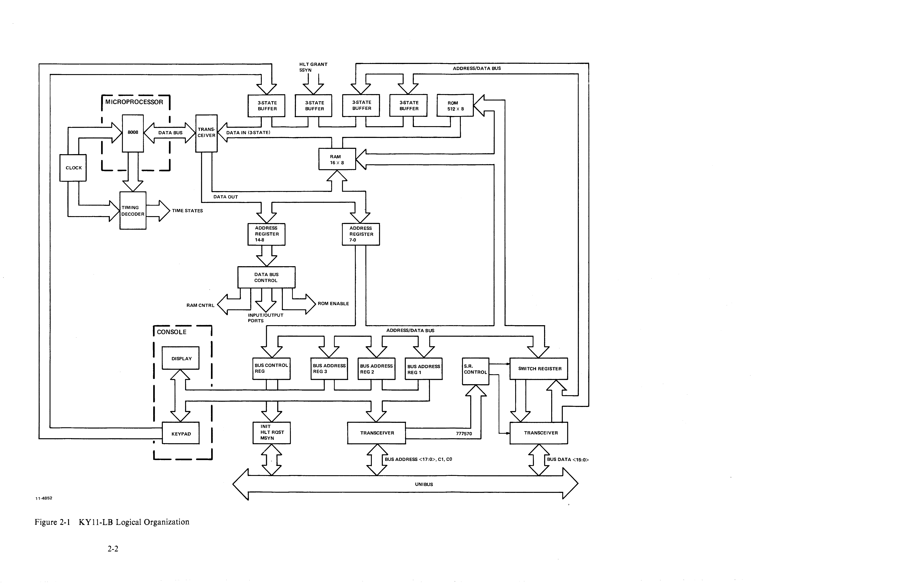
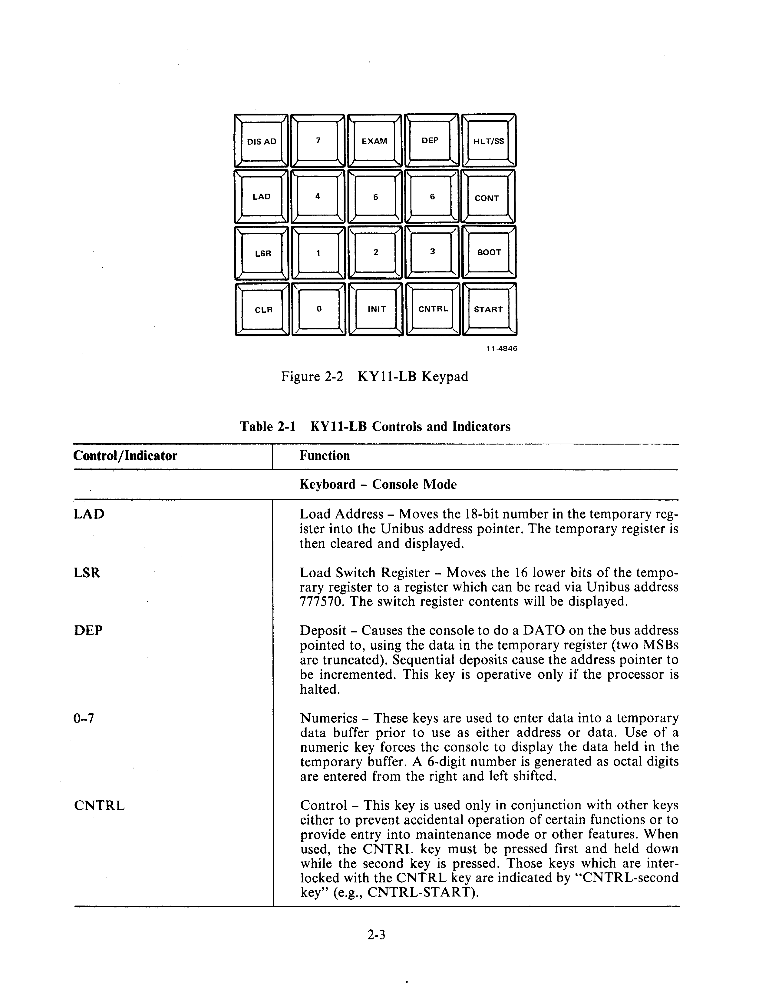
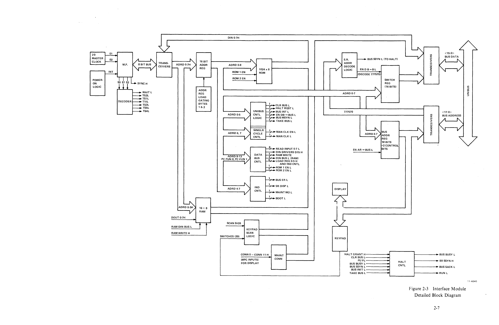

# Chapter 2 -- Functional Description

## 2.1 Introduction

The KY11-LB Programmer's Console/Interface module operates in two modes: console mode and maintenance mode. In console mode, which is the normal operational mode, a variety of facilities are available for examining and depositing into bus addresses, controlling processor execution, and managing the switch register. In maintenance mode, additional capabilities are provided for hardware troubleshooting and processor microprogram stepping.

## 2.2 Programmer's Console Keypad Functions/Controls and Indicators

### 2.2.1 Console Mode

**Table 2-1 KY11-LB Controls and Indicators**

#### Keyboard -- Console Mode

| Control/Indicator | Function |
|---|---|
| **LAD** | **Load Address** -- Moves the 18-bit number in the temporary register into the Unibus address pointer. The temporary register is then cleared and displayed. |
| **LSR** | **Load Switch Register** -- Moves the 16 lower bits of the temporary register to a register which can be read via Unibus address 777570. The switch register contents will be displayed. |
| **DEP** | **Deposit** -- Causes the console to do a DATO on the bus address pointed to, using the data in the temporary register (two MSBs are truncated). Sequential deposits cause the address pointer to be incremented. This key is operative only if the processor is halted. |
| **Numerics (0-7)** | These keys are used to enter data into a temporary data buffer prior to use as either address or data. Use of a numeric key forces the console to display the data held in the temporary buffer. A 6-digit number is generated as octal digits are entered from the right and left shifted. |
| **CNTRL** | **Control** -- This key is used only in conjunction with other keys either to prevent accidental operation of certain functions or to provide entry into maintenance mode or other features. When used, the CNTRL key must be pressed first and held down while the second key is pressed. Those keys which are interlocked with the CNTRL key are indicated by "CNTRL-second key" (e.g., CNTRL-START). |
| **CNTRL-INIT** | **Initialize** -- Operative only if the processor is halted. Causes BUS INIT L to be generated for 150 ms. |
| **DIS AD** | **Display Address** -- This key causes the current Unibus address pointer to be displayed. The next examine or deposit will occur at the address displayed. |
| **EXAM** | **Examine** -- Causes the console to do a DATI on the bus address pointed to and stores the data in the temporary register which is then displayed. Sequential examines cause the address pointer to be incremented by 2 or by 1 if the address is in the range 777700-777717. This key is operative only if the processor is halted. |
| **CLR** | **Clear Entry** -- Clears the current contents of the temporary register which is then displayed. |
| **CNTRL-BOOT** | Causes M9301 bootstrap terminator to be activated if present in the system. Console will boot only if the processor is halted. |
| **CNTRL-HALT/SS** | **Halt/Single Step** -- Halts the processor if the processor is running. If the processor is already halted it will single-instruction step the processor. It also retrieves and displays the contents of R7 (program counter). The CNTRL key is not required to single-instruction step the machine. |
| **CNTRL-CONT** | **Continue** -- Allows processor to continue using its current program counter from a halted state. The contents of the switch register are displayed. |
| **CNTRL-START** | Operative only if halted, this causes the program counter (R7) to be loaded with the contents of the Unibus address pointer. BUS INIT L is then generated and the processor is allowed to run. Switch register contents are then displayed. |
| **CNTRL-7** | Causes the Unibus address pointer to be added to the temporary data buffer which is also incremented by 2. This allows the console to calculate the correct offset address when mode 6 or 7, register 7 PIC (Position Independent Code) instructions are encountered. |
| **CNTRL-6** | This causes the switch register to be added to the temporary data buffer. This is useful when mode 6 or 7 instructions are encountered not using R7. |
| **CNTRL-1** | **Maintenance Mode** -- This combination puts the console into maintenance mode with certain maintenance features available. When the console is in maintenance mode, the normal console mode keypad functions are not available. The CLR key causes the console to exit from maintenance mode into console mode via a processor halt. |

### 2.2.2 Maintenance Mode

#### Keyboard -- Maintenance Mode

> **NOTE:** In maintenance mode the keypad functions are redefined with the following definitions.

| Control/Indicator | Function |
|---|---|
| **DIS AD** | Causes the Unibus address lines to be sampled and displayed. |
| **CLR** | Returns the console to console mode via a console halt. |
| **EXAM** | Causes the console to sample the Unibus data lines and display the data. |
| **5** | Causes the console to take control of the Unibus. Should be used only when a processor is not present in the system. |
| **HLT/SS** | Asserts manual clock enable and displays the current microprogram counter (MPC). |
| **CONT** | Asserts manual clock enable, generates a manual clock pulse, and displays the current MPC. |
| **BOOT** | Boots the M9301. If manual clock enable is asserted, this will allow the processor to be stepped through the power-up routine. |
| **START** | Drops manual clock enable and displays the current MPC. |

#### Indicator LEDs -- Any Mode

| Indicator | Function |
|---|---|
| **DC ON** | All dc power (+5 V) to logic is on. |
| **BATT** | Battery monitor indicator, operative only in machines having the battery back-up option. This indicator has four states: **Off** -- Indicates either no battery present or battery failure if a battery is present. **On (continuous)** -- Indicates that a battery is present and charged. **Flashing (slow)** -- Indicates ac power is ok and battery is charging. **Flashing (fast)** -- Indicates loss of ac power and that battery is discharging while maintaining MOS memory contents. |
| **RUN** | Indicates the state of the processor, either running or halted. |
| **SR DISP** | Indicates that the content of the switch register is being displayed. |
| **MAINT** | Indicates that console is in maintenance mode. |
| **BUS ERR** | Indicates that an examine or deposit resulted in a SSYN timeout or that HALT REQUEST failed to receive a HALT GRANT. |

#### DC Power Switch

| Position | Function |
|---|---|
| **DC OFF** | All dc power to logic is off. |
| **DC ON** | All dc power to logic is on. |
| **STNBY** | DC power is provided to MOS memory only.* |

\* Available in all BA11-C machines. Available in BA11-K boxes which have Battery Backup Option only.

Table 2-1 refers to certain registers which are located in the scratchpad RAM. These include the following:

1. Display Data
2. Keypad Image
3. Temporary Data Buffer
4. Unibus Address Pointer
5. Switch Register Image
6. EXAM, DEP, ENB and C1 flags

Detailed discussion of the scratchpad RAM and its registers is set forth in Chapter 5.

## 2.3 Hardware Organization

A detailed block diagram of the interface module showing data flow and control is indicated in Figure 2-3. The control functions shown include those for the Unibus interface and the internal data bus with the microprocessor. The latter controls include those for reading from and writing into the RAM, enabling ROMs 1 and 2, and reading the Unibus temporary buffer register or loading the bus address and switch registers. All of these functions occur on appropriate control from the stored program and keypad.

**Decoder for Timing States** -- The decoder element receives the state outputs SO, S1, and S2 from the microprocessor and generates the time states for the operation of the interface module. A sync pulse corresponding to two phase clock periods (1 time state) is also provided by the microprocessor.

**Power-up Logic** -- This circuitry activates the microprocessor, clearing its various registers and generating a clear line to all the registers of the interface module. There are separate clears for the address register and all other registers.

**Address Register** -- This 16-bit register is the principal buffer between the microprocessor and the remainder of the logic of the interface module. Although designated as an address register, the element also handles control data for the Unibus, data bus, and other control functions and outputs to the bus address and switch registers. One of its major functions is to receive the microprocessor program counter contents for fetching new instructions from the ROM or RAM.

**RAM** -- The 16-word by 8-bit RAM gives the interface module a scratchpad memory which may be read or whose contents may be modified under program control.

**ROM** -- The ROM, consisting of four 512 × 4-bit ROMs, makes a total of 1024 8-bit bytes available for the stored programs which execute the console functions.

**Switch Register Address Decoding** -- This logic decodes 777570, an 18-bit address defining the switch register and a DATI on the Unibus to cause the switch register to be enabled onto the Unibus.

**Switch Register** -- This 16-bit buffer register handles the data word to the Unibus.

**Bus Address Register** -- This 20-bit register buffers address information between the interface module and the Unibus. Eighteen bits are allocated for the actual address, and two control bits indicate the direction of data flow. Scan signals for the keypad and NUM lines for the display logic are specified by this register.

**Tristate Gates** -- These units are used to gate buffered Unibus data (16 bits) and Unibus address (18 bits) lines onto the tristate data bus by asserting an appropriate read input line. Keypad outputs and those maintenance lines provided for display of the processor microprogram counter are similarly buffered and gated. The outputs are all wire ORed onto the internal data bus and applied as input to the tristate transceivers.

**Keypad Scan and Display Logic** -- This circuitry develops read and drive signals for the keypad and LED display respectively. Five read signals developed from the scan signals are used to scan the keypad switch closures in groups of four. The drive signals are applied to the LED displays whose values are determined by the 3-bit NUM input.

**Data Bus Control** -- This circuitry performs all internal interface module control functions including RAM control, ROM enable, and selection of input/output ports. The logic also determines system operation during instruction, data fetch, or data out (TS3) via a 32 × 8-bit ROM.

**Unibus Control** -- The Unibus control register supervises data transfers between the interface module and the Unibus. According to the input bit patterns to the register, data transfer from the interface module to the Unibus, halt request, bus master sync, and other functions may be generated as required for proper interfacing of the two elements. Two other signals generated in the Unibus control register permit single stepping of the processor clock.

**Indicator Logic** -- This 4-bit register drives appropriate console indicators to show certain console states or errors. An indicator is turned on to show the existence of a bus error, when the switch register is being displayed or when in maintenance mode.

**Halt Logic** -- This circuitry halts the processor under various conditions and performs handshaking functions when the console takes complete control of the bus. When a HALT from the console is detected by the processor, the processor recognizes it as an interrupt request. The processor then inhibits its clock and returns a recognition signal to the console causing the console to assert an acknowledge. The console now has complete control of the Unibus and processor and may maintain this condition, with the processor halted, as long as desired.

## 2.4 Microprocessor Instruction Set

The interface module microprocessor has a repertoire of 48 basic instructions. According to the instruction type, these may range from 1 to 3 bytes (8 to 24 bits) in length. The successive bytes of a given instruction must be located in sequential memory locations. Instructions fall into one of five categories:

1. Index Register
2. Accumulator (Arithmetic/Logical)
3. Program Counter and Stack Control
4. Input/Output
5. Machine

A description of the microprocessor instructions and the number of time states required for their execution is given in Chapter 4.
