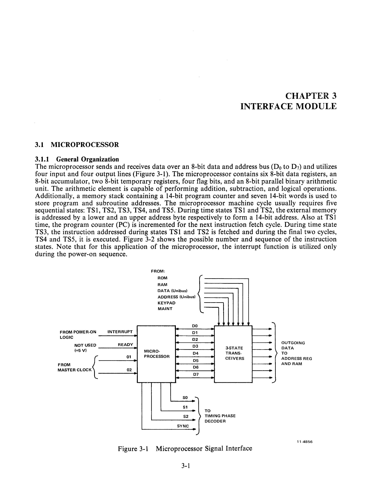
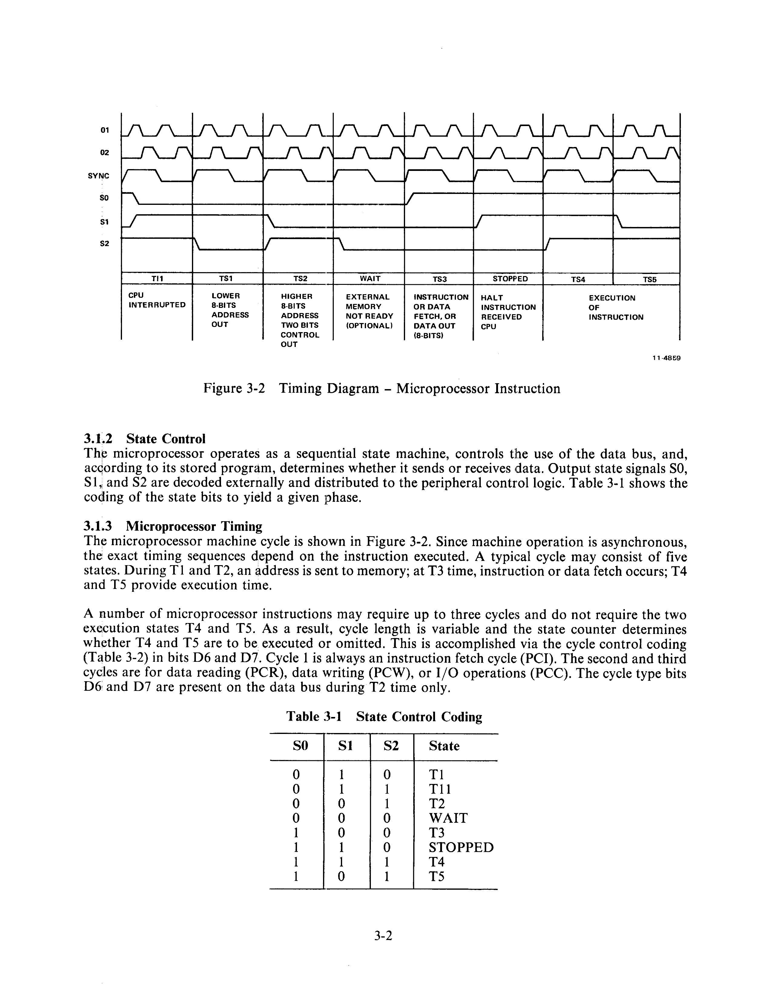
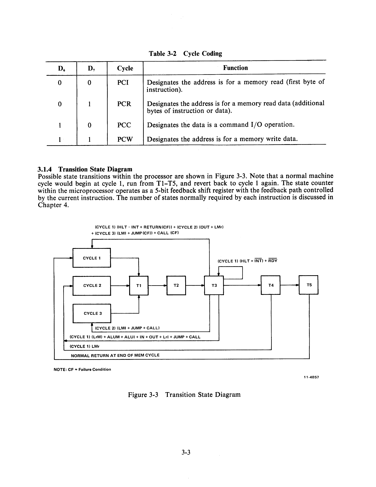

# Chapter 3 -- Interface Module

## 3.1 Microprocessor

### 3.1.1 General Organization

The microprocessor sends and receives data over an 8-bit data and address bus (D0 to D7) and utilizes four input and four output lines (Figure 3-1). The microprocessor contains six 8-bit data registers, an 8-bit accumulator, two 8-bit temporary registers, four flag bits, and an 8-bit parallel binary arithmetic unit. The arithmetic element is capable of performing addition, subtraction, and logical operations. Additionally, a memory stack containing a 14-bit program counter and seven 14-bit words is used to store program and subroutine addresses. The microprocessor machine cycle usually requires five sequential states: TS1, TS2, TS3, TS4, and TS5. During time states TS1 and TS2, the external memory is addressed by a lower and an upper address byte respectively to form a 14-bit address. Also at TS1 time, the program counter (PC) is incremented for the next instruction fetch cycle. During time state TS3, the instruction addressed during states TS1 and TS2 is fetched and during the final two cycles, TS4 and TS5, it is executed. Figure 3-2 shows the possible number and sequence of the instruction states. Note that for this application of the microprocessor, the interrupt function is utilized only during the power-on sequence.

### 3.1.2 State Control

The microprocessor operates as a sequential state machine, controls the use of the data bus, and, according to its stored program, determines whether it sends or receives data. Output state signals SO, S1, and S2 are decoded externally and distributed to the peripheral control logic. Table 3-1 shows the coding of the state bits to yield a given phase.

**Table 3-1 State Control Coding**

| SO | S1 | S2 | State |
|---|---|---|---|
| 0 | 0 | 0 | T1 |
| 0 | 0 | 1 | T1I |
| 0 | 1 | 0 | T2 |
| 0 | 1 | 1 | WAIT |
| 1 | 0 | 0 | T3 |
| 1 | 0 | 1 | STOPPED |
| 1 | 1 | 0 | T4 |
| 1 | 1 | 1 | T5 |

### 3.1.3 Microprocessor Timing

The microprocessor machine cycle is shown in Figure 3-2. Since machine operation is asynchronous, the exact timing sequences depend on the instruction executed. A typical cycle may consist of five states. During T1 and T2, an address is sent to memory; at T3 time, instruction or data fetch occurs; T4 and T5 provide execution time.

A number of microprocessor instructions may require up to three cycles and do not require the two execution states T4 and T5. As a result, cycle length is variable and the state counter determines whether T4 and T5 are to be executed or omitted. This is accomplished via the cycle control coding (Table 3-2) in bits D6 and D7. Cycle 1 is always an instruction fetch cycle (PCI). The second and third cycles are for data reading (PCR), data writing (PCW), or I/O operations (PCC). The cycle type bits D6 and D7 are present on the data bus during T2 time only.

**Table 3-2 Cycle Coding**

| D7 | D6 | Cycle | Function |
|---|---|---|---|
| 0 | 0 | PCI | Designates the address is for a memory read (first byte of instruction). |
| 0 | 1 | PCR | Designates the address is for a memory read data (additional bytes of instruction or data). |
| 1 | 0 | PCC | Designates the data is a command I/O operation. |
| 1 | 1 | PCW | Designates the address is for a memory write data. |

### 3.1.4 Transition State Diagram

Possible state transitions within the processor are shown in Figure 3-3. Note that a normal machine cycle would begin at cycle 1, run from T1-T5, and revert back to cycle 1 again. The state counter within the microprocessor operates as a 5-bit feedback shift register with the feedback path controlled by the current instruction. The number of states normally required by each instruction is discussed in Chapter 4.

### 3.1.5 System Start-Up

The microprocessor of the interface module is running any time power is applied to the system. When power (VDD) and clocks (Φ1, Φ2) are first turned on, a flip-flop internal to the microprocessor is set by sensing the rise of VDD. This internal signal forces a HALT (00000000) into the instruction register and the microprocessor is then in the stopped state. The next 16 clock periods are required to clear internal chip memories and other external logic and registers. Upon clearing the registers the system is ready for operation. If for any reason during operation, the microprocessor decodes a HALT, the system reverts to the beginning of the program after 16 clock periods.

## 3.2 Interface Module Registers and Controls (Figure 2-1)

### 3.2.1 Address Register

This is the principal buffer register between the microprocessor and the rest of the interface module logic. It has a capacity of 16 bits (two 8-bit bytes). The low order byte is loaded by time state TS1 and the high order byte by time state TS2 during each cycle.

### 3.2.2 Bus Address Register

The bus address register buffers address data between the interface module and the Unibus. Address information may be loaded into this register at time state TS3.

### 3.2.3 Switch Register

Similar to the bus address register, the switch register buffers outgoing data. This element may also be loaded at TS3.

### 3.2.4 Data Bus Control

The principal function of the data bus control is to determine interface module operation during TS3 time. It determines, through input bit coding, the type of function to be performed (i.e., RAM control, ROM enable) or programs any of its other I/O in accordance with the stored program.

### 3.2.5 Unibus Control

This register is also loaded at TS3 and is selected by the data bus control for activation at that time. According to its input coding, U.C.R. may issue a HALT request, BUS INIT, enable-data bus-to-bus, or generate a bus master sync in addition to other functions.
