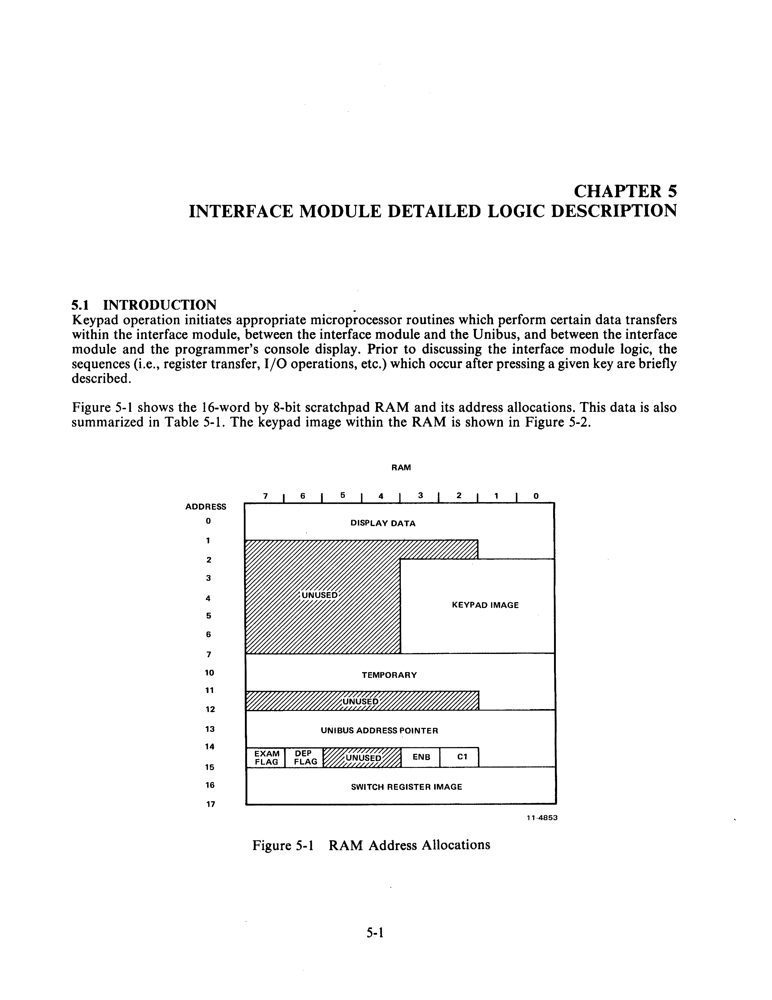
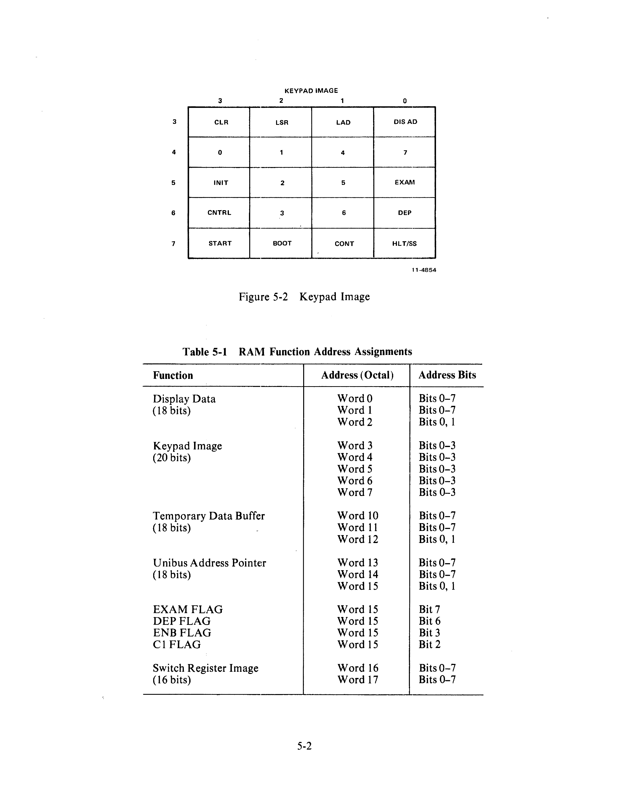

# Chapter 5 -- Interface Module Detailed Logic Description

## 5.1 Introduction

Keypad operation initiates appropriate microprocessor routines which perform certain data transfers within the interface module, between the interface module and the Unibus, and between the interface module and the programmer's console display. Prior to discussing the interface module logic, the sequences (i.e., register transfer, I/O operations, etc.) which occur after pressing a given key are briefly described.

Figure 5-1 shows the 16-word by 8-bit scratchpad RAM and its address allocations. This data is also summarized in Table 5-1. The keypad image within the RAM is shown in Figure 5-2.

**Table 5-1 RAM Function Address Assignments**

| Function | Address (Octal) | Address Bits |
|---|---|---|
| Display Data (18 bits) | Word 0 | Bits 0-7 |
| | Word 1 | Bits 0-7 |
| | Word 2 | Bits 0, 1 |
| Keypad Image (20 bits) | Word 3 | Bits 0-3 |
| | Word 4 | Bits 0-3 |
| | Word 5 | Bits 0-3 |
| | Word 6 | Bits 0-3 |
| | Word 7 | Bits 0-3 |
| Temporary Data Buffer (18 bits) | Word 10 | Bits 0-7 |
| | Word 11 | Bits 0-7 |
| | Word 12 | Bits 0, 1 |
| Unibus Address Pointer (18 bits) | Word 13 | Bits 0-7 |
| | Word 14 | Bits 0-7 |
| | Word 15 | Bits 0, 1 |
| EXAM FLAG | Word 15 | Bit 7 |
| DEP FLAG | Word 15 | Bit 6 |
| ENB FLAG | Word 15 | Bit 3 |
| C1 FLAG | Word 15 | Bit 2 |
| Switch Register Image (16 bits) | Word 16 | Bits 0-7 |
| | Word 17 | Bits 0-7 |

## 5.2 Programmer's Console Keypad Function Sequences

### 5.2.1 Console Mode Key Functions

**NUMERICS (0-7)**
1. Value of Key → (left shifted) Temporary Data Buffer
2. Temporary → Display
3. Clear indicators.

**LAD**
1. Temporary → Unibus Address Pointer
2. Zero → Temporary
3. Temporary → Display
4. Clear indicators.

**LSR**
1. Temporary → Switch Register Image
2. Switch Register Image → Switch Register
3. SR DISP indicator is set.

**CLR**
1. Zero → Temporary
2. Temporary → Display
3. Clear indicators.

**EXAM**
1. Pre-increment Unibus address pointer if the EXAM flag is set.
2. Unibus Address Pointer → Bus Address Register
3. Bus Address Register → Unibus Address
4. Assert MSYN.

> **NOTE:** Console waits for BUS SSYN to be returned. If SSYN does not occur within 20 µs, the transfer is aborted and the BUS ERR indicator is set.

5. Unibus Data → Temporary
6. Temporary → Display
7. Set EXAM flag.

**DEP**
1. Pre-increment Unibus address pointer if the DEP flag is set.
2. Unibus Address Pointer → Bus Address Register with C1 = 1.
3. Bus Address Register → Unibus Address
4. Temporary → Switch Register
5. Switch Register → Unibus Data
6. Assert MSYN.

> **NOTE:** Console waits for BUS SSYN to be returned. If SSYN does not occur within 20 µs, the transfer is aborted and the BUS ERR indicator is set.

7. Set DEP flag.
8. Switch Register Image → Switch Register

**DIS AD**
1. Unibus Address Pointer → Display
2. Clear EXAM or DEP flag if set.

**CNTRL-INIT**
1. Set BUS INIT and HALT REQUEST for 150 ms.

**CNTRL-HLT/SS**
1. Clears BUS SACK/BUS BUSY if set and sets HALT REQUEST
2. When HALT BUSY is active, sets 777707 → Bus Address Register
3. Bus Address Register → Unibus Address
4. Assert MSYN

> **NOTE:** Console waits for BUS SSYN to be returned. If SSYN does not occur within 20 µs, the transfer is aborted and the BUS ERR indicator is set.

5. Unibus Data → Temporary
6. Temporary → Display

**CNTRL-CONT**
1. Clears BUS SACK and BUS BUSY.
2. Switch Register Image → Display
3. Set SR DISP indicator.

**CNTRL-BOOT**
1. Sets and clears BOOT signal
2. Switch Register Image → Display
3. Set SR DISP indicator.

**CNTRL-START**
1. 777707 → Bus Address Register with C1 = 1
2. Bus Address Register → Unibus Address
3. Unibus Address Pointer → Switch Register
4. Switch Register → Unibus Data
5. Assert MSYN.

> **NOTE:** Console waits for BUS SSYN to be returned. If SSYN does not occur within 20 µs, the transfer is aborted and the BUS ERR indicator is set.

6. Switch Register Image → Switch Register
7. Assert BUS INIT for 150 ms.
8. Switch Register Image → Display
9. Set SR DISP indicator.

**CNTRL-7**
1. Unibus Address Pointer + Temporary + 2 → Temporary

**CNTRL-6**
1. Temporary + Switch Register Image → Temporary

**CNTRL-1**
1. Set maintenance indicator.
2. MPC Lines (sampled) → Display

### 5.2.2 Maintenance Mode Key Functions

**CLR**
1. Clears indicators.
2. Clears manual clock enable, if set.
3. Goes to halt condition.

**DIS AD**
1. Unibus Address (sampled) → Display

**EXAM**
1. Unibus Data (sampled) → Display

**HLT/SS**
1. Sets manual clock enable.
2. Clears BUS SACK and BUS BUSY.
3. MPC (sampled) → Display

**CONT**
1. Sets and clears manual clock
2. MPC (sampled) → Display

**BOOT**
1. Sets and clears BOOT signal.

**START**
1. Clears manual clock enable, if set.
2. MPC (sampled) → Display

**5**
1. Sets TAKE BUS signal, forcing console to assert BUS BUSY.

## 5.3 Detailed Logic Description

### 5.3.1 Clock Circuitry

The M7859 Interface board is driven by an MC 4024 (E42) 1-MHz clock (drawing CS M7859-0-1, sheet 2). The 1-MHz output at E42-8 is toggled down to two nonoverlapping 500-kHz pulses at E12-5, 6, and E30, and these pulses are applied to the microprocessor (E18) input as Φ1 and Φ2. The Φ2 clock, designated as KY1 CK2 H and KY1 CK2 L, is also used as a control pulse to clear system registers and together with the sync pulse to define the end of a timing cycle.

### 5.3.2 Power-Up Logic/Interrupt (Drawing CS M7859, Sheet 2)

The power-up logic/interrupt circuitry is comprised of E1-6, E40-10, E1-4, E36, E12, E29-1, E6, and E26. These elements sense when the system turns on, generate the interrupt to the microprocessor needed to start it, and clear registers to force program startup at location 0.

BUS DC LO at E1-3 initiates the function by clearing E36 which is configured as an 8-bit counter and generates KY1 PUP 1 L. This signal is routed to the Unibus control, indicator control, switch register, and bus address register as a master clear line. The address register is provided with its own clear line, KY1 ADR CLR L.

BUS DC LO L puts the microprocessor in the STOP state. The counter starts counting in the STOP state (E6, E36). KY1 STOP L and KY1 C2 L at E29-1 clock E6. E6 is a divide by two on the clock, while E36 counts from 0-7. Sixteen clock periods are thus counted. At the transition of E36 from 7 to 0, the interrupt is generated at E12-8 and the microprocessor goes into the T1I state (Interrupt). KY1 T1I L and KY1 CK2 L then reset E12 and clear the address register via E6-6 and the system is initialized.

### 5.3.3 Microprocessor (Drawing CS M7859, Sheet 2)

The 8008 Microprocessor Chip (E18) was discussed in detail in Chapter 3. According to drawing CS M7859, sheet 2, the unit communicates over an 8-bit bidirectional data bus via 8833 tristate transceivers E16 and E17, with the satellite logic of the interface module. A single interrupt line is received from the power-up logic to initiate microprocessor operations. Driven by a 2-phase, 500-kHz clock, the element yields a 3-bit state output code, SO, S1, and S2, plus a sync pulse, to drive a 7442 Timing Phase Decoder. The latter element provides eight separate timing cycles for the sequencing of interface module data transfers and other discrete operations.

### 5.3.4 Timing State Decoder

The timing state decoder (E23) receives the state outputs SO, S1, and S2 from the microprocessor and generates the timing states for the interface modules (drawing CS M7859, sheet 2). This unit is a 7442 4-line to 10-line decoder, with two unused outputs, that yields an 8-output sequence according to its 3-input state code. State control coding is presented in Chapter 3. State control inputs are determined in the microprocessor and depend on an internal 5-bit feedback shift register with the feedback path controlled by the instruction being executed.

### 5.3.5 Address Register (Drawing CS M7859, Sheet 2)

The address register, the principal buffer between the microprocessor and the remainder of the interface module logic, consists of four 74175 quad, D-type, double rail output latches. The low order bits are handled by E5 and E4 which generate KY1 ADRD 0 L through KY1 ADRD 3 L (E5) and their complements (for RAM addressing), and KY1 ADRD 4H through KY1 ADRD 7 H (E4), respectively. This 8-bit byte is the low order unit of the address or data with E10 and E28 containing the high order information ADRD 08-13 and PC FUN 1 and 0.

The data contained in the address register is routed to the following locations according to direction by the stored program:

1. ROM (address of next instruction: KY1 ADRD 0 L -- KY1 ADRD 8 L plus ROM 1 EN L or ROM 2 EN L)
2. RAM (address of data to be read or written: KY1 ADRD 0 L -- KY1 ADRD 3 L)
3. Unibus Control (KY1 ADRD 0 H -- KY1 ADRD 3 H)
4. Indicator Control (KY1 ADRD 4H -- KY1 ADRD 7 H)
5. Data Bus Control (KY1 ADRD 9 H -- KY1 ADRD 13 H, KY1 PC FUN 0H, KY1 PC FUN 1 H)
6. Switch Register (KY1 ADRD 0H -- KY1 ADRD 7 H)
7. Bus Address Register (KY1 ADRD 0 H -- KY1 ADRD 7 H)

The address register is loaded with a low order byte (E4 and E5) by signal KY1 LD AD 1 H, generated by AND E22-12 at time state TS1. The high order byte is gated in E28 and E10 by KY1 LD AD 2 H generated at E22-6 at timing state TS2.

### 5.3.6 ROM

The interface module ROM consists of E3, E21, E33, and E39 (drawing CS M7859, sheet 3). The four 512-word by 4-bit elements are addressed so that the ensemble looks like two 512 × 8-bit ROMs. E3 and E21 are activated by KY4 ROM 1 EN L and E33 and E39 by KY4 ROM 2 EN L. Address bits KY1 ADRD 0H through KY1 ADRD 8 H are routed to all four ROM elements with the enable 1 or 2 determining the address activated and thus yielding 1024 8-bit locations. Outputs are wire ORed with various inputs to give the KY2 DIN 0 H through KY2 DIN 7 H inputs to the tristate transceivers, E16 and E17.

The ROM 1 or ROM 2 enables are generated by the data bus control logic.

### 5.3.7 RAM

The scratchpad RAM consists of E11 and E27 (drawing CS M7859, sheet 3). These units effectively comprise a 16-word by 8-bit read/write memory, and serve as working storage for the microprocessor programs in storing addresses and data. Data is routed to the RAM (KY1 DOUT 0 H through KY1 DOUT 7 H) directly from the tristate transceivers of the microprocessor bidirectional data bus during RAM write operations. The 4-bit address lines KY1 ADRD 0 L through KY1 ADRD 3 L specify the address to be read from or written into during read/write.

Selection of the RAM for read or write is determined by the stored program via the data bus control. Either KY4 RAM → DIN BUS L or KY4 RAM WRITE H must be true to select the RAM. Output lines are wire ORed with various other microprocessor input ports to be routed to the 8833 tristate transceivers.

### 5.3.8 Switch Register (Drawing CS M7859, Sheet 6)

The switch register contains the 16-bit data used and consists of four 74175 quad, D-type, double rail output latches. The four elements comprising the register are E9, E19, E2, and E15. These units feed the 8641 bus transceivers E7, E25, E8, and E13 (respectively). Incoming 16-bit data (KY5 BB D00 H through KY5 BB D15 H) is applied to the 8093 tristate buffers and gated by an appropriate read line from the data bus control. Outgoing data (BUS D00 L through BUS D15 L) is gated by KY4 EN DB L, a signal generated in the switch register address decoding logic (sheet 5).

The switch register is addressable from the Unibus as address 777570 as described in Paragraph 5.3.9.

### 5.3.9 Switch Register Address Decode Logic (Drawing CS M7859, Sheet 5)

The switch register address decoding logic allows the Unibus to address the switch register via a decoding of address 777570. The logic has two outputs:

1. BUS SSYN L
2. KY4 EN DB → BUS L

KY4 EN DB → BUS L at E43-10 gates the data lines onto the Unibus (CS M7859, sheet 6) while the assertion of BUS SSYN L designates that the slave device has completed its part of the data transfer. The second stage of the address decode at E32 is gated by assertion of BUS MSYN L at E32-10. Assertion of MSYN requests that the slave defined by the A (address) lines perform the function required by the C lines. In this case, KY7 BB C1 H at inverter E40-9 specifies that the data is to be transferred to the Unibus data lines.

### 5.3.10 Bus Address Register (Drawing CS M7859, Sheets 7 and 8)

The bus address register consists of five 74175 quad, D-type, double rail output latches. The five elements comprising the register are E67, E57, E73, E58, and E51. Input to the bus address register is from the address register (KY1 ADRD 0 H through KY1 ADRD 7 H). Outputs are routed to the display and keypad logic and to the 8641 Unibus transceivers E61, E56, E65, E55, and E50.

A Unibus address is enabled to the Unibus via the bus address transceivers from the bus address register by KY7 EN AR L generated at E51-11. The switch register is available to the Unibus as address 777570 via the bus address transceivers and the switch register decode logic. The latter function is discussed in Paragraph 5.3.9.

E67 and E57 contain the keypad scan signals (KY6 SCAN 1 L through KY6 SCAN 6 L) while E73 drives the display (KY6 NUM 1 H through KY6 NUM 3 H).

Incoming 18-bit address information (KY6 BB A00 H through KY7 BB A17 H) is applied to the 8093 tristate buffers and gated by an appropriate read line from the data bus control.

### 5.3.11 Data Bus Control Logic (Drawing CS M7859, Sheet 5)

The data bus control directs the reading and loading of the various interface module registers, the reading of the ROMs, and the reading/writing of the RAM. It also determines the direction of data flow in the interface module and between the interface module and the Unibus, i.e., whether data will be read from or be routed to the Unibus. A list of I/O functions and associated select signals follows:

| Select Signal | Function |
|---|---|
| READ INPUT 0 L | UNIBUS DATA |
| READ INPUT 1 L | |
| READ INPUT 2 L | UNIBUS ADDRESS |
| READ INPUT 3 L | |
| READ INPUT 4 L | |
| READ INPUT 5 L | KEYPAD REG |
| READ INPUT 6 L | MAINTENANCE |
| READ INPUT 7 L | |
| LD REG 0 H | BUS ADDR REG |
| LD REG 1 H | |
| LD REG 2 H | |
| LD REG 3 H | SWITCH REG |
| LD REG 4 H | |
| LD REG 5 H | UNIBUS CONT LOGIC |
| EN ROM 1 L | ROM SELECT |
| EN ROM 2 L | |
| RAM WRITE H | RAM WRITE |
| RAM DIN BUS L | ENABLE RAM DATA |
| DIN DRIVERS DIS H | DISABLE DATA IN |

Specifically, the data bus control logic decodes memory references into three areas (ROM 1, ROM 2, and RAM) and determines whether the access is a read or write. The logic also decodes I/O instructions and generates loading or gating signals depending on the direction of data transfer and the port selected.

**Memory address allocation:**

- **ROM 2** (E33 and E39): Memory addressing space spans locations 0 through 777₈.
- **ROM 1** (E3 and E21): Memory addressing space spans locations 4000₈ through 4777₈.
- **RAM** (E11 and E27): Memory addressing space spans locations 20000₈ through 20017₈.

**Bus control signal decoding (PC FUN):**

| PC FUN 0 | PC FUN 1 | Function |
|---|---|---|
| L | L | Memory read of first byte of instruction only (fetch) |
| L | H | Memory read of additional bytes of instruction or data |
| H | H | Memory write (used only to write into RAM) |
| H | L | I/O operation |

The 32 × 8 PROM (E34) does the initial decoding of the type of transfer (read, write, or I/O) from the signals KY1 PC FUN 0 H and KY1 PC FUN 1 H.

### 5.3.12 Unibus Control (Drawing CS M7859, Sheet 5)

Unibus control is accomplished via two 74175 quad, D-type, double rail output latches, E52 and E64. The stored program input bit configurations are read in under control of an appropriate data bus control signal, LD REG 5 H. E64 D2 and D3 latches are utilized for the manual clock enable and manual clock lines while the other six lines are Unibus control signals.

### 5.3.13 Keypad Scan Logic (Drawing CS 5411800-0-1)

The logic and driving circuitry for the keypad and display elements is located on a circuit board in the rear of the programmer's console panel.

Scan signals for the keypad are generated at the interface module (bus address register). These six lines (KY6 SCAN 1 L through KY6 SCAN 6 L) are then routed through hex 7417 buffer drivers to the console circuit board where they are designated as READ and DRIVE signals. As indicated by CS 5411800-0-1, sheet 2, READ 1 through READ 5 signals continuously scan the keypad in groups of 4. As each READ signal is applied to check for a pressed key, a corresponding DRIVE signal is simultaneously generated and applied to the appropriate transistor in the LED display circuitry (CS 11800-0-1, sheet 3).

A pressed key thus results in activation of 1 to 4 lines. This information is routed out through J1 to the interface module and applied to the data bus for eventual read-in to the microprocessor.

### 5.3.14 Indicator Logic (Drawing CS M7859, Sheet 5)

The indicator control consists of a single quad, D-type, latch configuration, 74175 (E68) and four 7417 open collector inverters (E69) for driving the panel indicators. Input bit coding KY1 ADRD 4H through KY1 ADRD 7 H via the stored program determines which of the following panel indicators are turned on:

1. BUS ERR
2. SR DISP
3. MAINT
4. BOOT

### 5.3.15 Halt Logic (Drawing CS M7859-0-1, Sheet 9)

The halt logic allows the console to obtain control of the Unibus in order to perform Unibus transactions. Control of the Unibus is passed to the KY11-LB from the PDP-11 processor via a HALT REQUEST and HALT GRANT sequence. Use of the HALT/SS key initiates a program sequence within the KY11-LB to issue a HALT REQUEST to the PDP-11 processor. The processor will arbitrate the request and at the appropriate time will respond with HALT GRANT. The reception of HALT GRANT H by the halt logic direct sets the HALT SACK flip-flop on E63-4, causing BUS SACK L to be generated at E62-13. The set output of the HALT SACK flip-flop (E63-5) sets up the data input of the HALT BUSY flip-flop (E63-12).

The reception of BUS SACK L by the PDP-11 processor will cause it to drop HALT GRANT H. When the Unibus becomes free (unasserted BUS BUSY L and BUS SSYN L), the E63-11 will be clocked, setting the HALT BUSY flip-flop. This, in turn, asserts BUS BUSY L through E62-10 and causes the RUN indicator to be turned off via the 7417 buffer (E66-12). This logic operates in the same manner if the HALT GRANT is generated not by a HALT REQUEST from the KY11-LB but by a HALT instruction in the PDP-11 processor. The output of the HALT BUSY flip-flop (KY8 HALT BUSY H) can be tested by the microprocessor program to check if the console has control of the Unibus before performing Unibus transactions.

The HALT SACK and HALT BUSY flip-flops are direct cleared by either BUS INIT L from the Unibus or by the signal KY4 CLR BUS L which can be generated by the microprocessor program. Clearing these flip-flops relinquishes control of the Unibus to the PDP-11 processor.

The signal KY4 TAKE BUS L, which can direct set the HALT BUS flip-flop, allows the microprocessor program to perform Unibus operations without first obtaining the Unibus through a legal request. This signal is only used during maintenance mode operation of the KY11-LB to bypass a failing or hung processor.

### 5.3.16 Buffers (Drawing CS M7859, Sheet 4)

#### 5.3.16.1 Tristate Buffers (8093)

The following units, which are gated by read input signals from the data bus control, buffer input data from several sources.

1. Unibus Data
2. Unibus Address
3. Keypad Register
4. Maintenance Inputs (from processor microprogram counter).

Outputs from the 8093s are wire ORed and sent to the tristate transceivers with the ROM and RAM data as KY2 DIN 0H through KY2 DIN 7 H.

#### 5.3.16.2 Tristate Transceivers (8833)

These units buffer data between the microprocessor bidirectional data bus and the satellite logic of the interface module.
