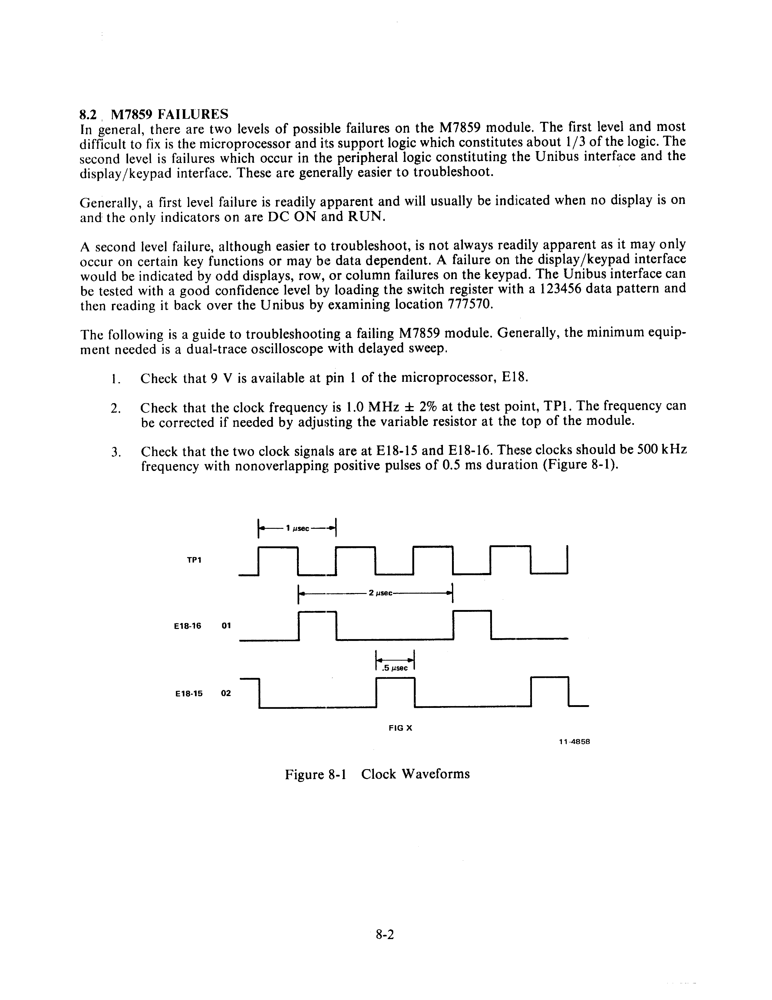

# Chapter 8 -- KY11-LB Maintenance

## 8.1 Preliminary Considerations

The following is a guide to locating possible problems on the KY11-LB.

1. **Power Switch Failure** -- If the power switch fails to control the power supply, check cable 7011414-2-2 (BA11-L) at J2 or cable 7011992-0-0 (BA11-K) at Faston tabs TB4 and TB5 on the bezel-mounted board to ensure that cable(s) are securely and correctly installed.

   If the power switch does turn on the power supply (fans turn) but the DC ON indicator does not come on, check cable 7011992-0-0 (BA11-K) at tabs TB6 and TB7 on the bezel-mounted board.

   If the four indicators on the left side of the keypad are all on, then the cable 7012214-0-0 connecting the bezel-mounted board to the interface board (M7859) is probably plugged in backward on one end.

   If no display and none of the four indicators are on, then check cable 7012214-0-0 at J1 on the bezel-mounted board and M7859 board to ensure that it is correctly and securely installed.

   Note that there should be no cables from either the bezel-mounted board or the M7859 board attached to the backplane. The connection at the backplane is for use by the KY11-LA Operator Console only.

   If the RUN indicator is on but there is no display and no response from the keypad, the problem is probably at the M7859 Interface module. Check the module to ensure that the microprocessor chip (E18) is securely installed in its socket.

   If the display works and the console responds to the keypad except for the BOOT key, check that cable 7011413-0-0 is properly connected to the M9301 and to the bezel-mounted board at tabs TB1 and TB2.

   If the display MPC, single microstep, etc. functions in maintenance mode do not work correctly, check that the cable(s) from J2 and J3 of the M7859 are properly installed.

> **NOTE:** These cables should be installed only for maintenance of the processor. By disconnecting these cables for normal operation, the effect is that the maintenance functions are nonoperative except for the TAKE BUS function.

## 8.2 M7859 Failures

In general, there are two levels of possible failures on the M7859 module. The first level and most difficult to fix is the microprocessor and its support logic which constitutes about 1/3 of the logic. The second level is failures which occur in the peripheral logic constituting the Unibus interface and the display/keypad interface. These are generally easier to troubleshoot.

Generally, a first level failure is readily apparent and will usually be indicated when no display is on and the only indicators on are DC ON and RUN.

A second level failure, although easier to troubleshoot, is not always readily apparent as it may only occur on certain key functions or may be data dependent. A failure on the display/keypad interface would be indicated by odd displays, row, or column failures on the keypad. The Unibus interface can be tested with a good confidence level by loading the switch register with a 123456 data pattern and then reading it back over the Unibus by examining location 777570.

The following is a guide to troubleshooting a failing M7859 module. Generally, the minimum equipment needed is a dual-trace oscilloscope with delayed sweep.

1. Check that 9 V is available at pin 1 of the microprocessor, E18.

2. Check that the clock frequency is 1.0 MHz ± 2% at the test point, TP1. The frequency can be corrected if needed by adjusting the variable resistor at the top of the module.

3. Check that the two clock signals are at E18-15 and E18-16. These clocks should be 500 kHz frequency with nonoverlapping positive pulses of 0.5 µs duration (Figure 8-1).

4. Check the signal at E18-18 which should be at logic low. If the signal is high the microprocessor may not have responded to the interrupt request on power-up. If the signal is toggling, this may be indicative of a different class of problems discussed in the following paragraphs.

5. The M7859 logic is such that if the microprocessor encounters a HALT instruction and goes to the STOP state, peripheral logic will automatically try to restart the microprocessor from location 0. Hence, if there are problems in the microprocessor support logic, such as address or data failures, time state decoding failures, etc., the microprocessor will not follow the program and generally encounters a HALT instruction.

   The general technique to solve this class of problems is to sync off of the signal STOP L and to use delayed sweep to track addresses backward to find the specific failing address. A quick check of the number of times TS1 L is true between the times that STOP L is true will give an idea of how far into the program the failure occurs. In general the easiest technique is to use the TS3 L signal as a visual key on one channel while using the other channel to probe addresses, data, timing signals, etc.
