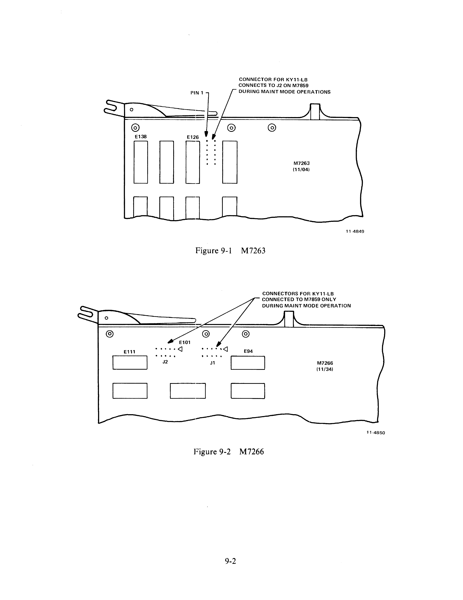
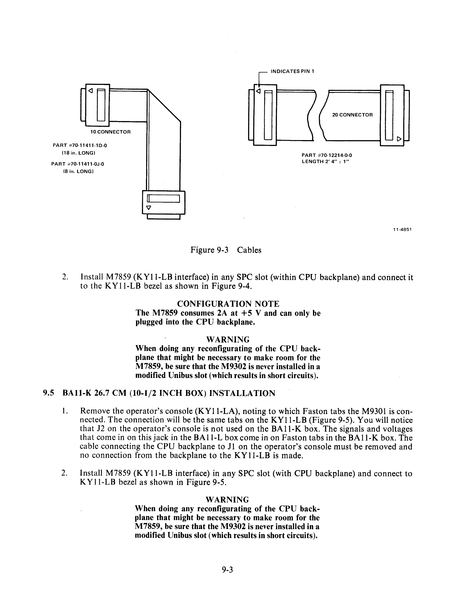
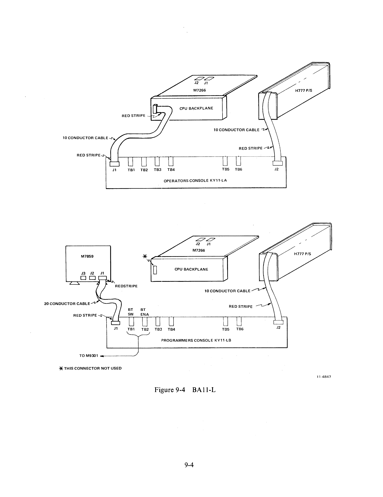
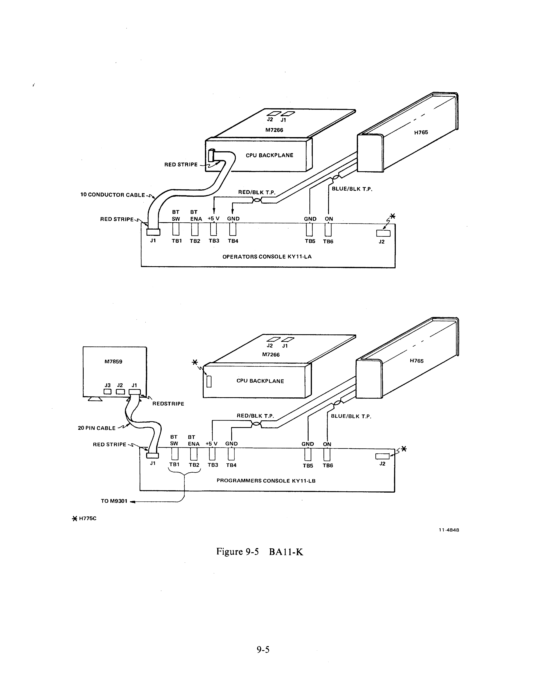

# Chapter 9 -- KY11-LB Installation

## 9.1 KY11-LB Description

The KY11-LB is a programmer's console option for both the 11/04 and 11/34 CPUs. It replaces the KY11-LA (operator's console) which is the standard console on 11/04s and 11/34s. The hardware in the KY11-LB option is exactly the same for both the 11/04 and 11/34. The KY11-LB contains a bezel assembly (consisting of a keypad, 7-segment display, indicator lamps, and ON/OFF switch) and a separate SPC quad interface module (M7859). Also, three loose piece cables: two 10-conductor, 45.7 cm (18 inch) long cables and one 20-conductor cable. The two 10-conductor cables are not required for normal console functions and should only be installed when using the console in maintenance mode.

## 9.2 CPU Box Type

PDP-11/04s and 11/34s are available in both the BA11-L 13.4 cm (5-1/4 inch) box and BA11-K 26.7 cm (10-1/2 inch) box. The difference between these two boxes creates the only difference in installing the KY11-LB. In all cases, the 10-conductor cable, running from the operator's console to the CPU backplane, is not used and must be removed when the KY11-LB is installed. It is extremely important not to connect this cable to the KY11-LB as a short circuit may result.

## 9.3 CPU Differences

The 11/04 is a single-module CPU (M7263). The 11/34 is a 2-module CPU (M7265 and M7266). Maintenance mode connections between KY11-LB and 11/04 are made on the M7263. Maintenance mode connections between KY11-LB and 11/34 are made on the M7266 (Figures 9-1 and 9-2). Note that all figures in this procedure show the M7266 module (11/34). This is done because the hook-up for normal KY11-LB operation is the same for both CPUs.

To identify cables and part numbers for cables, refer to Figure 9-3.

## 9.4 BA11-L 13.3 cm (5-1/4 Inch Box) Installation

1. Remove the operator's console (KY11-LA), noting to which Faston tabs the M9301 is connected. The connections will be to the same tabs on the KY11-LB. The cable from H777 Power Supply plugged into J2 on the KY11-LA will plug into J2 on the KY11-LB. The cable from the CPU backplane to J1 on the KY11-LA must be removed. No connection is made from the backplane to the KY11-LB.

2. Install M7859 (KY11-LB interface) in any SPC slot (within CPU backplane) and connect it to the KY11-LB bezel as shown in Figure 9-4.

> **CONFIGURATION NOTE:** The M7859 consumes 2A at +5 V and can only be plugged into the CPU backplane.

> **WARNING:** When doing any reconfiguring of the CPU backplane that might be necessary to make room for the M7859, be sure that the M9302 is never installed in a modified Unibus slot (which results in short circuits).

## 9.5 BA11-K 26.7 cm (10-1/2 Inch Box) Installation

1. Remove the operator's console (KY11-LA), noting to which Faston tabs the M9301 is connected. The connection will be the same tabs on the KY11-LB (Figure 9-5). You will notice that J2 on the operator's console is not used on the BA11-K box. The signals and voltages that come in on this jack in the BA11-L box come in on Faston tabs in the BA11-K box. The cable connecting the CPU backplane to J1 on the operator's console must be removed and no connection from the backplane to the KY11-LB is made.

2. Install M7859 (KY11-LB interface) in any SPC slot (within CPU backplane) and connect to KY11-LB bezel as shown in Figure 9-5.

> **WARNING:** When doing any reconfiguring of the CPU backplane that might be necessary to make room for the M7859, be sure that the M9302 is never installed in a modified Unibus slot (which results in short circuits).

## 9.6 Maintenance Mode Hook-Up

To utilize the KY11-LB as a maintenance tool for troubleshooting the CPU or system, additional cable(s) must be installed. The 11/04 requires one additional cable and the 11/34 requires two additional cables.

### PDP-11/04 (Maintenance Mode Cabling)

The 11/04 requires only one additional cable for maintenance mode operation. This 10-conductor cable (Part No. 70-11411-1D-0) connects J2 of the M7859 to the unmarked male connector on the M7263 (11/04 CPU). The cable (70-11411-1D-0) has a pointer on each end to indicate pin 1 as shown in Figure 9-3. Install the cable with the pointer on the end of the cable lined up with pin 1 on the CPU module (M7263). Pin 1 on M7263 is called out on Figure 9-1. Points on J2 (M7859) and the cable should also be lined up.

### PDP-11/34 (Maintenance Mode Cabling)

The 11/34 requires two additional cables for maintenance mode operation. Both cables are the same and are the same part as is used on the 11/04. See Figure 9-3 for part number.

> **NOTE:** Maintenance cables for both 11/04 and 11/34 are all 45.7 cm (18 inch) long, 10-conductor cables.

When installing maintenance cables connect J2 (M7859) to J1 (M7266) and J3 (M7859) to J2 (M7266). The pointers on the cable and board must be matched at both ends of the cables.
