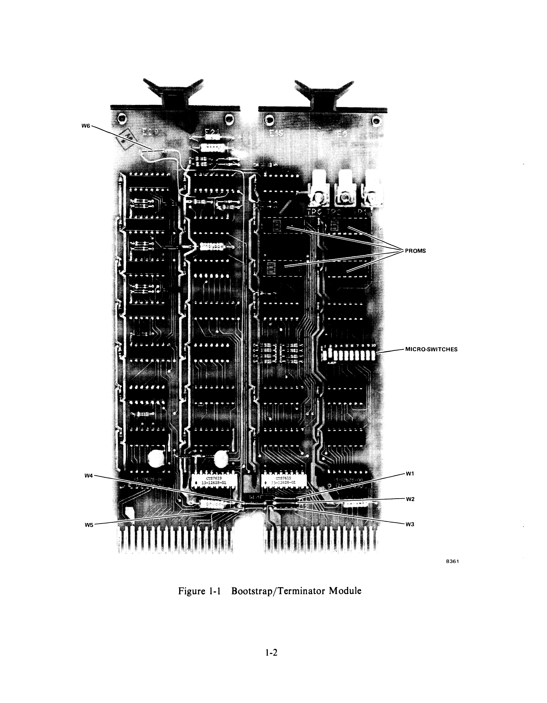
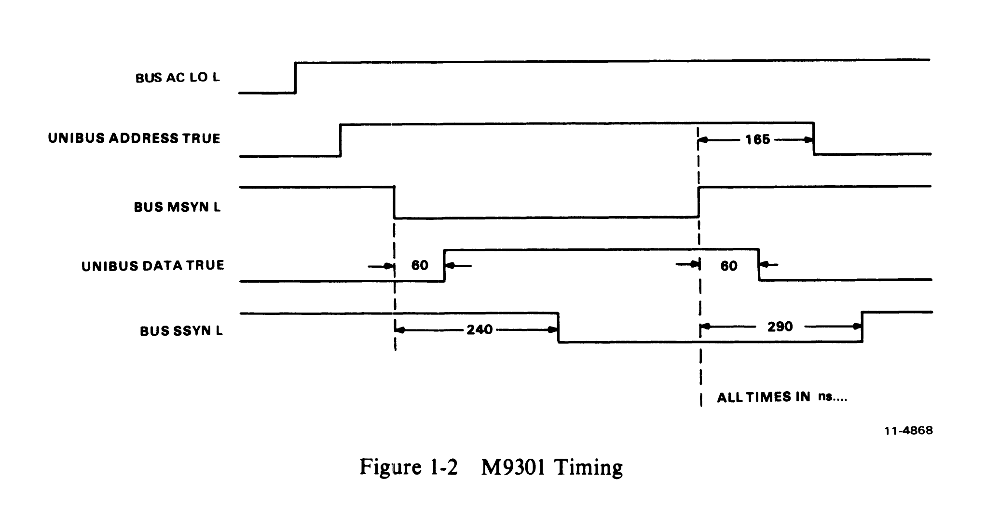
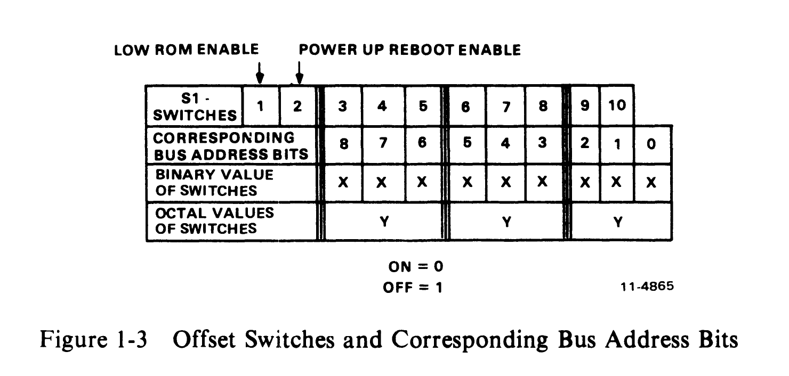

# Chapter 1 -- Introduction

## 1.1 General Description

The M9301 contains a complete set of Unibus termination resistors along with 512 words of read-only memory which can be used for bootstrap programs, diagnostic routines, and the console emulator routine. The module also provides circuitry for initiating bootstrap programs either on power-ups or from an external or logic level switch closure. See Figure 1-1 for a photo of the module.

## 1.2 Features

- Available features depend on the variation used.
- The M9301 combines Unibus termination and bootstrap capability on one double height module.
- Can be used in PDP-11 machines which can handle an extended length module in the terminator slots. (The M9301-YC can be used only in a PDP-11/70 system.)
- Bootstrap programs may be initiated by the following means:
  1. Direct program jumps to the memory space occupied by the bootstrap.
  2. Programmer's console load address and start sequence.
  3. Power restarts (Paragraph 2.3).
  4. External boot switch closure.
- Provides capability of enabling or disabling boots on power restarts.
- Provides 512 words of user memory space which can be programmed by the user or purchased with standard patterns provided by DEC.

The first two chapters of this manual describe features of the M9301 which apply to all versions. Chapters 3, 4, and 5 do not pertain to the -YC and -YH versions.

The remaining chapters deal with the programming information and specific functions for each version. One chapter is devoted entirely to each version, so that the reader need not search through irrelevant information to find what he needs.

## 1.3 Physical Description

The M9301 is a double height extended, 21.6 x 14 cm (8-1/2 x 5-1/2 in) Flip-Chip module which plugs into the A and B terminator slots on the PDP-11 backplane.

## 1.4 Electrical Specifications

| Parameter | Value |
|---|---|
| Power Consumption | +5 Vdc -- 2.0 A typical |
| Electrical Interfaces | Standard using 8837 and 8640 receivers and 8881 drivers |

### 1.4.1 External Electrical Interfaces

The external interface consists of three Faston tabs (TP1, TP2, and TP3) provided at the handle end of the module. The following loading and usage constraints apply.

**TP1** -- Represents one standard TTL load with a 1K ohm pull-up. Input should be stable during a power-up. Refer to Paragraph 2.4 for TP1 usage.

**TP2** -- Represents two standard TTL loads with a 1 kilohm pull-up resistor. Input signals should be limited to a 100 ns minimum pulse width with all switch bounce noise restricted to a 5 ms maximum duration. Note that triggering is initiated upon release of an input low (logic 0) pulse. On all power-ups, triggering is disabled until approximately 100 ms after power returns (Paragraph 2.7), assuming that +5 Vdc will be available from the power supply within 20 ms. It is also important to realize that this input has no high voltage protection capability and adequate filtering must be provided when locating this input outside the standard DEC computer enclosure. Refer to Paragraph 2.5 for TP2 usage.

**TP3** -- Should be used as a ground return for external switches attached to TP1 and TP2. Note that there is no protection for large voltage spikes on this input so proper filters should be externally installed to guarantee adequate isolation.

### 1.4.2 Electrical Prerequisites

Refer to Chapter 6 and following for system constraints on the specific version being used.

Power and Ground Pinouts (Refer to Table 1-1 for pin assignments.)

- +5 Vdc: Pins AA2, BA2
- GND: Pins AC2, AT1, BC2, BT1

### 1.4.3 Timing

Figure 1-2 shows important timing constraints for the M9301. Values shown are typical.

### 1.4.4 Operating Environmental Specifications

| Parameter | Value |
|---|---|
| Temperature Range | 5 C to 50 C |
| Relative Humidity | 20% to 95% (without condensation) |

## 1.5 Installation

As a universal bootstrap/terminator module, the M9301 in its various versions, can be adapted by the user to meet a variety of boot requirements and system configurations. Major factors that must be considered during installation concern the address offset microswitches and the external boot switch. Figure 1-3 shows the relationship between the switches and the lower nine bus address bits.

### 1.5.1 Power-Up Reboot Enable

Automatic booting on all power-ups can be enabled or disabled using the POWER UP REBOOT ENAB switch (S1-2). If this dip switch is set to the OFF position, the processor will power up normally, obtaining a new PC from memory location 24(8) and a new PSW from location 26(8). When the switch is in the ON position during a power-up, the processor will obtain its new PC and PSW from locations 173024 and 173026 respectively. The address of BOOT SELECT switches S1-3 through S1-10 is 173024.

The function performed by the REBOOT ENABLE switch (S1-2) can be controlled by an external switch using the Faston tabs on the M9301 module. This external switch closure should be made to ground (enabling boot) using Faston tab TP3 as a ground return. In the PDP-11/04 and 34, when MOS memory is present with battery backup, a battery status indication signal is generated by the power supply. This signal should be attached to the POWER UP REBOOT ENAB input (TP1) on the M9301. If this status signal goes low, it indicates that the contents of the MOS memory are no longer valid and must be reloaded, usually from some mass storage device. The M9301, sensing the status of the memory, forces a boot on power-up, allowing new data to be written into memory. Note that grounding TP1 will override S1-2 if the switch is off.

If the battery status input is high (logic 1), the M9301 will not automatically boot on power-up, and execution will begin at the address specified by location 24.

### 1.5.2 Low ROM Enable

This dip switch (S1-1), when set to the OFF position, prevents the M9301 from responding to the Unibus address range 765000 through 765777. See address maps for the specific versions to see how each version is affected by S1-1.

### 1.5.3 Boot Switch Selection

In order to select bootstraps to be run on power-ups and external boot enables, eight dip switches (S1-3 through S1-10) are provided on the M9301. Tables in Chapter 7 and following chapters show switch configurations for the various options supplied by each version.

### 1.5.4 External Boot Switch

A device can be externally booted using the EXTERNAL BOOT input on Faston tab TP2. If this input is brought to ground, BUS AC LO L will be activated causing the processor to perform a POWER FAIL. Upon returning to a logic 1, this input will deactivate BUS AC LO L initiating a power-up sequence in the CPU. Faston tab TP3 should be used as a ground return for the external boot switch. Note that the power-down trap vectors to locations 24(8) and 26(8).

**Table 1-1 M9301 Modified Unibus Pin Assignments**

| Pin | Signal | Pin | Signal |
|---|---|---|---|
| AA1 | BUS INIT L | BA1 | SPARE |
| AA2 | POWER (+5 V) | BA2 | POWER (+5 V) |
| AB1 | BUS INTR L | BB1 | SPARE |
| AB2 | TEST POINT | BB2 | TEST POINT |
| AC1 | BUS D00 L | BC1 | BUS BR 5 L |
| AC2 | GROUND | BC2 | GROUND |
| AD1 | BUS D02 L | BD1 | BAT BACKUP +5 V |
| AD2 | BUS D01 L | BD2 | BR 4 L |
| AE1 | BUS D04 L | BE1 | INT SSYN |
| AE2 | BUS D03 L | BE2 | PAR DET |
| AF1 | BUS D06 L | BF1 | BUS ACLO L |
| AF2 | BUS D05 L | BF2 | BUS DCLO L |
| AH1 | BUS D08 L | BH1 | BUS A01 L |
| AH2 | BUS D07 L | BH2 | BUS A00 L |
| AJ1 | BUS D10 L | BJ1 | BUS A03 L |
| AJ2 | BUS D09 L | BJ2 | BUS A02 L |
| AK1 | BUS D12 L | BK1 | BUS A05 L |
| AK2 | BUS D11 L | BK2 | BUS A04 L |
| AL1 | BUS D14 L | BL1 | BUS A07 L |
| AL2 | BUS D13 L | BL2 | BUS A06 L |
| AM1 | BUS PA L | BM1 | BUS A09 L |
| AM2 | BUS D15 L | BM2 | BUS A08 L |
| AN1 | P1 | BN1 | BUS A11 L |
| AN2 | BUS PB L | BN2 | BUS A10 L |
| AP1 | P0 | BP1 | BUS A13 L |
| AP2 | BUS BBSY L | BP2 | BUS A12 L |
| AR1 | BAT BACKUP +15 V | BR1 | BUS A15 L |
| AR2 | BUS SACK L | BR2 | BUS A14 L |
| AS1 | BAT BACKUP -15 V | BS1 | BUS A17 L |
| AS2 | BUS NPR L | BS2 | BUS A16 L |
| AT1 | GROUND | BT1 | GROUND |
| AT2 | BUS BR 7 L | BT2 | BUS C1 L |
| AU1 | +20 V | BU1 | BUS SSYN L |
| AU2 | BUS BR 6L | BU2 | BUS CO 1 |
| AV1 | +20 V | BV1 | BUS MSYN L |
| AV2 | +20 V | BV2 | -5 V |
