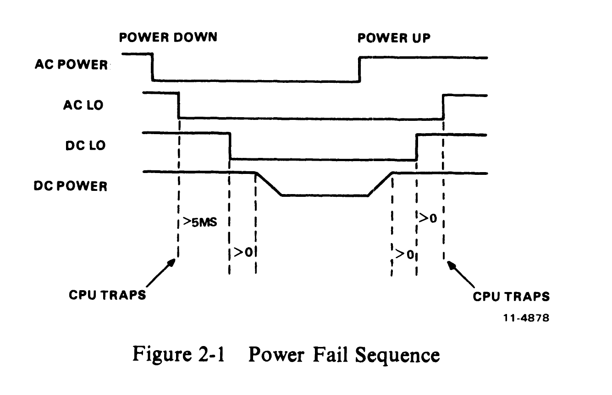
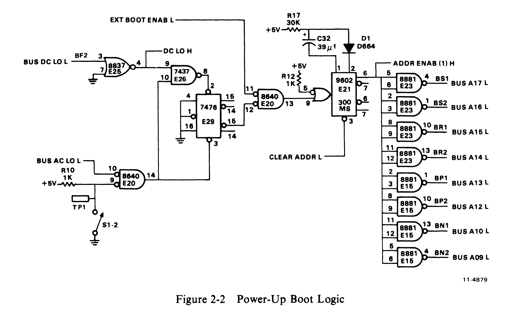
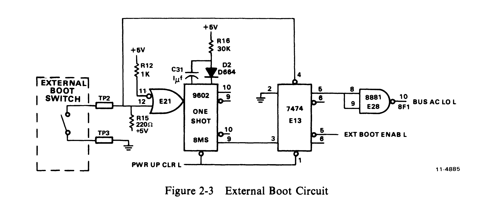
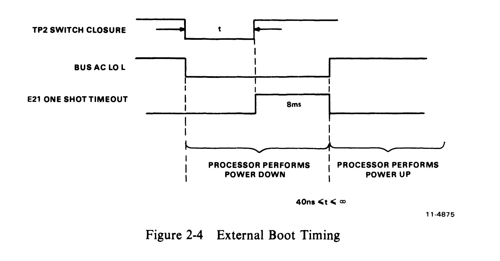
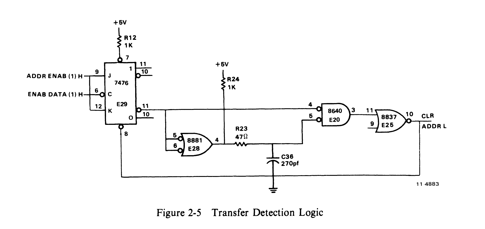
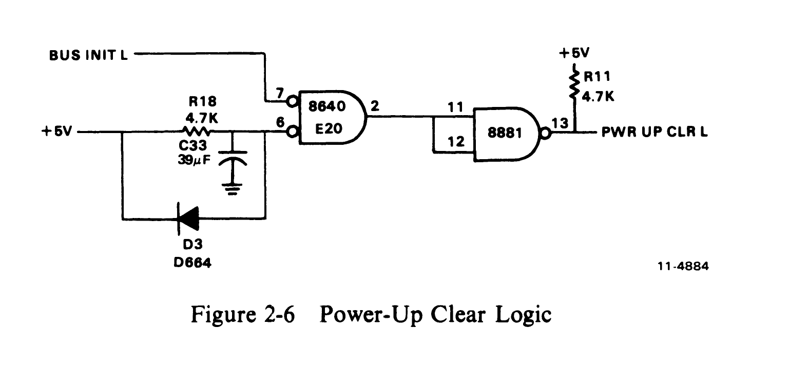
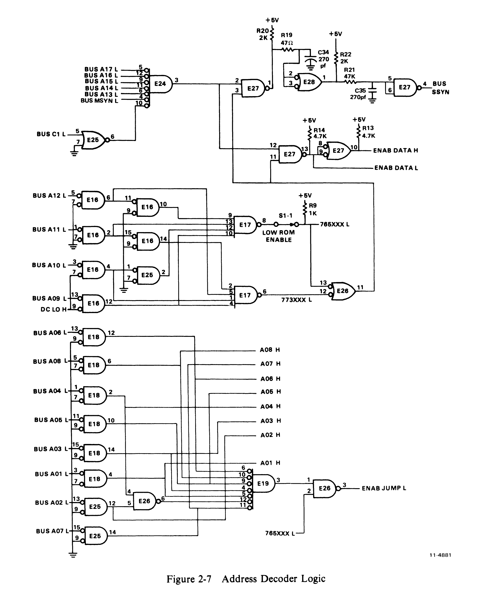
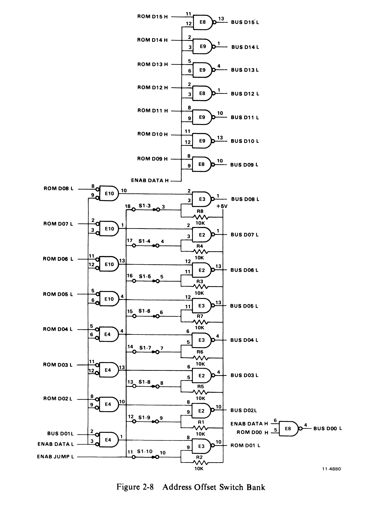
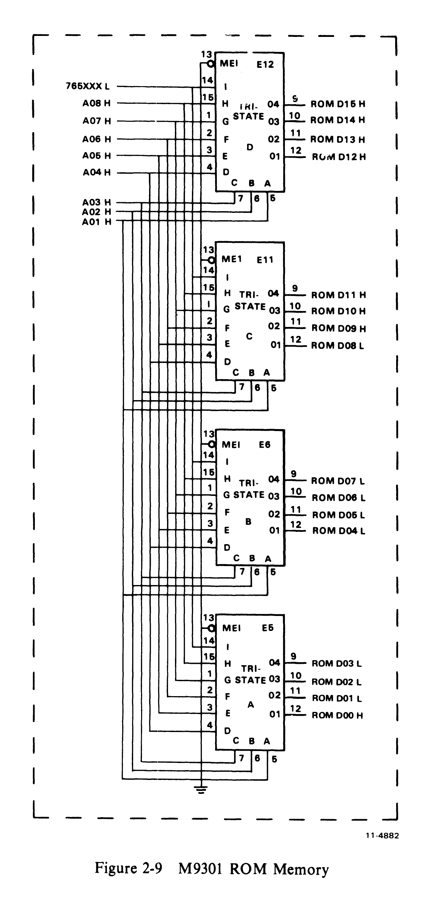

# Chapter 2 -- Hardware Description

## 2.1 General

All versions of the M9301 are physically and electrically identical with the exception of the ROMs that are used; and the hardware description which follows applies to each of them. Various portions of the circuitry will be analyzed separately for clarity. Various portions of the M9301 circuit schematics (CS M9301-0-1) will be referenced throughout the description.

## 2.2 Definition of Terms

**Bootstrap Program** -- A bootstrap program is any program which loads another (usually larger) program into computer memory from a peripheral device.

**Bootstrap** -- Bootstrap and bootstrap program are used interchangeably.

**Boot** -- Boot is a verb which means to initiate execution of a bootstrap program.

> **NOTE:** Some processors have a feature which enables them to select power fail vectors. A vector of 24(8) will be used in this discussion for the sake of simplicity.

## 2.3 Power-Up Sequence

Typically all PDP-11 computers perform a power-up sequence each time power is applied to their CPU module(s). This sequence is as follows:

1. +5 Vdc comes true
2. BUS DC LO L unasserted by power supply
3. BUS INIT asserted
4. BUS AC LO L released by power supply
5. Processor accesses memory location 24(8) for new PC
6. Processor accesses memory location 26(8) for new PSW
7. Processor begins running program at new PC contents.

With an M9301 Bootstrap/Terminator in the PDP-11 computer system, on power-ups the user can optionally force the processor to read its new PC from a ROM memory location (Unibus location 773024(8)) and offset switch bank on the M9301 on power-up. Switch S1-2 on the M9301 can enable or disable this feature. A new PSW will also be read from a location (Unibus location 773026(8)) in the M9301 memory. This new PC and PSW will then direct the processor to a program (typically a bootstrap) in the M9301 ROM (Unibus memory locations 773000 through 773776).

If switch S1-2 is turned off, disabling power-up boots, an external switch or logic level can be used to force the processor to execute a boot program.

## 2.4 Power-Up Booting Logic

The status of the PDP-11 power supply is described by the two Unibus control lines BUS AC LO L and BUS DC LO L. The condition of these two lines in relation to the +5 V output of the power supply is defined by Unibus specifications as summarized in Figure 2-1.

### 2.4.1 Power-Up and Power Down

On the M9301, power-up sequences are detected by the circuitry shown in Figure 2-2. When +5 V first becomes true, both BUS AC LO and BUS DC LO are asserted low. Assuming the POWER UP REBOOT ENABLE switch (S1-2) is closed on, flip-flop E29 will then be set. When BUS DC LO L goes high followed by BUS AC LO L, this flip-flop is then cleared, generating a low-to-high transition on the output of E20 (pin 13). This transition triggers the one-shot E21 which asserts Unibus address lines BUS A09 L, BUS A10 L, and BUS A12 L through BUS A17 L for up to 300 ms.

### 2.4.2 Processor Reads New Program Counter

During the 300 ms time-out of E21, the central processor will be performing its power-up sequence. When the processor attempts to read a new program counter (PC) address from memory location 24(8), the address bits enabled by the one-shot E21 are logically ORed to generate the address 773024(8). This location happens to be an address in the M9301 ROM space which contains the starting address of a specific boot routine.

### 2.4.3 Processor Reads New Status Word

Having obtained a new PC from location 773024(8), the processor then attempts to read a new processor status word (PSW) from memory location 26(8). The address bits enabled by one-shot E21 are logically ORed to generate the address 773026(8) which is also in the M9301 ROM address space. Once this transfer is completed, the removal of MSYN from the bus will generate an ADDR CLR L signal which clears the one-shot (E21) time-out, removing address bits BUS A09, BUS A10, and BUS A12 through BUS A17. The 300 ms time-out length of E21 was chosen to guarantee enough time for any PDP-11 processor to complete the two memory transfers described before releasing the address lines.

### 2.4.4 Power-Up Reboot Enable Switch

The POWER UP REBOOT ENABLE switch (S1-2) can be used to disable the logic shown in Figure 2-2. With this switch open, the clear input to flip-flop E29 will always be low, preventing it from ever being set on power restarts. Faston tab TP1 is provided to allow switch S1-2 to be remotely controlled. Note that when an external switch is used, S1-2 must be left in the OFF position.

## 2.5 External Boot Circuit

The processor can be externally activated by grounding the Faston tab TP2 input, as shown in Figure 2-3. This low input sets flip-flop E13 which then generates a BUS AC LO L signal on the Unibus. Upon seeing this signal the PDP-11 processor will begin a power-down routine, anticipating a real power failure. After completing this routine, the processor will wait for the release of BUS AC LO L, at which time it will perform a power-up sequence through locations 24(8) and 26(8).

When the EXTERNAL BOOT input switch is released, the one-shot E21 is triggered, causing an 8 ms time-out, and the set input to flip-flop E13 is removed (Figure 2-4). At the end of the one-shot time-out, flip-flop E13 is clocked low, releasing the BUS AC LO L line and firing the 300 ms one-shot (E21). The processor then is forced to read its new PC and PSW from location 773024 and 773026 respectively.

## 2.6 Power-Up Transfer Detection Logic

After BUS AC LO L and BUS DC LO L have performed their power-up sequence, the logic shown in Figure 2-5 counts the first two DATI transfers on the Unibus and generates a 75 ns pulse on the CLR ADDR L line. The two Unibus transfers performed will be to obtain a new PC and PSW as previously described. The CLR ADDR L pulse resulting will be used to clear the one-shot E21 shown in Figure 2-2, releasing bus address line BUS A09, BUS A10, and BUS A12 through BUS A17.

## 2.7 Power-Up Clear

The circuit shown in Figure 2-6 is included on the M9301 to guarantee that specific storage elements on the module are cleared when power is first applied. The PWR CLR L signal will be held low for approximately 70 ms after the +5 V has returned, assuming that the +5 V supply has a rise time of less than 20 ms. The exact period of time for holding PWR CLR L is a function of the rise time of the +5 V power supply.

## 2.8 Address Detection Logic

### 2.8.1 M9301 Address Space

Figure 2-7 shows the complete Unibus address detection logic on the M9301. The purpose of this circuitry is to detect Unibus addresses within the address space of the M9301: 773000(8) -- 773777(8) and 765000(8) -- 765777(8), and to recognize the specific addresses 773024(8) and 773026(8) for the power-up circuit previously described.

### 2.8.2 M9301 Memory Access Constraints

The circuitry shown in Figure 2-7 determines when the M9301 ROM address space is being accessed. Upon receiving a recognized Unibus address, and BUS MSYN, the ROM data outputs are enabled onto the Unibus data lines (BUS D00 L -- BUS D15 L), and BUS SSYN L is enabled 200 ns later. Conditions which must be met before enabling the ROM data and returning BUS SSYN are as follows:

1. Detection of the Unibus address 765XXX (dependent on position of the L ROM ENABLE switch S1-1) or 773XXX.
2. Transfer being performed is a DATI operation where BUS C1 L is not asserted.
3. A BUS MSYN L control signal has been obtained.

### 2.8.3 Low ROM Enable Switch

The LOW ROM ENABLE switch (S1-1) shown in Figure 2-7 allows the user to disable the M9301 detection of Unibus addresses 765000 through 765777. Disabling the detection of these addresses (S1-1 is set to OFF position) becomes essential when that memory space is being used by other peripheral devices in the system. For M9301 modules containing standard DEC programs, users should note what program features will be eliminated by disabling M9301 address locations 765000 through 765777.

### 2.8.4 ROM Address Generation

Logic shown in the lower half of Figure 2-7 performs two functions. First it receives the nine address inputs for the M9301 ROM memory (765XXXL and A01H through A08H). Second it detects the Unibus address 773024 and generates the offset switch enable signal ENAB JUMP L.

## 2.9 Address Offset Switch Bank

As previously mentioned, on power-up, the M9301 processor obtains its new PC from location 773024(8) instead of 24(8). When the M9301 address detection logic decodes address 24(8), it enables (via ENAB JUMP L) the address offset switch bank (Figure 2-8). The contents of these switches, combined with the contents of the specified address in M9301 ROM memory, produce a new PC for the CPU. This new PC will point the processor to the starting address of a specific program (usually a bootstrap routine) in the M9301 memory. Several programs can be included in the M9301 memory with any one being user selectable through the address offset switch selection.

Example:

| | Octal |
|---|---|
| M9301 ROM address 773024 contains | 173000 |
| Offset switch bank contains | 254 |
| New PC read by CPU | 173254 |

> **NOTE:** A switch in the ON position = 0. A switch in the OFF position = 1.

See Figure 1-3 for the relationship of the address offset switches to the bus address bits.

## 2.10 ROM Memory

The heart of the M9301 is the 512-word ROM shown in Figure 2-9. It is composed of four 512 x 4-bit tristate ROMs organized in a 512 x 16-bit configuration. All four units share the same address lines and produce 16-bit PDP-11 instructions for execution by the processor.

All four sets of ROM outputs are always enabled, so that any change in address inputs will result in a change in the Unibus data lines when the ENAB DATA signals in Figure 2-7 are enabled. For further information on M9301 compatible ROMs, consult Chapter 6.

M9301 users that program their own PROMs should note the following programming constraints.

1. There is no address or data output translation required.

2. Unibus address locations 773000(8) through 773776(8) are located in the lower 256 words of the PROM. These addresses constitute the upper portion of the PROM, as far as the rest of the system is concerned, however. Unibus address locations 765000(8) through 765776(8) are resident in the upper 256 words. These addresses constitute the lower PROM addresses with relation to the system, however, and are enabled and disabled by S1-1, the LOW ROM ENABLE switch.

3. When coding PROM patterns, data bits D01 through D08 must always contain the inverse of the data required, to compensate for the extra inversion logic included in the M9301 offset switch circuitry.

4. PROM location 773024 bits D01 through D08 must be logical 1s for the offset switches to work correctly.

## 2.11 M9301 Terminator

The terminator section of the M9301 consists of four resistor pack circuits, each containing the required pull-up and pull-down resistors for proper Unibus termination. Since PDP-11/04 and PDP-11/34 computers incorporate BUS GRANT pull-up resistors on the processor modules, space has been left on the M9301 for five jumpers (W1 through W5) which allow the user to decide whether or not to include BUS GRANT pull-up resistors. The M9301 BUS GRANT jumpers must be installed on all modules which are used to replace an M930.

Caution should be taken when inserting M9301 modules in various PDP-11 computers. If the processor in question does not have BUS GRANT pull-ups on the CPU, jumpers W1 through W5 on the M9301 should be inserted or the M9301 should be positioned at the end of the Unibus furthest from the CPU.

A good rule of thumb is that the jumpers should be installed when the M9301 is used in place of an M930 or equivalent.
