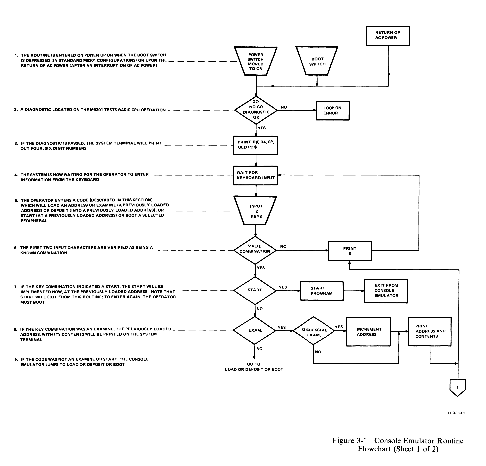
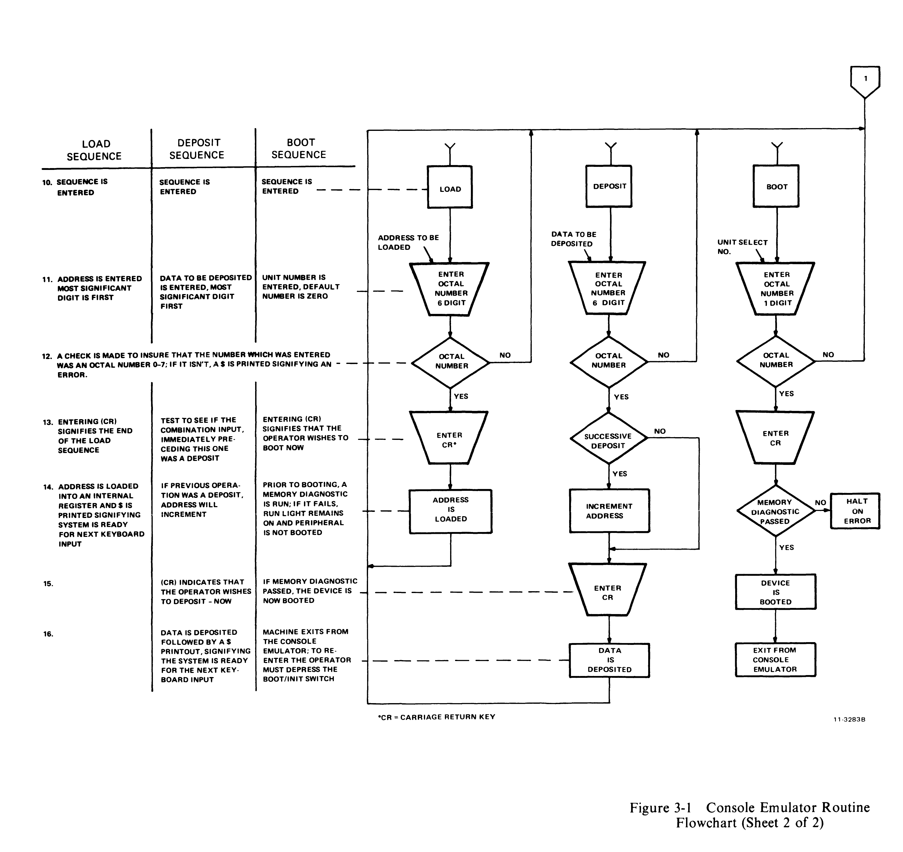

# Chapter 3 -- The Console Emulator

## 3.1 General

The console emulator routine is a standard part of the firmware for the M9301-YA, -YB, -YE, -YF, and -YJ options. A simplified operator's flowchart is presented in Figure 3-1 to give the reader a unified picture of the routine.

## 3.2 Symbols

A list of the symbols used follows.

- **Rectangle:** indicates an automatic operation performed by the machine.
- **Diamond:** indicates a decision, an automatic operation which can take either of two paths depending on how the question stated within the diamond is answered.
- **Trapezoid:** indicates operator action, the moving of a switch or the typing of keys.

## 3.3 Using the Console Emulator

With switches S1-1 through S1-10 set in the ON position the system will execute a normal console emulator power-up routine when power is supplied or the boot switch is pressed. Diagnostic tests 1-5 will run first. An error will cause the processor to loop. Completion of these diagnostic tests will be followed by the register display routine. R0, R4, R6, and R5 will be printed out on the terminal. A `$` sign will be printed at the beginning of the next line on the terminal, indicating that the console emulator routine is waiting for input from the operator. In the discussion that follows, the following symbols will be used.

- **(SB):** Space bar
- **(CR):** Carriage return key
- **X:** Any octal number 0-7

The four console functions can be exercised by pressing keys, as follows:

| Function | Keyboard Strokes |
|---|---|
| Load Address | L (SB) X X X X X X (CR) |
| Examine | E (SB) |
| Deposit | D (SB) X X X X X X (CR) |
| Start | S (CR) |

The first digit typed will be the most significant digit. The last digit typed will be the least significant. If an address or data word contains leading zeros, these zeros can be omitted when loading the address or depositing the data. An example using the load, examine, deposit, and start functions follows. Assume that a user wishes to:

1. Turn on power
2. Load address 700
3. Examine location 700
4. Deposit 777 into location 700
5. Examine location 700
6. Start at location 700.

To accomplish this, the following procedure must be followed.

| Operator Input | Terminal Display |
|---|---|
| 1. TURNS ON POWER | XXXXXX XXXXXX XXXXXX XXXXXX |
| 2. L(SB) 700 (CR) | $L 700 |
| 3. E(SB) | $E 000700 XXXXXX |
| 4. D(SB) 777(CR) | $D 777 |
| 5. E(SB) | $E 000700 000777 |
| 6. S(CR) | $S |

> **NOTE:** The console emulator routine will not work with odd addresses. Even numbered addresses must always be used.

### 3.3.1 Successive Operations

#### 3.3.1.1 Examine

Successive examine operations are permitted. The address is loaded for the first examine only. Successive examine operations cause the address to increment and will display consecutive addresses along with their contents.

For example, to examine addresses 500-506:

| Operator Input | Terminal Display |
|---|---|
| L(SB) 500 (CR) | L 500 |
| E(SB) | $E 000500 XXXXXX |
| E(SB) | $E 000502 XXXXXX |
| E(SB) | $E 000504 XXXXXX |
| E(SB) | $E 000506 XXXXXX |

#### 3.3.1.2 Deposit

Successive deposit operations are permitted. The procedure is identical to that used with examine.

For example, to deposit 60 into location 500, 2 into location 502, and 4 into location 504:

| Operator Input | Terminal Display |
|---|---|
| L(SB) 500 (CR) | $L 500 |
| D(SB) 60 (CR) | $D 60 |
| D(SB) 2 (CR) | $D 2 |
| D(SB) 4 (CR) | $D 4 |

#### 3.3.1.3 Alternate Deposit-Examine Operations

This mode of operation will not increment the address. The address will contain the last data which was deposited.

For example, to load address 500 and deposit 1000, 2000, and 5420 with examine operations after every deposit:

| Operator Input | Terminal Display |
|---|---|
| L(SB) 500 (CR) | $L 500 |
| D(SB) 1000 (CR) | $D 1000 |
| E(SB) | $E 000500 001000 |
| D(SB) 2000 (CR) | $D 2000 |
| E(SB) | $E 000500 002000 |
| D(SB) 5420 (CR) | $D 5420 |
| E(SB) | $E 000500 005420 |

#### 3.3.1.4 Alternate Examine-Deposit Operations

If an examine is the first instruction after a load sequence, and is alternately followed by deposits and examines, the address will not be incremented, and the address will contain the last data which was deposited. The above example applies to this operation, and with the exception of the order of examine and deposit, the end result is the same.

### 3.3.2 Limits of Operation

The M9301 console emulator routine can directly manipulate the lower 28K of memory and the 4K I/O page. See Chapter 5 for an explanation of techniques required to access addresses above the lower 28K.

## 3.4 Booting from the Keyboard

Once the `$` symbol has been displayed in response to system power-up, or pressing of the boot switch, the system is ready to load a bootstrap from the device which the operator selects. The procedure is as follows.

1. Find the 2-character boot command code in the appropriate chapter that corresponds to the peripheral to be booted.
2. Load paper tape, magtape, disk, etc. into the peripheral to be booted if required.
3. Verify that the peripheral indicators signify that the peripheral is ready (if applicable).
4. Type the 2-character code obtained from the table.
5. If there is more than one unit of a given peripheral, type the unit number to be booted (0-7). If no number is typed, the default number will be 0.
6. Type (CR); this initiates the boot.

Before booting, always remember:

1. The medium (paper tape, disk, magtape, cassette, etc.) must be placed in the peripheral to be booted prior to booting.
2. The machine will not be under the control of the console emulator routine after booting.
3. The program which is booted in must:
   a. Be self starting or
   b. Allow the user to load another program by using the CONT function or
   c. Be startable from the console emulator after having been booted in.
4. Actuating the boot switch will always abort the program being run. The contents of the general registers (R0-R7) will be destroyed. There is no way to continue with the program which was aborted. Some programs are designed to be restartable.

### 3.4.1 Booting the High-Speed Reader Using the Console Emulator

To load the CPU diagnostic for an 11/34 computer system with a high-speed reader, perform the following procedure.

1. Place the HALT/CONT switch in the CONT position.
2. Obtain a `$` by either turning on system power or actuating the boot. (R0, R4, SP, and old PC will be printed prior to the $.)
3. Place the absolute loader paper tape (coded leader section) in the high-speed reader.
4. Type: PR (CR). The absolute loader tape will be loaded, and the machine will halt.
5. Remove the absolute loader and place the leader of the program, in this case a CPU diagnostic, in the reader.
6. Move the HALT/CONT switch to HALT and then return it to CONT. The diagnostic will be loaded and the machine will halt (normal for this program; non-diagnostic programs may or may not be self-starting).
7. If program is not self-starting, activate the BOOT/INIT switch. This will restart the console emulator routine.
8. Using the console emulator, deposit desired functions into the software switch register (a memory address) location. (See the diagnostic for the software switch register's actual location and significance.)
9. Using the console emulator, load the starting address, and start the program as described earlier in this section.

### 3.4.2 Booting a Disk Using the Console Emulator

To boot the system's RK11 disk, which contains the CPU diagnostic that you want to run, perform the following procedure.

1. Verify that the HALT/CONT switch is in the CONT position and the write lock switch on the RK11 peripheral is in the ON position.
2. Turn on system power or press the console boot switch. The system terminal displays R0, R4, SP, and old PC which are octal numbers, followed by a `$` on the next line.
3. Place the disk pack in drive 0.
4. When the RK05 load light appears, the system is ready to be booted.
5. Type: DK (CR). This causes the loading of the bootstrap routine into memory and the execution of that routine.
6. The program should identify itself and initiate a dialogue (which will not be discussed here).

## 3.5 Recovering from Errors in the Console Emulator Routine

Table 3-1 describes the effects of entering information incorrectly to the console emulator routine. The following symbols are used in the table.

- **(9)** -- Represents a non-octal number (8 or 9)
- **(Y)** -- Represents:
  1. All keys (other than numerics) which are unknown
  2. Keys which are known but do not constitute a valid code in the context which they are entered.

Refer to previous sections for a discussion of the correct method operating the console emulator routine.

**Escape Route:** If an entry has not been completed and the user realizes that an incorrect or unwanted character has been entered, press the rub out or delete key. This action will void the entire entry and allow the user to try again.

**Table 3-1 Deposit Errors: Useful Examples**

| Error | Result | Remedy | Operator | Terminal |
|---|---|---|---|---|
| L was followed by a key other than (SB) | Terminal display will immediately return a $ to signify an unknown code. No address is loaded. | Try again | L(Y) | $L / $ |
| An illegal (non octal) number (8 or 9) is typed after the correct load entrance, within an otherwise valid number. | Upon receipt of the illegal number, the Console Emulator will ignore the entire address and return a $. | Try again | L(SB)XXX9 | $L XXX9 / $ |
| An incorrect alphabetic key is typed after the correct load entrance within an otherwise valid number. | Same as illegal number. | Try again | L(SB)XXXY | $L XXXY / $ |
| The most significant octal number in a six bit address is greater than one. | An address will be loaded. However, the state of the most significant address bit will be determined by bit 15 only: 2=0, 3=1, 4=0, 5=1, 6=0, 7=1 | Try again | S(SB) 6XXXXX | $S 0XXXXX / $ |
| An unwanted but legal octal number is loaded. | Address will be loaded but unchanged. | Try again | | |
| An extra (seventh) octal number is typed. | The loaded number will be incorrect. The system will accept any size word but will only remember the last six characters typed in. | Try again | L(SB)1XXXXXX | $L 1XXXXXX / $ Actually Load XXXXXX |
| A memory location higher than the highest memory available in the machine is loaded. | No errors will result unless a deposit, examine, or start is attempted. | Try again | L(SB)1XXXXX (CR) | L 1XXXXX |
| Load address and number were entered correctly, (CR) was not entered. | Machine will wait indefinitely for (CR). $ will not be returned. | Type (CR) | L(SB)XXXXX (CR) | $L XXXXX $XXXXX(CR) |
| E or S is followed by a key other than space. | Terminal display will immediately return a $ to signify an unknown code. | Try again | E(Y) or S(X) | $E / $ / $S / $ |
| Examine or start is attempted to a memory location which is higher than the highest available memory location in the machine (I/O page can be examined) or to an odd memory location. | The system will hang up when (SB) is executed. | Depress the boot switch | E(SB) or S(SB) | $E or $S |
| Examine is performed without loading an address prior to first examine. | An examine operation of an unknown address will be performed. It is possible that the machine may attempt to examine an address which does not exist. The system may hangup in a program loop. | Try again or boot if system hangs up. | | |
| Start is performed without loading an address prior to starting. | Start at an unknown location will occur. | Reload program and try again. | | |
| D was followed by a key other than space. | Terminal display will immediately return a $ to signify an unknown code. | Try again | DY | $D / $ |
| Deposit is attempted to a memory location which is higher than the highest available memory in the machine (with the exception of the I/O page). | The system will hang up when (SB) is executed. | Activate the boot switch to reboot the system. | | |
| Deposit is performed without loading an address or knowing what address has been previously loaded. | a. Data will be written over and lost. / b. Machine might hang up in a program loop. | a. Immediately following the error, perform an examine to determine the location which was accessed. Restore original contents if known. / b. Reboot machine. | | |
| Deposit into an odd address is attempted. | The system will hang up when (CR) is executed. | Depress the boot switch. | | |
