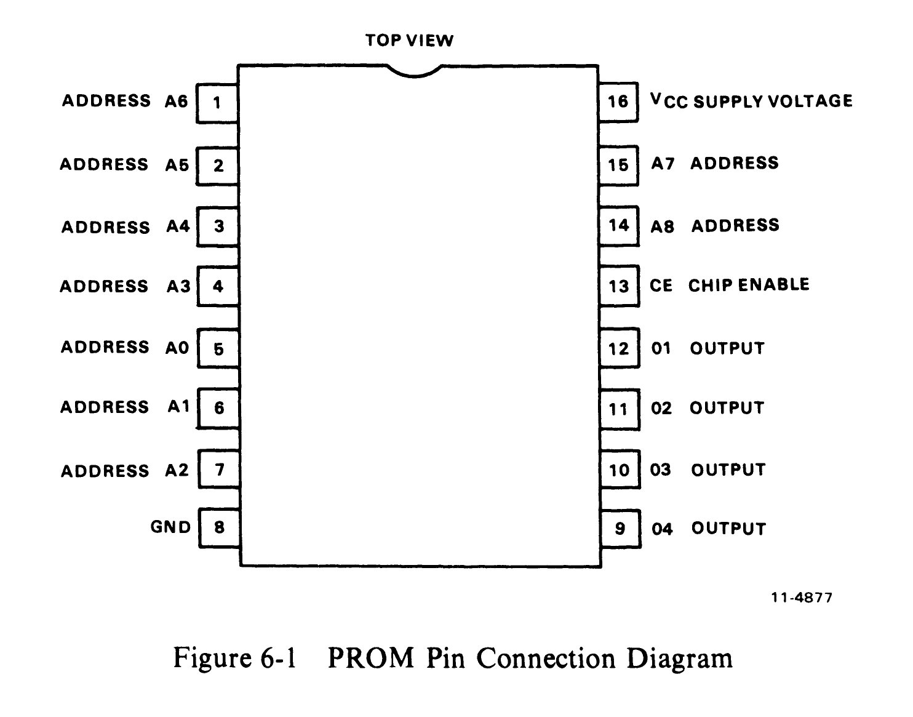
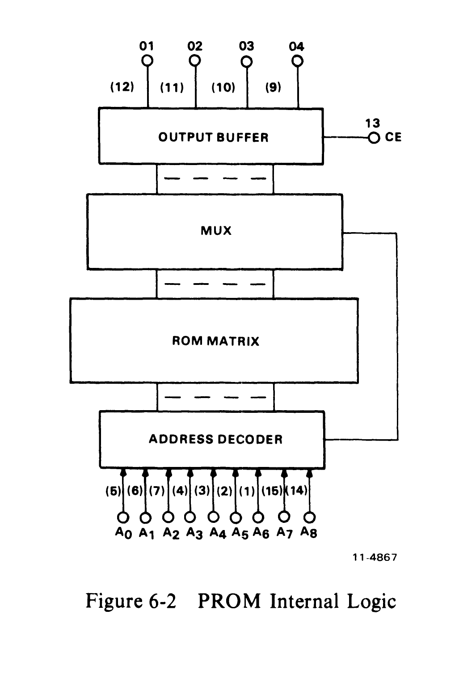

# Chapter 6 -- M9301-0

## 6.1 General

The M9301-0 has been created as a universal bootstrap device which allows the user to program and install customized 512 x 4-bit PROMs. This module version comes with four 16-pin IC (integrated circuit) sockets in place of the ROMs normally inserted on other module versions. When configuring PROM bit patterns for the M9301-0, care should be taken to arrange them to meet the address and data output pinouts on the module (Paragraph 2.10).

The switches for this version are hardwired in the same way as the switches for the other versions (Paragraphs 2.4, 2.8, and 2.9). However, the user will have to determine how he wants to set the switches, depending on the programs he blasts into the PROMs and the program starting locations he selects.

## 6.2 PROM Programming Procedure

The PROM is manufactured with logic level 0s in all storage locations. In order to program a logic level 1 at a specified bit, the ROM programmer must electrically alter a bit at logic level 0 to logic level 1. There are 2048 bits which are organized as 512 words of 4 bits each. Figure 6-1 shows a PROM pin diagram. Figure 6-2 is a block diagram showing the logic internal to the PROM.

