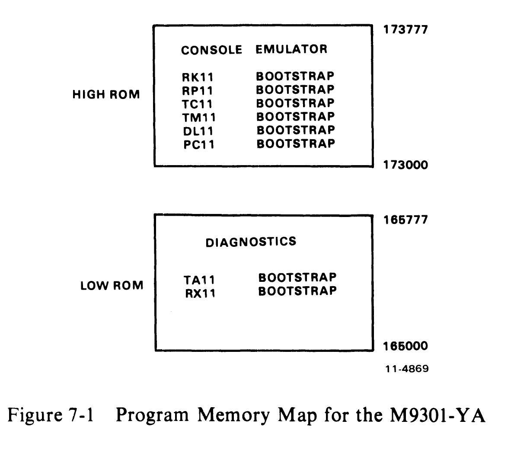
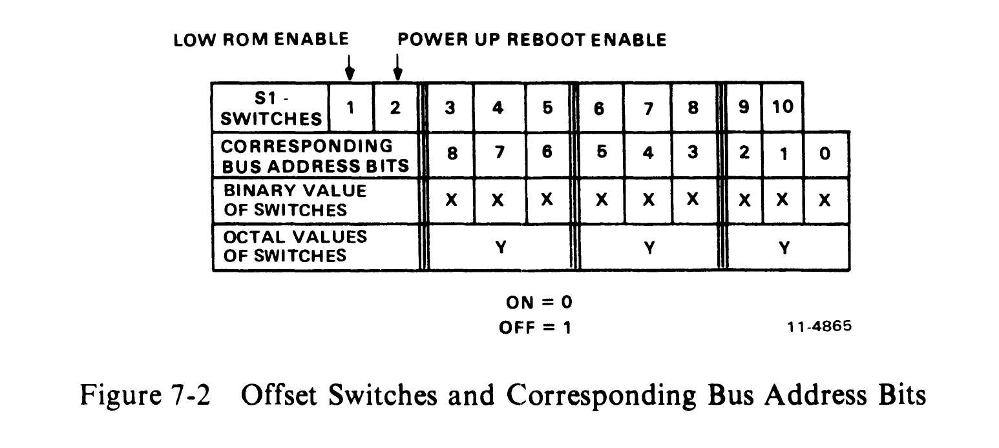
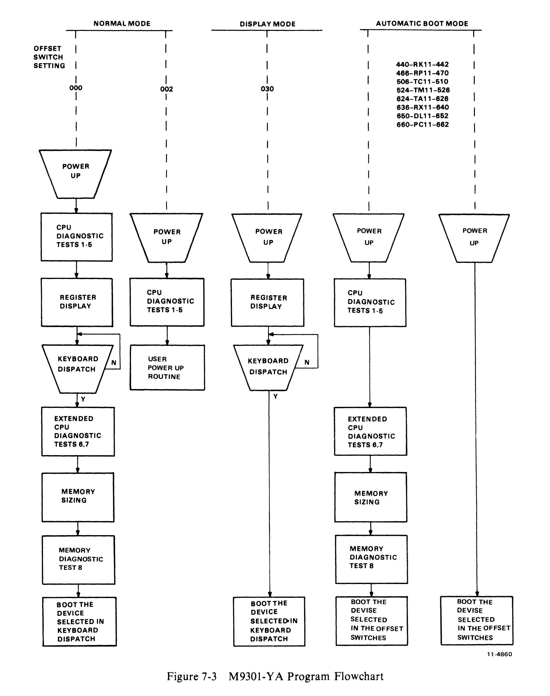

# Chapter 7 -- M9301-YA

## 7.1 Introduction

The M9301-YA is designed specifically for PDP-11/04 and PDP-11/34 OEM systems. The ROM routines include basic CPU and memory GO-NO GO diagnostics, a console emulator program, and a specific set of bootstrap programs.

The only physical difference between the M9301-YA and the M9301-0 module is that specially programmed tristate 512 x 4-bit ROMs are inserted in the 16-pin dip sockets of the M9301-0. Figure 7-1 is a program memory map of the M9301-YA module, and it lists the nature of each diagnostic test in the ROMs. A program listing for the ROMs may be found in the M9301 engineering drawings.



Memory map contents:
- HIGH ROM (173000-173777): Console Emulator, RK11/RP11/TC11/TM11/DL11/PC11 bootstraps
- LOW ROM (165000-165777): Diagnostics, TA11/RX11 bootstraps

## 7.2 Bootstrap Programs

The commands which can be used to call the bootstrap programs from the console emulator are listed in Table 7-1.

**Table 7-1 Bootstrap Routine Codes for the M9301-YA**

| Device | Description | Command |
|---|---|---|
| RK11 | Disk Cartridge | DK |
| RP11 | RP02/03 Disk Pack | DP |
| TC11 | DECtape | DT |
| TM11 | 800 bpi Magtape | MT |
| TA11 | Magnetic Cassette | CT |
| RX11 | Diskette | DX |
| DL11 | ASR-33 Teletype | TT |
| PC11 | Paper Tape | PR |

An explanation of the functions performed by the various bootstrap programs follows.

RX11 Diskette Bootstrap -- Loads the first 64 words (200(8) bytes) of data from track one, sector one into memory locations 0-176 beginning at location 0. If location 0 does not contain 240, the boot is restarted. Restarts will occur 2000 times before the machine is halted automatically.

TA11 Cassette Bootstrap -- This bootstrap is identical to that of the RX11 except that data is loaded from the cassette beginning at the second block.

PC11 Paper Tape Reader Bootstrap -- Loads an absolute loader formatted tape into the upper memory locations XXX746 to XXX777 (XXX is dependent on memory size). Once loading is completed, the boot transfers operation to a routine beginning at location XXX752. In systems containing an M9301-YA which is set up not to run diagnostic test 1 through test 5, XXX will become 017, not the upper part of memory.

Disk and DECtape Bootstraps (excluding RX11) -- Load 1000(8) words (2000(8) bytes) of data from the device into memory locations 0-1776(8).

Magtape Bootstraps: TM11 -- Loads second record (2000(8) bytes maximum size) from the magtape into memory location 0-1776(8).

## 7.3 Microswitch Settings

A set of ten microswitches is located on the M9301 module. They determine which ROM routines are selected on power-up and give the user automatic access to any function. Switch S1-1 should be on for normal operation in order to allow access to the low ROM addresses (765000-765777). The primary activating processes for the M9301-YA are the power-up sequence and the enabling of the console boot switch. Switch S1-2 must be in the ON position in order to enable activation of the M9301-YA on a power-up. If switch S1-2 is off, then the processor will trap to location 24 (as normal) to execute the user power-up routine. When switch S1-2 is ON, the other switches, S1-3 through S1-10, determine what action the M9301-YA will take on power-up.

If the system includes a console boot switch, then any time that switch is pressed the M9301-YA will be activated. Note that some processors will have to be halted for this switch to have any effect. Enabling the console boot switch causes the processor to enter a ROM routine by creating a fake power-down/power-up sequence. The user should note that the position of switch S1-2 is irrelevant when the console boot switch is used.

Pushing the console boot switch thus results in a normal power-up sequence in the processor. Prior to the power-up sequence, the M9301-YA asserts 773000 on the Unibus address lines. This causes the new PC to be taken from ROM location 773024 instead of location 000024. The new PC will be the logical OR of the contents of ROM location 773024 and the eight microswitches on the M9301-YA module. A switch in the ON position is read as a 0, while a switch in the OFF position is a 1. In this way all the M9301-YA program options are accessible.

Each program option is given a different starting address. Note that microswitch S1-10 is ORed with bit 1 of the data in ROM location 773024. S1-9 is ORed with bit 2, etc. No switch is provided for combination with bit 0, because an odd address could result when going through the trap sequence. Figure 7-2 shows the relationship of the switches to the bus address bits.



## 7.4 Program Control Through the Microswitches

The microswitches on the M9301-YA enable the user either to start a bootstrap operation or to enter the console emulator, simply by pressing the boot switch. Note that a momentary power failure will have the same effect as pushing the boot switch. The user should also note that he can select any function with or without diagnostics. Adding 2 to the appropriate octal code in the switches will disable the diagnostics.

Figure 7-3 shows a program flowchart for the M9301-YA. Notice that the choice and sequence of routines is entirely dependent on the offset switch settings.

Table 7-2 shows the options with their corresponding switch settings and octal codes.



**Table 7-2 Options and Corresponding Switch Settings**

| Function | S3 | S4 | S5 | S6 | S7 | S8 | S9 | S10 | Octal Code |
|---|---|---|---|---|---|---|---|---|---|
| CPU Diagnostics with Console Emulator | ON | ON | ON | ON | ON | ON | ON | ON | 000 |
| CPU Diag. Vector through location 24 | ON | ON | ON | ON | ON | ON | ON | OFF | 002 |
| Console Emulator without Diag. | ON | ON | ON | ON | OFF | OFF | ON | ON | 030 |
| CPU Diag. Boot RK11 | OFF | ON | ON | OFF | ON | ON | ON | ON | 440 |
| Boot RK11 (without Diag.) | OFF | ON | ON | OFF | ON | ON | ON | OFF | 442 |
| CPU Diag. Boot RP11 | OFF | ON | ON | OFF | OFF | OFF | OFF | ON | 466 |
| Boot RP11 (without Diag.) | OFF | ON | ON | OFF | OFF | OFF | ON | ON | 470 |
| CPU Diag. Boot TC11 | OFF | ON | OFF | ON | ON | ON | OFF | OFF | 506 |
| Boot TC11 (without Diag.) | OFF | ON | OFF | ON | ON | OFF | OFF | ON | 510 |
| CPU Diag. Boot TM11 | OFF | ON | OFF | OFF | ON | OFF | ON | ON | 524 |
| Boot TM11 (without Diag.) | OFF | ON | OFF | OFF | ON | OFF | OFF | OFF | 526 |
| CPU Diag. Boot TA11 | OFF | OFF | ON | ON | OFF | ON | OFF | ON | 624 |
| Boot TA11 (without Diag.) | OFF | OFF | ON | ON | OFF | ON | OFF | OFF | 626 |
| CPU Diag. Boot RX11 | OFF | OFF | ON | ON | OFF | OFF | OFF | OFF | 636 |
| Boot RX11 (without Diag.) | OFF | OFF | ON | OFF | ON | ON | ON | ON | 640 |
| CPU Diag. Boot DL11 | OFF | OFF | ON | OFF | OFF | ON | ON | ON | 650 |
| Boot DL11 (without Diag.) | OFF | OFF | ON | OFF | OFF | ON | OFF | OFF | 652 |
| CPU Diag. Boot PC11 | OFF | OFF | ON | OFF | OFF | OFF | ON | ON | 660 |
| Boot PC11 (without Diag.) | OFF | OFF | ON | OFF | OFF | OFF | ON | OFF | 662 |

Note: ON = Logic 0, OFF = Logic 1

## 7.5 Diagnostic Programs

An explanation of the eight CPU and memory diagnostic tests follows. Three types of tests are included in the M9301-YA diagnostics:

1. Primary CPU tests (1-5)
2. Secondary CPU tests (6, 7)
3. Memory test (8)

### 7.5.1 Primary CPU Tests

The primary CPU tests exercise all unary and double operand instructions with all source modes. These tests do not modify memory. If a failure is detected, a branch-self (BR.) will be executed. The run light will stay on, because the processor will hang in a loop, but there will be no register display. The user must use the halt switch to exit from the loop. If no failure is detected in tests 1-5, the processor will emerge from the last test and enter the register display routine portion of the console emulator program.

**TEST 1 -- SINGLE OPERAND TEST**

This test executes all single operand instructions using destination mode 0. The basic objective is to verify that all single operand instructions operate; it also provides a cursory check on the operation of each instruction, while ensuring that the CPU decodes each instruction in the correct manner.

Test 1 tests the destination register in its three possible states: zero, negative, and positive. Each instruction operates on the register contents in one of four ways:

1. Data will be changed via a direct operation, i.e., increment, clear, decrement, etc.
2. Data will be changed via an indirect operation, i.e., arithmetic shifts, add carry, and subtract carry.
3. Data will be unchanged but operated upon via a direct operation, i.e., clear a register already containing zeros.
4. Data will be unchanged but examined via a non-modifying instruction (TEST).

> **NOTE:** When operating upon data in an indirect manner, the data is modified by the state of the appropriate condition code. Arithmetic shift will move the C bit into or out of the destination. This operation, when performed correctly, implies that the C bit was set correctly by the previous instruction. There are no checks on the data integrity prior to the end of the test. However, a check is made on the end result of the data manipulation. A correct result implies that all instructions manipulated the data in the correct way. If the data is incorrect, the program will hang in a program loop until the machine is halted.

**TEST 2 -- DOUBLE OPERAND, ALL SOURCE MODES**

This test verifies all double operand, general, and logical instructions, each in one of the seven addressing modes (excludes mode 0). Thus two operations are checked: the correct decoding of each double operand instruction, and the correct operation of each addressing mode for the source operand.

Each instruction in the test must operate correctly in order for the next instruction to operate. This interdependence is carried through to the last instruction (bit test) where, only through the correct execution of all previous instructions, a data field is examined for a specific bit configuration. Thus, each instruction prior to the last serves to set up the pointer to the test data.

Two checks on instruction operation are made in test 2. One check, a branch on condition, is made following the compare instruction, while the second is made as the last instruction in the test sequence.

Since the GO-NO GO test resides in ROM memory, all data manipulation (modification) must be performed in destination mode 0 (register contains data). The data and addressing constants used by test 2 are contained within the ROM.

It is important to note that two different types of operations must execute correctly in order for this test to operate:

1. Those instructions that participate in computing the final address of the data mask for the final bit test instruction.
2. Those instructions that manipulate the test data within the register to generate the expected bit pattern.

Detection of an error within this test results in a program loop.

**TEST 3 -- JUMP TEST MODES 1, 2, AND 3**

The purpose of this test is to ensure correct operation of the jump instruction. This test is constructed such that only a jump to the expected instruction will provide the correct pointer for the next instruction.

There are two possible failure modes that can occur in this test:

1. The jump addressing circuitry will malfunction causing a transfer of execution to an incorrect instruction sequence or non-existent memory.
2. The jump addressing circuitry will malfunction in such a way as to cause the CPU to loop.

The latter case is a logical error indicator. The former, however, may manifest itself as an after-the-fact error. For example, if the jump causes control to be given to other routines within the M9301, the interdependent instruction sequences would probably cause a failure to eventually occur. In any case, the failing of the jump instruction will eventually cause an out of sequence or illogical event to occur. This in itself is a meaningful indicator of a malfunctioning CPU.

This test contains a jump mode 2 instruction which is not compatible across the PDP-11 line. However, it will operate on any PDP-11 within this test, due to the unique programming of the instruction within test 3. Before illustrating the operation, it is important to understand the differences of the jump mode 2 between machines.

On the PDP-11/20, 11/05, 11/15, and 11/10 processors, for the jump mode 2 [JMP(R)+], the register (R) is incremented by 2 prior to execution of the jump. On the PDP-11/04, 11/34, 11/35, 11/40, 11/45, 11/50, 11/55, and 11/70, (R) is used as the jump address and incremented by 2 after execution of the jump.

In order to deal with this incompatibility, JMP (R)+ is programmed with (R) pointing back on the jump itself. On 11/20, 11/05, 11/10, and 11/15 processors, execution of the instruction would cause (R) to be incremented to point to the following instruction, effectively continuing a normal execution sequence.

On PDP-11/04, 11/34, 11/35, 11/40, 11/45, 11/50, 11/55, and 11/70 processors, the use of the initial value of (R) will cause the jump to loop back on itself. However, correct operation of the autoincrement will move (R) to point to the next instruction following the initial jump. The jump will then be executed again. However, the destination address will be the next instruction in sequence.

**TEST 4 -- SINGLE OPERAND, NON-MODIFYING BYTE TEST**

This test focuses on one unique single operand instruction, the TST. TST is a special case in the CPU execution flow since it is a non-modifying operation. Test 4 also tests the byte operation of this instruction. The TSTB instruction will be executed in mode 1 (register deferred) and mode 2 (register deferred, autoincrement).

The TSTB is programmed to operate on data which has a negative value most significant byte and a zero (not negative) least significant byte.

In order for this test to operate properly, the TSTB on the low byte must first be able to access the even addressed byte and then set the proper condition codes. The TSTB is then reexecuted with the autoincrement facility. After the autoincrement, the addressing register should be pointing to the high byte of the test data. Another TSTB is executed on what should be the high byte. The N bit of the condition codes should be set by this operation.

Correct execution of the last TSTB implies that the autoincrement recognized that a byte operation was requested, thereby only incrementing the address in the register by one, rather than two. If the correct condition code has not been set by the associated TSTB instruction, the program will loop.

**TEST 5 -- DOUBLE-OPERAND, NON-MODIFYING TEST**

Two non-modifying, double-operand instructions are used in this test -- the compare (CMP) and bit test (BIT). These two instructions operate on test data in source modes 1 and 4, and destination modes 2 and 4.

The BIT and CMP instructions will operate on data consisting of all ones (177777). Two separate fields of ones are used in order to utilize the compare instructions, and to provide a field large enough to handle the autoincrementing of the addressing register.

Since the compare instruction is executed on two fields containing the same data, the expected result is a true Z bit, indicating equality.

The BIT instruction will use a mask argument of all ones against another field of all ones. The expected result is a non-zero condition (Z).

Most failures will result in a one instruction loop.

On successful completion of test 5, the register display routine is enabled, provided the console emulator has been selected in the microswitches. This routine prints out the octal contents of the CPU registers R0, R4, SP, and old PC on the console terminal. This sequence will be followed by a prompt character ($) on the next line.

An example of a typical printout follows.

```
      XXXXXX      XXXXXX      XXXXXX      XXXXXX
$
Prompt  R0          R4          R6          R5
                                (Stack      (Old PC)
                                Pointer)
```

NOTES:
1. Where X signifies an octal number (0-7).
2. Whenever there is a power-up routine or the boot switch is released on PDP-11/04 and PDP-11/34 machines, the PC at this time will be stored in R5. The contents of R5 are then printed as the old PC shown in the example.
3. The prompting character string indicates that diagnostics have been run and the processor is operating.

### 7.5.2 Secondary CPU and Memory Tests

The secondary CPU tests modify memory and involve the use of the stack pointer. The JMP and JSR instructions and all destination modes are tested. If a failure is detected, these tests, unlike the primary tests, will execute a halt.

Secondary CPU and memory diagnostics are run immediately after test 5 when they have been evoked by means other than the console emulator, provided that the correct microswitches have been set. If the console emulator has been entered at the completion of test 5, the secondary CPU and memory diagnostics will be run when the appropriate boot command is given.

Note that the user can execute the secondary CPU and memory diagnostics without running a bootstrap program. A false boot command (an invalid device code followed by a carriage return) will cause execution of tests 6, 7, and 8 before the attempt to boot is made. If these tests are executed successfully, the device will be called but not found. The processor will trap to location 4, which has been set up by the M9301-YA, causing control to return to the console emulator. The readings for the four registers are now available, and the old PC is the highest location in memory. A failure in one of the tests will, of course, cause a halt.

**TEST 6 -- DOUBLE OPERAND, MODIFYING BYTE TEST**

The objective of this test is to verify that the double-operand, modifying instructions will operate in the byte mode. Test 6 contains three subtests:

1. Test source mode 2, destination mode 1, odd and even bytes
2. Test source mode 3, destination mode 2
3. Test source mode 0, destination mode 3, even byte.

The move byte (MOVB), bit clear byte (BICB), and bit set byte (BISB) are used within test 6 to verify the operation of the modifying double-operand functions.

Since modifying instructions are under test, memory must be used as a destination for the test data. Test 6 uses location 500 as a destination address. Later, in test 7 and the memory test, location 500 is used as the first available storage for the stack.

Note that since test 6 is a byte test, location 500 implies that both 500 and 501 are used for the byte tests (even and odd, respectively). Thus, in the word of data at 500, odd and even bytes are caused to be all 0s and then all 1s alternately throughout the test. Each byte is modified independently of the other.

**TEST 7 -- JSR TEST**

The JSR is the first test in the GO-NO GO sequence that utilizes the stack. The jump subroutine command (JSR) is executed in modes 1 and 6. After the JSR is executed, the subroutine which was given control will examine the stack to ensure that the correct data was placed in the correct stack location (500). The routine will also ensure that the line back register points to the correct address. Any errors detected in this test will result in a halt.

**TEST 8 -- MEMORY TEST**

Although this test is intended to test both core and MOS memories, the data patterns used are designed to exercise the most taxing operation for MOS. Before the details of the test are described, it would be appropriate to discuss the assumptions placed upon the failure modes of the MOS technology.

This test is intended to check for two types of problems that may arise in the memory.

1. Solid element or sense amp failures
2. Addressing malfunctions external to the chip.

The simplest failure to detect is a solid read or write problem. If a cell fails to hold the appropriate data, it is expected that the memory test will easily detect this problem. In addition, the program attempts to saturate a chip in such a way as to cause marginal sense amp operation to manifest itself as a loss or pick-up of unexpected data. The 4K x 1-chip used in the memory consists of a 64 x 64 matrix of MOS storage elements. Each 64-bit section is tied to a common sense amplifier. The objective of the program is to saturate the section with, at first all 0s and one 1-bit. This 1-bit is then floated through the chip. At the end, the data is complemented, and the test repeated.

For external addressing failures, it is assumed that if two or more locations are selected at the same time, and a write occurs, it is likely that both locations will assume the correct state. Thus, prior to writing any test data, the background data is checked to ensure that there was no crosstalk between any two locations. All failures will result in a program halt as do failures in tests 6 and 7.

> **NOTE:** If the expected and received data are the same, it is highly probable that an intermittent failure has been detected (i.e., timing or margin problem). The reason the expected and received data can be identical is that the test program rereads the failing address after the initial non-compare is detected. Thus, a failure at CPU speed is detected, and indicated by the reading of the failing address on a single reference (not at speed) operation.

## 7.6 Troubleshooting Through Register Display

When a halt occurs, the user should reboot the system by pressing the BOOT/INIT switch. The registers R0, R4, R6, and R5 will be displayed on the terminal in that order.

| Register | Contents |
|---|---|
| R0 | Expected data |
| R4 | Received data |
| R6 | Failing address (SP) |
| R5 | Old PC |

The diagnostic program in the M9301-YA will cause the processor to jump to one of four addresses: 165316, 165346, 165370, or 165534. The user should consult the diagnostic program listing to find the failing test and begin troubleshooting. Possible causes of the failure include bus errors, a bad M9301 module, and a bad CPU.
