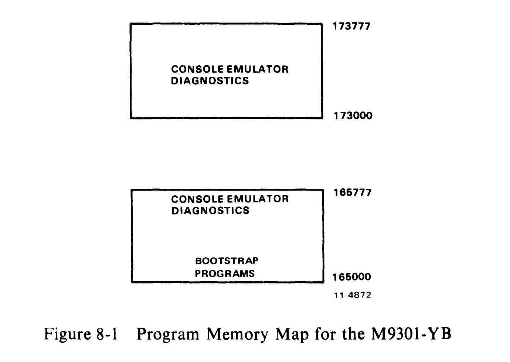
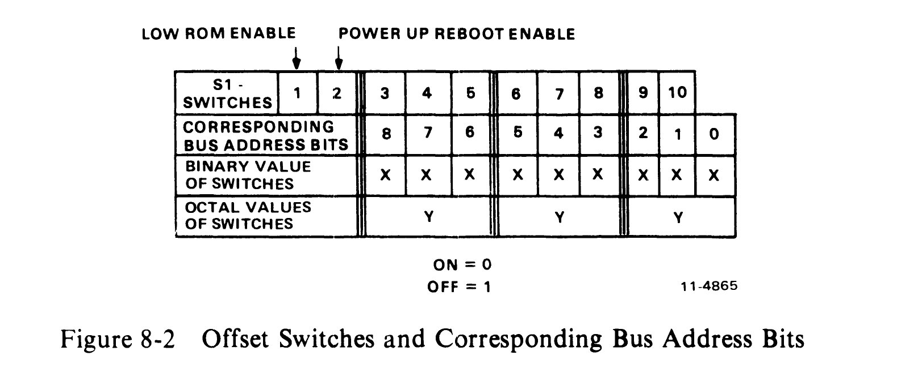
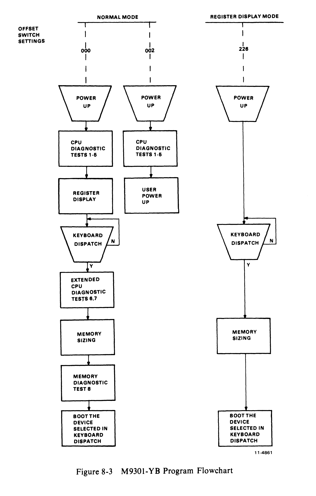

# Chapter 8 -- M9301-YB

## 8.1 Introduction

The M9301-YB is designed specifically for PDP-11/04 and PDP-11/34 end user systems. The ROM routines include basic CPU and memory GO-NO GO diagnostics, a console emulator program, and a specific set of bootstrap programs. Figure 8-1 is a program memory map for the M9301-YB.

Memory map contents:
- HIGH ROM (173000-173777): Console Emulator, Diagnostics
- LOW ROM (165000-165777): Console Emulator, Diagnostics, Bootstrap Programs

## 8.2 Bootstrap Programs

The commands used to call the bootstrap programs from the console emulator are listed in Table 8-1.

**Table 8-1 Bootstrap Routine Codes for the M9301-YB**

| Device | Description | Command |
|---|---|---|
| RK11 | Disk Cartridge | DK |
| RP11 | RP02/03 Disk Pack | DP |
| TC11 | DECtape | DT |
| TM11 | 800 bpi Magtape | MT |
| TA11 | Magnetic Cassette | CT |
| RX11 | Diskette | DX |
| DL11 | ASR-33 Teletype | TT |
| PC11 | Paper Tape | PR |
| RJS03/04 | Fixed Head Disk | DS |
| RJP04 | Disk Pack | DB |
| TJU16 | Magnetic Tape | MM |

An explanation of the functions performed by the various bootstrap programs follows.

RX11 Diskette Bootstrap -- Loads the first 64 words (200(8) bytes) of data from track one, sector one into memory locations 0-176 beginning at location 0. Once loaded the content of location 0 is checked. If it contains 240, operation is transferred to the routine beginning in location 0. If location 0 does not contain 240, the boot is restarted. Restarts will occur 2000 times before the machine is halted automatically.

TA11 Cassette Bootstrap -- This bootstrap is identical to that of the RX11 except that data is loaded from the cassette beginning at the second block.

PC11 Paper Tape Reader and DL11 Bootstraps -- Load an absolute loader formatted tape into the upper memory locations XXX746 to XXX777 (XXX is dependent on memory size). Once loading is completed, these boots transfer operation to a routine beginning at location XXX752.

Disk and DECtape Bootstraps (excluding RX11) -- Load 1000(8) words (2000(8) bytes) of data from the device into memory locations 0-1776.

Magtape Bootstraps:
- TM11 -- Loads second record (2000(8) bytes maximum size) from the magtape into memory location 0-1776(8).
- TJU16 -- Load second record (2000(8) bytes maximum size) from magtape into memory locations 0-1776. (Note that the first record contains the magtape directory.)

## 8.3 Microswitch Settings

A set of ten microswitches is located on the M9301 module. They determine which ROM routines are selected and give the user automatic access to any function.

The primary activating processes for the M9301-YB are the power-up sequence and the enabling of the console boot switch. Switch S1-1 (low ROM enable) must be in the ON position in order to enable activation of the M9301-YB console emulator or diagnostics. Switch S1-2 (POWER UP REBOOT ENABLE) must be on to activate the ROM on power-up. If switch S1-2 is off, then the processor will trap to location 24 (as normal) to execute the user power-up routine. When switch S1-2 is on, the other switches, S1-3 through S1-10, determine what action the M9301-YB will take on power-up.

If the system includes a console boot switch, then any time that switch is pressed the M9301-YB will be activated. Note that some processors will have to be halted for this switch to have any effect. Enabling the console boot switch causes the processor to enter a ROM routine by creating a fake power-down/power-up sequence. The user should note that the position of switch S1-2 is irrelevant when the console boot switch is used.

Pushing the console boot switch thus results in a normal boot on power-up sequence in the processor. Prior to the power-up sequence, the M9301-YB asserts 773000 on the Unibus address lines. This causes the new PC to be taken from ROM location 773024 instead of location 000024. The new PC will be the logical OR of the contents of ROM location 773024 and the eight microswitches on the M9301-YB module. A switch in the ON position is read as a 0. Likewise, a switch in the OFF position is a 1. In this way all the M9301-YB options are accessible.

Each option is given a different address. Note that microswitch S1-10 is ORed with bit 1 of the data in ROM location 773024. S1-9 is ORed with bit 2, etc. No switch is provided for combination with bit 0, because an odd address could result when going through the trap sequence. Figure 8-2 shows the relationship of the switches to the bus address bits.

The microswitches on the M9301-YB also enable the user to enter the console emulator, simply by pressing the boot switch.

Figure 8-3 shows a program flowchart for the M9301-YB. Notice that the choice and sequence of routines is entirely dependent on the offset switch settings.

Table 8-2 shows the options and corresponding switch settings and octal codes. The user should note that the M9301-YB does not provide for default booting from a peripheral.

**Table 8-2 Options and Corresponding Switch Settings**

| Function (on Power-up) | S1-1 | -2 | -3 | -4 | -5 | -6 | -7 | -8 | -9 | -10 | Octal Code |
|---|---|---|---|---|---|---|---|---|---|---|---|
| Vector through Location 24(8) | -- | OFF | -- | -- | -- | -- | -- | -- | -- | -- | -- |
| GO-NO GO Console Emulator | ON | ON | ON | ON | ON | ON | ON | ON | ON | ON | 000 |
| GO-NO GO Vector through Location 24(8) | ON | ON | ON | ON | ON | ON | ON | ON | ON | OFF | 002 |
| Console Emulator | ON | ON | ON | OFF | ON | ON | OFF | ON | OFF | OFF | 226 |

> **NOTE:** The above functions are the same for a boot initiated by the boot switch except that S1-2 may be ON or OFF.

## 8.4 Diagnostics

An explanation of the eight CPU and memory diagnostic tests follows. Three types of tests are included in the M9301-YB diagnostics:

1. Primary CPU tests (1-5)
2. Secondary CPU tests (6, 7)
3. Memory test (8)

### 8.4.1 Primary CPU Tests

The primary CPU tests exercise all unary and double operand instructions with all source modes. These tests do not modify memory. If a failure is detected, a branch-self (BR.) will be executed. The run light will stay on, because the processor will hang in a loop, but there will be no register display. The user must use the halt switch to exit from the loop. If no failure is detected in tests 1-5, the processor will emerge from the last test and enter the register display routine (console emulator).

**TEST 1 -- SINGLE OPERAND TEST** -- Same as M9301-YA Test 1 (Section 7.5.1).

**TEST 2 -- DOUBLE OPERAND, ALL SOURCE MODES** -- Same as M9301-YA Test 2 (Section 7.5.1).

**TEST 3 -- JUMP TEST MODES 1, 2, 3** -- Same as M9301-YA Test 3 (Section 7.5.1).

**TEST 4 -- SINGLE OPERAND, NON-MODIFYING BYTE TEST** -- Same as M9301-YA Test 4 (Section 7.5.1).

**TEST 5 -- DOUBLE-OPERAND, NON-MODIFYING TEST** -- Same as M9301-YA Test 5 (Section 7.5.1).

On successful completion of test 5, the register display routine is enabled, provided the console emulator has been selected in the microswitches. This routine prints out the octal contents of the CPU registers R0, R4, SP, and old PC on the console terminal. This sequence will be followed by a prompt character ($) on the next line.

NOTES:
1. Where X signifies an octal number (0-7).
2. Whenever there is a power-up routine or the boot switch is released on PDP-11/04 and PDP-11/34 machines, the PC at this time will be stored in R5. The contents of R5 are then printed as the old PC shown in the example.
3. The prompting character string indicates that diagnostics have been run and the processor is operating.

### 8.4.2 Secondary CPU and Memory Tests

The secondary CPU tests modify memory and involve the use of the stack pointer. The JMP and JSR instructions and all destination modes are tested. If a failure is detected, these tests, unlike the primary tests, will execute a halt.

Secondary CPU and memory diagnostics are run immediately after test 5 when they have been evoked by means other than the console emulator, provided that the correct microswitches have been set. If the console emulator has been entered at the completion of test 5, the secondary CPU and memory diagnostics will be run when the appropriate boot command is given.

Note that the user can execute the secondary CPU and memory diagnostics without running a bootstrap program. A false boot command (an invalid device code followed by a carriage return) will cause execution of tests 6, 7, and 8 before the attempt to boot is made. If these tests are executed successfully, the device will be called but not found. The processor will trap to location 4, which has been set up by the M9301-YB. A new PC is obtained at location 4, causing control to return to the console emulator. The readings for the four registers are now available, and the old PC is the highest location in memory. A failure in one of the tests will, of course, cause a halt.

**TEST 6 -- DOUBLE OPERAND, MODIFYING BYTE TEST** -- Same as M9301-YA Test 6 (Section 7.5.2).

**TEST 7 -- JSR TEST** -- Same as M9301-YA Test 7 (Section 7.5.2).

**TEST 8 -- MEMORY TEST** -- Same as M9301-YA Test 8 (Section 7.5.2).

## 8.5 Troubleshooting Through Register Display

When a halt occurs, the user should reboot the system by pressing the BOOT/INIT switch. The registers R0, R4, R6, and R5 will be displayed on the terminal in that order.

| Register | Contents |
|---|---|
| R0 | Expected data |
| R4 | Received data |
| R6 | Failing address (SP) |
| R5 | Old PC |

The diagnostic program in the M9301-YB will cause the processor to jump to one of four addresses: 165316, 165346, 165370, or 165534. The user should consult the diagnostic program listing to find the failing test and begin troubleshooting. Possible causes of the failure include bus errors, a bad M9301 module, and a bad CPU.
