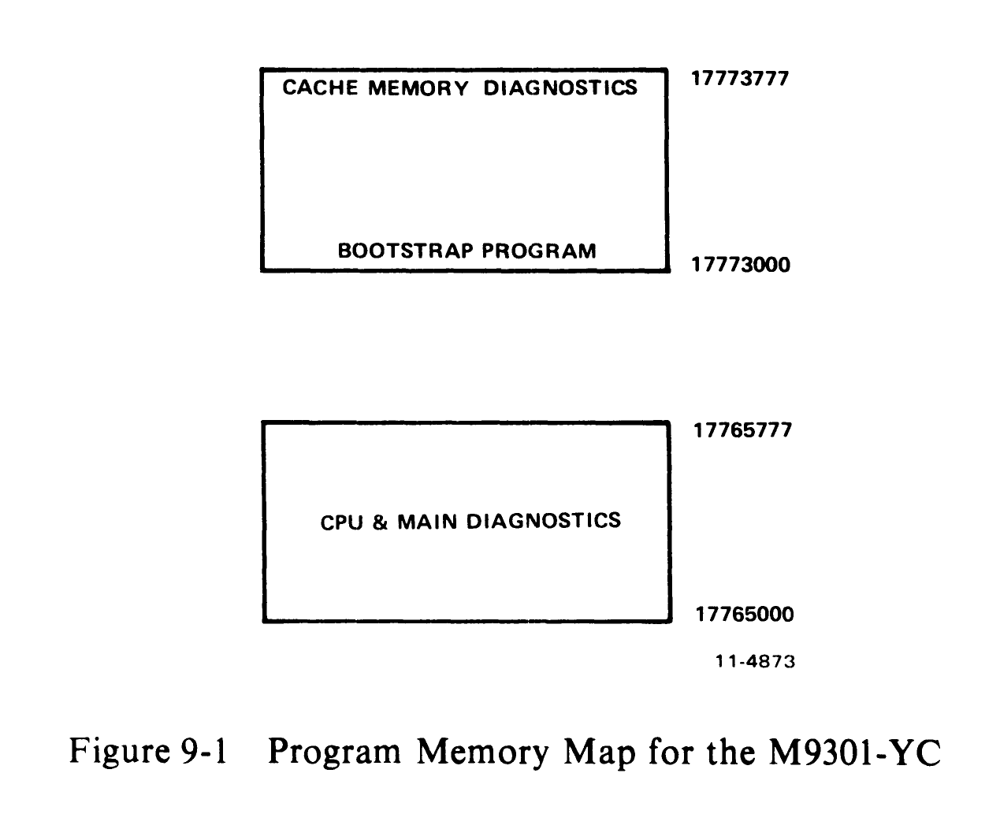
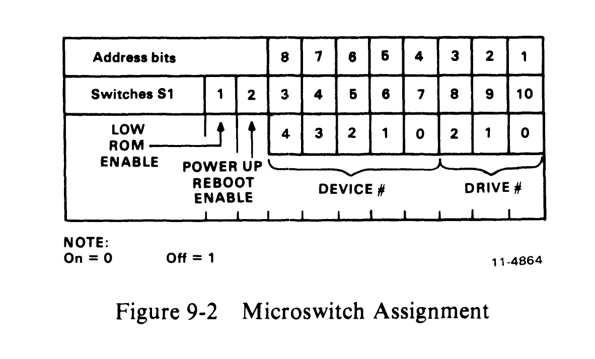
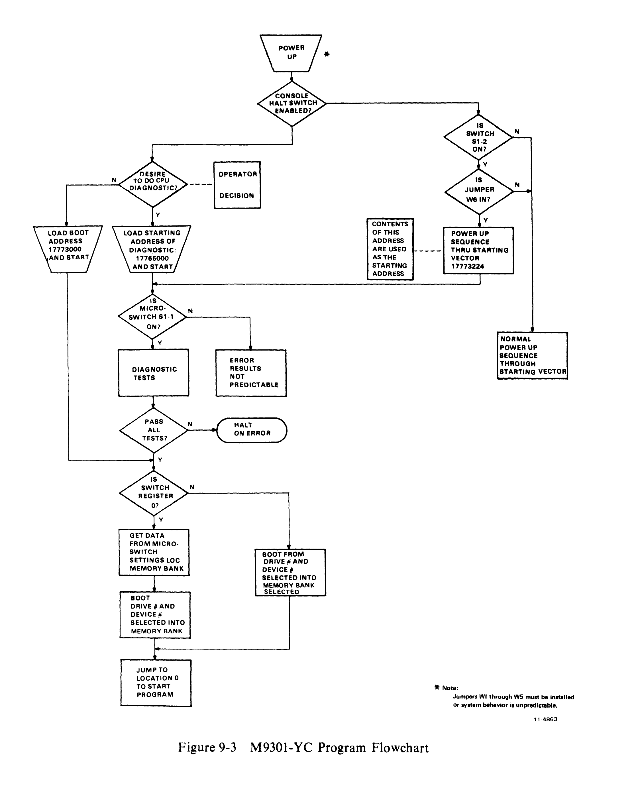

# Chapter 9 -- M9301-YC

## 9.1 Introduction

The M9301-YC is used primarily in the PDP-11/70. It contains basic CPU, cache, and memory diagnostics. It can boot from any one of 8 devices and to any one of the 16 lowest 32K banks of memory (0--512K).

The PDP-11/70 requires pull-up resistors on the bus grant lines, so W1 through W5 must be installed. Refer to ECO M9301-00005 to determine if W6 must be installed.

The ROM routine causes a device code, drive number, and desired bank to be obtained from the console switch register after load and start. If the SWR is 0, then device code and drive number are obtained from the M9301 microswitches (32K bank 0 is used). For instructions on how to start, refer to Paragraph 9.6.

Figure 9-1 shows a memory map for the M9301-YC ROMs. MAINDEC-11-DEKBH is a listing of the code. A copy of this may be found in the *PDP-11/70 Systems Manual*.



```
                                    17773777
 ┌─────────────────────────────┐
 │  CACHE MEMORY DIAGNOSTICS   │
 │                             │
 │     BOOTSTRAP PROGRAM       │    17773000
 └─────────────────────────────┘


                                    17765777
 ┌─────────────────────────────┐
 │                             │
 │   CPU & MAIN DIAGNOSTICS    │
 │                             │    17765000
 └─────────────────────────────┘
```

## 9.2 Diagnostic Test Explanation

The diagnostic portion of the program will test the basic CPU, including the branches, the registers, all addressing modes, and most of the instructions in the PDP-11 repertoire. It will then set the stack pointer to kernel D-space PAR 7. It will also turn on, if requested, memory management and the Unibus map, and will check memory from virtual address 100 to 157776. After main memory has been verified, with the cache off, the cache memory will be tested to verify that hits occur properly. Main memory will be scanned again to ensure that the cache is working properly throughout the 28K of memory to be used in the boot operation.

If one of the cache memory tests fails, the operator can attempt to boot the system anyway by pressing continue. This will cause the program to force misses in both groups of the cache before going to the bootstrap section of the program.

A listing of the M9301-YC diagnostic tests follows.

| Test | Description |
|------|-------------|
| TEST 1 | This test verifies the unconditional branch |
| TEST 2 | Test CLR, MODE 0, and BMI, BVS, BHI, BLOS |
| TEST 3 | Test DEC, MODE 0, and BPL, BEQ, BGE, BGT, BLE |
| TEST 4 | Test ROR, MODE 0, and BVC, BHIS, BHI, BNE |
| TEST 5 | Test BHI, BLT, and BLOS |
| TEST 6 | Test BLE and BGT |
| TEST 7 | Test register data path and modes 2, 3, 6 |
| TEST 10 | Test ROL, BCC, BLT, and MODE 6 |
| TEST 11 | Test ADD, INC, COM, and BCS, BLE |
| TEST 12 | Test ROR, BIS, ADD, and BLO, BGE |
| TEST 13 | Test DEC and BLOS, BLT |
| TEST 14 | Test COM, BIC, and BGT, BGE, BLE |
| TEST 15 | Test ADC, CMP, BIT, and BNE, BGT, BEQ |
| TEST 16 | Test MOVB, SOB, CLR, TST and BPL, BNE |
| TEST 17 | Test ASR, ASL |
| TEST 20 | Test ASH, AND SWAB |
| TEST 21 | Test 16 KERNEL PARs |
| TEST 22 | Test and load KIPDRs |
| TEST 23 | Test JSR, RTS, RTI, and JMP |
| TEST 24 | Load and turn on memory management and the Unibus map |
| TEST 25 | Test main memory from virtual 100 to 28K |
| TEST 26 | Test cache data memory |
| TEST 27 | Test virtual 28K with cache on |

## 9.3 Diagnostic Test Descriptions

**TEST 1 -- This test verifies the unconditional branch.**
The registers and condition codes are all undefined when this test is entered and they should remain that way upon the completion of this test.

**TEST 2 -- Test CLR, MODE 0, and BMI, BVS, BHI, BLOS.**
The registers and condition codes are all undefined when this test is entered. Upon completion of this test the SP (R6) should be zero and only the Z flip-flop will be set.

**TEST 3 -- Test DEC, MODE 0, and BPL, BGE, BGT, BLE.**
Upon entering this test the condition codes are: N = 0, Z = 1, V = 0, and C = 0.
The registers are: R0 = ?, R1 = ?, R2 = ?, R3 = ?, R4 = ?, R5 = ?, and SP = 000000.
Upon completion of this test the condition codes will be: N = 1, Z = 0, V = 0, and C = 0.
The registers affected by the test are: SP = 177777.

**TEST 4 -- Test ROR, MODE 0, and BVC, BHIS, BHI, BNE.**
Upon entering this test the condition codes are: N = 1, Z = 0, V = 0, and C = 0.
The registers are: R0 = ?, R1 = ?, R2 = ?, R3 = ?, R4 = ?, R5 = ?, and SP = 177777.
Upon completion of this test the condition codes will be: N = 0, Z = 0, V = 1, and C = 1.
The registers affected by the test are: SP = 077777.

**TEST 5 -- Test BH1, BLT, and BLOS.**
Upon entering this test the condition codes are: N = 0, Z = 0, V = 1, and C = 1.
The registers are: R0 = ?, R1 = ?, R2 = ?, R3 = ?, R4 = ?, R5 = ?, and SP = 077777.
Upon completion of this test the condition codes will be: N = 1, Z = 1, V = 1, and C = 1.
The registers are unaffected by the test.

**TEST 6 -- Test BLE and BGT.**
Upon entering this test the condition codes are: N = 1, Z = 1, V = 1, and C = 1.
The registers are: R0 = ?, R1 = ?, R2 = ?, R3 = ?, R4 = ?, R5 = ?, and SP = 077777.
Upon completion of this test the condition codes will be: N = 1, Z = 0, V = 1, and C = 1.
The registers are unaffected by the test.

**TEST 7 -- Test register data path and modes 2, 3, 6.**
When this test is entered the condition codes are: N = 1, Z = 0, V = 1, and C = 1.
The registers are: R0 = ?, R1 = ?, R2 = ?, R3 = ?, R4 = ?, R5 = ?, and SP = 077777.
Upon completion of this test the condition codes are: N = 0, Z = 1, V = 0, and C = 0.
The registers are left as follows: R0 = 125252, R1 = 000000, R2 = 125252, R3 = 125252, R4 = 125252, R5 = 125252, SP = 1225252, and MAPL00 = 125252.

**TEST 10 -- Test ROL, BCC, BLT, and MODE 6.**
When this test is entered the condition codes are: N = 0, Z = 1, V = 0, and C = 0.
The registers are: R0 = 125252, R1 = 000000, R2 = 125252, R3 = 125252, R4 = 125252, R5 = 125252, SP = 125252, and MAPL00 = 125252.
Upon completion of this test the condition codes are: N = 0, Z = 0, V = 1, and C = 1.
The registers are left unchanged except for MAPL00 which should now equal 052524.

**TEST 11 -- Test ADD, INC, COM, and BCS, BLE.**
When this test is entered the condition codes are: N = 0, Z = 0, V = 1, and C = 1.
The registers are: R0 = 125252, R1 = 000000, R2 = 125252, R3 = 125252, R4 = 125252, R5 = 125252, SP = 125252, and MAPL00 = 052524.
Upon completion of this test the condition codes are: N = 0, Z = 1, V = 0, and C = 0.
The registers are left unchanged except for R3 which now equals 000000, and R1 which is also 000000.

**TEST 12 -- Test ROR, BIS, ADD, and BLO, BGE.**
When this test is entered the condition codes are: N = 0, Z = 1, V = 0, and C = 0.
The registers are: R0 = 125252, R1 = 000000, R2 = 125252, R3 = 030000, R4 = 125252, R5 = 125252, and SP = 125252.
Upon completion of this test the condition codes are: N = 0, Z = 1, V = 0, and C = 0.
The registers are left unchanged except for R3 which should be modified back to 000000, and R4 which should now equal 052525.

**TEST 13 -- Test DEC and BLOS, BLT.**
When this test is entered the condition codes are: N = 0, Z = 1, V = 0, and C = 0.
The registers are: R0 = 125252, R1 = 000000, R2 = 125252, R3 = 000000, R4 = 052525, R5 = 125252, and SP = 125252.
Upon completion of this test the condition codes are: N = 1, Z = 0, V = 0, and C = 0.
The registers are left unchanged except for R1 which should now equal 177777.

**TEST 14 -- Test COM, BIC, and BGT, BLE.**
When this test is entered the condition codes are: N = 1, Z = 0, V = 0, and C = 0.
The registers are: R0 = 125252, R1 = 177777, R2 = 125252, R3 = 000000, R4 = 052525, R5 = 125252, and SP = 125252.
Upon completion of this test the condition codes are: N = 0, Z = 0, V = 1, and C = 1.
The registers are left unchanged except for R0 which should now equal 052525, and R1 which should now equal 052524.

**TEST 15 -- Test ADC, CMP, BIT, and BNE, BGT, BEQ.**
When this test is entered the condition codes are: N = 0, Z = 0, V = 1, and C = 1.
The registers are: R0 = 052525, R1 = 052524, R2 = 125252, R3 = 000000, R4 = 052525, R5 = 125252, and SP = 125252.
Upon completion of this test the condition codes are: N = 0, Z = 1, V = 0, and C = 0.
The registers are now: R0 = 052525, R1 = 000000, R2 = 125252, R3 = 000000, R4 = 052525, R5 = 052525, and SP = 125252.

**TEST 16 -- Test MOVB, SOB, CLR, TST and BPL, BNE.**
When this test is entered the condition codes are: N = 0, Z = 1, V = 0, and C = 0.
The registers are: R0 = 052525, R1 = 000000, R2 = 125252, R3 = 000000, R4 = 052525, R5 = 052525, and SP = 125252.
Upon completion of this test the condition codes are: N = 0, Z = 1, V = 0, and C = 0.
R0 is decremented by an SOB instruction to 000000; R1 is cleared and then incremented around to 000000.

**TEST 17 -- Test ASR, ASL.**
When this test is entered the condition codes are: N = 0, Z = 1, V = 0, and C = 0.
The registers are: R0 = 125252, R1 = 000000, R2 = 125252, R3 = 000000, R4 = 052525, R5 = 052525, and SP = 125252.
Upon completion of this test the condition codes are: N = 0, Z = 0, V = 0, and C = 0.
The registers are left unchanged except for R0 which is now equal to 000000, R1 which is now 000001, and R2 which is now 000000.

**TEST 20 -- Test ASH, and SWAB.**
When this test is entered the condition codes are: N = 0, Z = 0, V = 0, and C = 0.
The registers are: R0 = 000000, R1 = 000001, R2 = 000000, R3 = 000000, R4 = 052525, R5 = 052525, and SP = 125252.
Upon completion of this test the condition codes are: N = 0, Z = 1, V = 0, and C = 1.
The registers are left unchanged except for R1 which should now equal 000000.

**TEST 21 -- Test 16 KERNEL PARs.**
When this test is entered the condition codes are: N = 0, Z = 1, V = 0, and C = 1.
The registers are: R0 = 000000, R1 = 000000, R2 = 000000, R3 = 000000, R4 = 052525, R5 = 052525, and SP = 125252.
Upon completion of this test the condition codes are: N = 0, Z = 1, V = 00, and C = 0.
The registers now equal: R0 = 172400, R1 = 000000, R2 = 000000, R3 = 000000, R4 = 052525, R5 = 125252, and SP = 125252.
All KERNEL PARs = 125252.

**TEST 22 -- Test and load KIPDRs.**
When this test is entered the condition codes are: N = 0, Z = 1, V = 0, and C = 0.
The registers are: R0 = 172400, R1 = 000000, R2 = 000000, R3 = 000000, R4 = 052525, R5 = 125252, and SP = 125252.
Upon completion of this test the condition codes are: N = 0, Z = 1, V = 0, and C = 0.
The registers that are modified are: R0 = 172300, R1 = 000000, and R2 = 077406.
All KERNEL I-SPACE PDRs (172300 -- 172316) = 077406.

**TEST 23 -- Test JSR, RTS, RTI, JMP.**
This test first sets the stack pointer to KDPAR7 (172376), and then verifies that JSR, RTS, RTI, and JMP all work properly.

On entry to this test the stack pointer (SP) is initialized to 172376 and is left that way on exit.

**TEST 24 -- Load and turn on memory management and the Unibus map.**
This test is only executed if the upper 4 bits (<15:12>) of the switch register are non-zero. The test will load memory management to relocate to the 32K block number specified. It will also set up the Unibus addresses correctly. (If bits <15:12> specify block number 3, the user should boot into memory from 96K to 128K. The KIPARs will be loaded as follows: KIPAR0 = 006000, KIPAR1 = 006200, KIPAR2 = 006400, KIPAR3 = 006600, KIPAR4 = 007000, KIPAR5 = 007200, KIPAR6 = 007400. KIPAR7 will always equal 177600.)
The Unibus map registers will then be set as follows: MAPL0 = 000000, MAPH0 = 03, MAPL1 = 020000, MAPH1 = 03, MAPL2 = 040000, MAPH2 = 03, MAPL3 = 060000, MAPH3 = 03, MAPL4 = 100000, MAPH4 = 03, MAPL5 = 120000, MAPH5 = 03, MAPL6 = 140000, MAPH6 = 03.

**TEST 25 -- Test main memory from virtual 1000 to 28K.**
This test will test main memory with the cache disabled, from virtual address 001000 to 157776. If the data does not compare properly, the test will halt at either 165740 or 165776. If a parity error occurs, the test will halt at address 165776, with PC + 2 on the stack which is in the KERNEL D-SPACE PARs.

In this test the registers are initialized as follows: R0 = 001000, R1 = DATA READ, R2 = 067400, R3 = 0001000, R4 = 067400, R5 = 177746 (control register), SP = 172376.

The following two tests are cache memory tests. If either fails to run successfully, the program will come to a halt in the M9301 ROM. If you desire to try to boot your system or diagnostic, you can press continue and the program will force misses in both groups of the cache and go to the bootstrap that has been selected.

**TEST 26 -- Test cache data memory.**
This test will check the data memory in the cache, first group 0 and then group 1. It loads 052525 into an address, complements it twice and then reads the data. It then checks that address to ensure the data was a hit. The sequence is repeated on the same address with 125252 as the data. All cache memory data locations are tested in this way. If either group fails and the operator presses continue, the program will try to boot with the cache disabled.

The registers are initialized as follows for this test: R0 = 001000 (address), R1 = 000002 (count), R2 = 001000 (count), R3 = 001000 (count), R4 = 125252 (pattern), R5 = 177746 (control register), SP = 172374 (flag of zero pushed on stack).

**TEST 27 -- Test virtual 28K with cache on.**
This test checks virtual memory from 001000 through 157776 to ensure that you can get hits all the way up through main memory. It starts with group 1 enabled, then tests group 0, and finally checks memory with both groups enabled. If any one of the three passes fail, the test will halt at CONT + 2. Then if the operator presses continue, the program will try to boot with the cache disabled.

Upon entry the registers will be set up as follows: R0 = 001000 (address), R1 = 000003 (pass count), R2 = 067400 (memory counter), R3 = 001000 (first address), R4 = 067400 (memory counter), R5 = 177746 (control register), SP = 172374 (pointing to code for control register).

Upon completion of this test, main memory from virtual address 001000 through 157776 will contain its own virtual address.

## 9.4 PDP-11/70 Bootstrap

The bootstrap portion of the program (beginning at 17773000) looks at the lower byte of the console switch register to determine which one of eight devices and which one of eight drives to boot from. Switches <02:00> select the drive number (0--7), and switches <07:03> select the device code (1--11) to be used. If the lower byte of the switch register is zero, the program will read the set of microswitches on the M9301 to determine the device and drive number. These switches can be set to select a default boot device (provided the console SWR is 0).

If the bootstrap operation fails as a result of a hardware error in the peripheral device, the program will do a RESET instruction, jump back to the test that sets up memory management, and will attempt to boot again.

## 9.5 Microswitches

Switch S1-1 is the low ROM enable switch. It is used to inhibit (when OFF) the M9301-YC from responding to addresses 17765000--17765777. Switch S1-2 is the power-up reboot enable switch. It enables the M9301-YC ROM on power-up. Switches S1-3 through S1-10 correspond to bus data bits 8--1 respectively. They are read when location 17773024 is accessed (Figure 9-2).



```
              LOW     POWER UP
              ROM     REBOOT
              ENABLE  ENABLE
                |       |
 Address bits   |   | 8 | 7 | 6 | 5 | 4 | 3 | 2 | 1 |
 Switches S1  1 | 2 | 3 | 4 | 5 | 6 | 7 | 8 | 9 | 10|
                    |         |         |         |
                    +---------+---------+---------+
                     DEVICE #           DRIVE #

 NOTE:
 On = 0
 Off = 1
```

Since the external boot switch and boot on power-up capabilities are available on the M9301-YC (ECO M9301-00005), if all required ECOs are included and microswitch S1-2 is ON, the PDP-11/70 will boot (dependent on console switch register and/or the microswitches) on a power-up. If booting on power-up is not desired, switch S1-2 should be OFF.

If the operator wishes to load address 17765000 and start (or boot on power-up), switch S1-1 should be on. However, some peripheral devices in the system may require bus addresses in the range of 17765000--17765777. In this case switch S1-1 must be OFF. With switch S1-1 OFF, the M9301-YC must be started at location 17773000 or an SSYN time-out will occur. Microswitches S1-3 through S1-10 are used whenever 17765000 or 17773000 is loaded and the processor is started from the console, and the console switches are set equal to 0 (all ON). Microswitches S1-3 through S1-7 correspond to device codes. Microswitches S1-8 through S1-10 correspond to drive numbers. For example, the RK05 drive 1 is selected through the following configuration:

S1-1: ON/OFF, S1-2: ON/OFF, S1-3: ON, S1-4: OFF, S1-5: OFF, S1-6: ON, S1-7: OFF, S1-8: ON, S1-9: ON, S1-10: OFF

Note that only eight devices can be selected (1--4 and 6--11). Device code 5 is reserved. Use of this code will result in errors.

Figure 9-3 shows a program flowchart for the M9301-YC. Notice that the choice of routines is determined by jumpers and microswitch settings as well as console switch register settings.



## 9.6 Starting Procedure

### 9.6.1 Console Switch Settings

The lower byte of the console switch register should be set to have the drive number (0--7) in switches <02:00>, and the device code (1--11) in switches <07:03>.

The upper byte of the switch register should be set to have the bank number of the 32K block of memory for the bootstrap operation (0--17) in switches <15:12>.

The memory blocks are as follows:

| Block | Physical Memory |
|-------|----------------|
| 0 | 0--28K |
| 1 | 32K--60K |
| 2 | 64K--92K |
| 3 | 96K--124K |
| 4 | 128K--156K |
| ... | ... |
| 10 | 256K--284K |
| ... | ... |
| 14 | 384K--412K |
| 15 | 416K--444K |
| 16 | 448K--476K |
| 17 | 480K--508K |

### 9.6.2 Starting Addresses

The normal starting address for the diagnostic and boot routine is 17765000 (microswitch S1-1 must be ON). If the diagnostic portion of this program fails and the operator wants to attempt to boot anyway, he must follow these steps:

1. Set up memory management if booting into other than the lower 28K of memory. BUS INIT (console start) initializes memory management to 0--28K of main memory.
2. a. If the device is on the Massbus, set stack pointer to a valid address and load that address with the memory bank number put into switches <15:12>.
   b. If the device is on the Unibus, set up Unibus map registers 0 through 6 to map to the same memory as memory management. BUS INIT (console start) initializes the map to 0--128K of main memory.
3. Deposit address 173000 into the PC.
4. Set the device code and drive number in the lower byte of the switch register.
5. Press continue.

Examples:

A. RP04 -- Set stack pointer to 40000, load 000000 into address 40000, load 173000 into the PC (17777707), set 000070 into switches (RP04 drive 0), press continue.

B. RK05 -- Load 173000 into the PC (17777707), set 000030 into switches (RK05 drive 0), press continue.

### 9.6.3 Operator Action

If the diagnostic portion of the ROM routine fails, record PC of the instruction and refer to the listing to find out which test in the program failed.

## 9.7 Errors

Table 9-1 is a list of error halts indexed by the address displayed.

**Table 9-1 Error Halts**

| Address Displayed | Test Number and Subsystem Under Test |
|-------------------|--------------------------------------|
| 17765004 | Test 1, Branch Test |
| 17765020 | Test 2, Branch Test |
| 17765036 | Test 3, Branch Test |
| 17765052 | Test 4, Branch Test |
| 17765066 | Test 5, Branch Test |
| 17765076 | Test 6, Branch Test |
| 17765134 | Test 7, Register Data Path Test |
| 17765146 | Test 10, Branch Test |
| 17765166 | Test 11, CPU Instruction Test |
| 17765204 | Test 112, CPU Instruction Test |
| 17765214 | Test 13, CPU Instruction Test |
| 17765222 | Test 14, COM Instruction Test |
| 17765236 | Test 14, CPU Instruction Test |
| 17765260 | Test 15, CPU Instruction Test |
| 17765270 | Test 16, Branch Test |
| 17765312 | Test 16, CPU Instruction Test |
| 17765346 | Test 17, CPU Instruction Test |
| 17765360 | Test 20, CPU Instruction Test |
| 17765374 | Test 20, CPU Instruction Test |
| 17765450 | Test 21, KERNAL PAR Test |
| 17765474 | Test 22, KERNAL PAR Test |
| 17765510 | Test 23, JSR Test |
| 17765520 | Test 23, JSR Test |
| 17765530 | Test 23, RTS Test |
| 17765542 | Test 23, RTI Test |
| 17765550 | Test 23, JMP Test |
| 17765760 | Test 25, Main Memory Data Compare Error |
| 17766000 | Test 25, Main Memory Parity Error (no recovery possible from this error) |
| 17773644 | Test 26, Cache Memory Data Compare Error |
| 17773654 | Test 26, Cache Memory No Hit (Pressing continue here will cause boot attempt forcing misses) |
| 17773736 | Test 27, Cache Memory Data Compare Error |
| 17773746 | Test 27, Cache Memory No Hit (Pressing continue here will cause boot attempt forcing misses) |
| 17773764 | Test 25 OR 26, Cache Memory Parity Error (Pressing continue here will cause boot attempt forcing misses) |

**Error Recovery**

Most of the error halts are hard failures (there is no recovery). If main memory halts are the fault, try booting to another bank (if the program is relocatable) or swap modules from another bank with bank 0.

If the processor halts in one of the two cache tests, the error can be recovered from. Press continue to finish the test (if at either 17773644 or 17773736) or force misses in both groups of the cache and attempt to boot the system monitor with the cache disabled (if at either 17773654, 17773746, or 17773764).

If this program fails in an uncontrolled manner, it might be due to an unexpected trap to location 000004. If this is suspected, then load a 000006 into address 000004 and a 000000 into location 000006. This will cause all traps to location 000004 to halt with 00000010 in the address lights. The operator can then examine the CPU error register at location 17777766.

The bits in the CPU error register are defined as follows:

- Bit 02 = Red zone stack limit
- Bit 03 = Yellow zone limit
- Bit 04 = Unibus time-out
- Bit 05 = Nonexistent memory (cache)
- Bit 06 = Odd address error
- Bit 07 = Illegal halt
