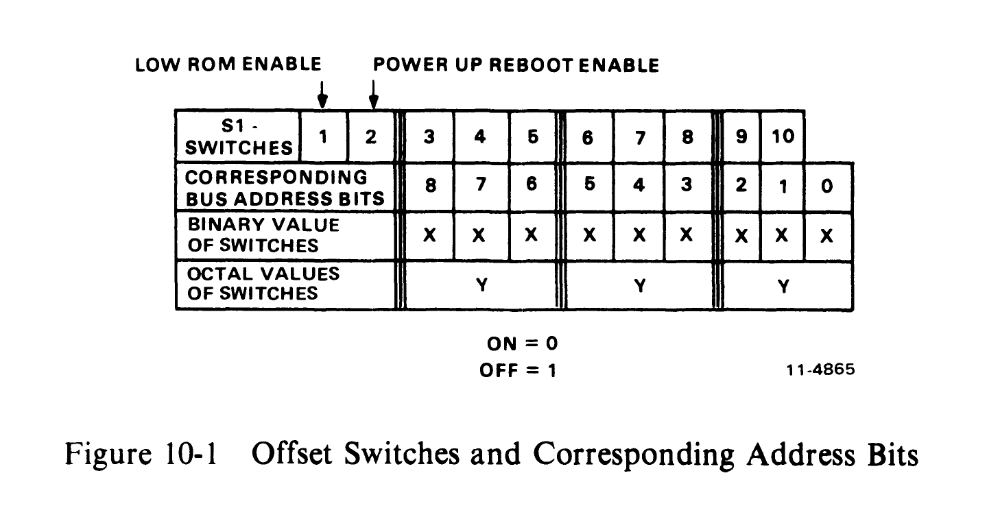
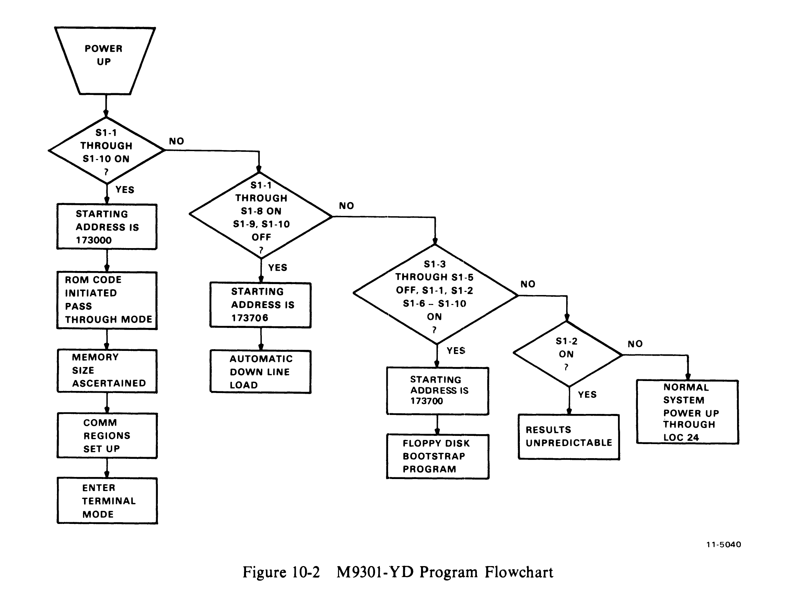

# Chapter 10 -- M9301-YD

## 10.1 Introduction

The M9301-YD is programmed to provide transparent pass-through of data between a terminal on a satellite computer and an asynchronous serial line on the same computer. It also contains all of the necessary instructions for requesting a secondary mode program load and accepting a down-line load on its serial line from another machine using DDCMP protocol. These features enable a PDP-11 computer to be a satellite in a REMOTE-11 system.

The M9301-YD ROM will run on any PDP-11 computer. Two DL11s are required with the following addresses and vectors:

| Function | Address | Vector |
|----------|---------|--------|
| Local Terminal | 177560 | 60 |
| Interprocessor | 175610 | 400 |

The ROM may be activated by placing the starting address for the desired type of bootstrap in the switch register and pressing LOAD ADDRESS, START, or by utilizing the power-up bootstrap feature of the M9301-YD with proper setting of the address offset microswitches.

Figure 10-1 shows the relation of the microswitches to the starting address. Figure 10-2 is the M9301-YD power-up flowchart.



```
              LOW     POWER UP
              ROM     REBOOT
              ENABLE  ENABLE
                |       |
 S1 -          |       |
 SWITCHES    1 | 2 | 3 | 4 | 5 | 6 | 7 | 8 | 9 | 10|
 CORRESPONDING |   |   |   |   |   |   |   |   |   |
 BUS ADDRESS   | 8 | 7 | 6 | 5 | 4 | 3 | 2 | 1 | 0 |
 BITS          |   |   |   |   |   |   |   |   |   |
 BINARY VALUE  | x | x | x | x | x | x | x | x | x |
 OF SWITCHES   |   |   |   |   |   |   |   |   |   |
 OCTAL VALUES  |   y   |       y       |       y       |
 OF SWITCHES   |       |               |               |

 ON = 0
 OFF = 1
```



## 10.2 Normal Bootstrap (173000)

The starting address is 173000. Switches S1-1 through S1-10 are on for power-up bootstrap. Ordinarily, when the ROM code is initiated, the satellite comes up in pass-through mode. First, the memory size of the computer is ascertained. Then, necessary communications regions are set up and the OSOP message "Enter terminal mode" is sent on the serial line. All further communication is in ASCII with the ROM program polling the ready flags in the four control and status registers to determine the next action. XON (Q) and XOFF (S) are supported within the satellite computer, and transmission is assumed to be full duplex.

The only way the terminal mode may be discontinued is through the receipt of a DDCMP message. The ROM accepts only the following messages: "Program load without transfer address," "Program load with transfer address," and "Enter terminal mode."

## 10.3 Secondary Mode Bootstrap (173006)

Switches S1-1 through S1-8 are ON for use of the power-up bootstrap function. S1-9 and S1-10 are OFF. The alternate starting address 173006 causes an automatic down line load. The "Enter terminal mode" message is replaced by "Request secondary mode program load." The host machine should respond to this message with a program load so that terminal mode is only transiently activated. Bus addresses 177560--177566 will be addressed during this time. The secondary mode program load message may be used for loading programs into satellites without terminals or for loading a scroller into a machine with a graphics terminal. All other secondary mode actions are identical to those of the normal bootstrap.

## 10.4 Floppy Bootstrap (173700)

The starting address 173700 should be used for initiating a boot load from a floppy disk. The switches should be set as follows: S1-1, S1-2 ON; S1-3 through S1-5 OFF; S1-6 through S1-10 ON.

## 10.5 Sending DDCMP Messages

A callable subroutine within the ROM will send DDCMP boot mode messages. These messages should be already loaded in memory. Location 162 is loaded by the M9301-YD with the address of this subroutine. To use it, call from the user program with:

```
    CLR     R2              ;indicate no completion routine
    MOV     #MSG,R5
    JSR     PC,@162
```

where MSG has the following format:

- Bytes 0 and 1 contain the number of bytes in the message
- Byte 2 has an OSOP code
- Bytes 3 through n have the data (if any)

The message is sent using interrupt driven code, but control is not returned to the user program until the message has been completely sent out.

## 10.6 Receiving DDCMP Messages

A program which has been booted down line from the host to the satellite will automatically receive DDCMP messages if properly initialized and if the interrupt for the serial line receive register is enabled. The program listing which follows shows the routine which handles the messages. It should be included in the booted program.

```
    MOV     @162,-(SP)      ;get RECDDC address
    SUB     #62,(SP)
    MOV     #-9.,R4         ;MSU size
    CLR     R3              ;CRC initialize
    CLR     R2              ;completion (move)
    JSR     PC,@(SP)+       ;call RECDDC
    BCS     ERROR
    Add     #8.,RO          ;point to OSOP Code
```

To restart this receiving routine, execute JMP@164.

The M9301-YD uses locations 150--167 for communications and 170--171 for temporary data during program loads. It also loads location 54 with the high usable memory address. The address in 54 has been adjusted to leave room for buffers and a stack for use by the ROM.
