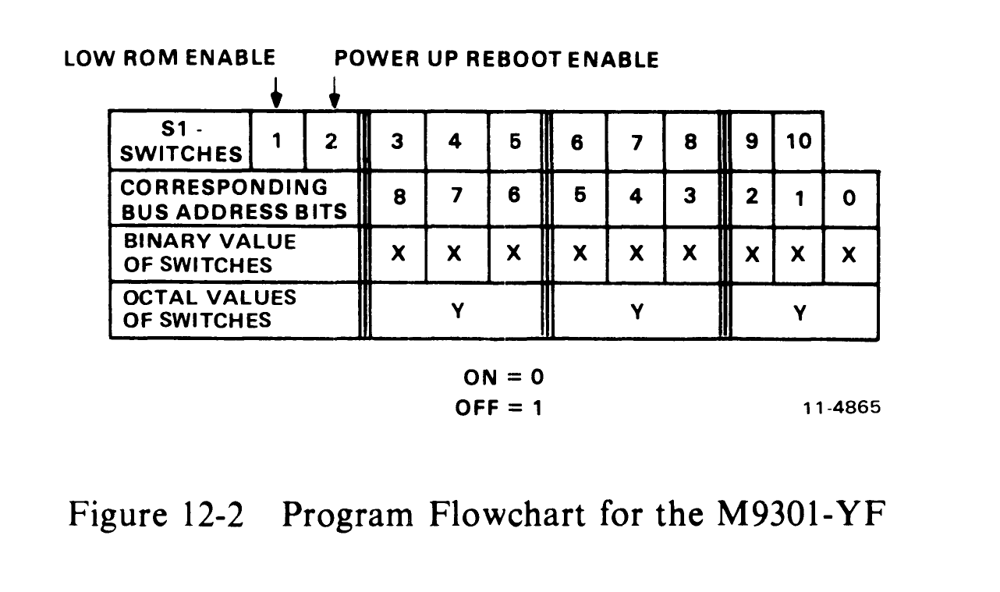
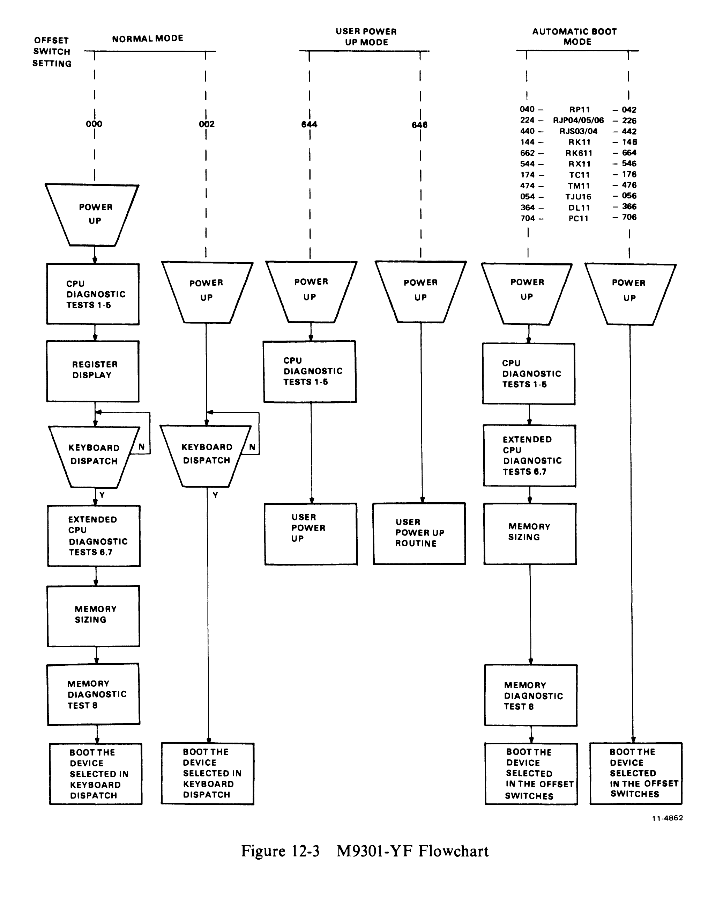
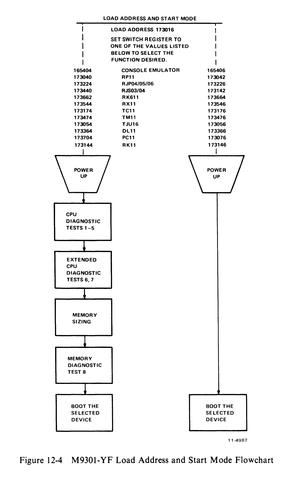

# Chapter 12 -- M9301-YF

## 12.1 Introduction

The M9301-YF is designed to function in PDP-11 systems. It provides bootstrapping capabilities for all major PDP-11 devices and includes routines for console emulation and some basic CPU and memory GO-NO GO diagnostic tests.

This bootstrap module has been designed for maximum flexibility of operation. Its function may be initiated in any of four ways: automatically at power up (exception 11/45, 11/50); by depressing the console boot switch; by a LOAD ADDRESS and START sequence; and by using the console emulator through a terminal.

The M9301-YF is essentially a combination of the M9301-YA and the M9301-YB. The M9301-YF can boot from the console switch register, but only unit number 0. Note that the TA11 is not supported.

## 12.2 Memory Map

Figure 12-1 is a memory map for the M9301-YF.

```
                              773777
    ┌─────────────────────┐
    │                     │
    │  BOOTSTRAP PROGRAMS │
    │                     │
    └─────────────────────┘
                              773000


                              765777
    ┌─────────────────────┐
    │                     │
    │  CONSOLE EMULATOR   │
    │  DIAGNOSTICS        │
    │                     │
    └─────────────────────┘
                              765000
```

The lower addresses, 765000--765777, can be disabled by putting switch S1-1 in the OFF position. This would free addresses 765000--765777, allowing the user to occupy this address space.

Note that if switch S1-1 is OFF, the console emulator and diagnostics are no longer available. Also, the DL11 and PC11 cannot be booted if S1-1 is OFF.

## 12.2 Operation of the M9301-YF

The user can boot a program from any of 11 peripheral devices by calling the bootstrap program for that peripheral through the console emulator. The first routines to be executed (if 000 is the contents of the microswitches) are the primary CPU diagnostics.

The display routine is entered automatically. This routine will type the contents of R0, R4, R6, and R5 (note the sequence) on the Teletype or terminal in octal. Pressing the console boot switch causes the PDP-11/04 and PDP-11/34 systems to copy the PC into R5 before the power-up sequence starts. The console emulator (keyboard dispatch) program is then entered automatically. This routine types a carriage return, a line feed and then the prompt symbol, $. The user can call bootstrap programs at this point by typing the appropriate device code. He then types an octal number following the device code specifying the drive number (default 0) and hits the carriage return key. Table 12-1 lists the peripheral bootstrap programs supported by the M9301-YF.

**Table 12-1 M9301-YF Bootstrap Programs**

| Device                         | Description            | Command |
| ------------------------------ | ---------------------- | ------- |
| DL11                           | Low-Speed Paper Tape   | TT      |
| PC11                           | High-Speed Paper Tape  | PR      |
| RK11                           | RK03/05 Disk Drive     | DK      |
| RK611                          | RK06 Disk Drive        | DM      |
| RP11                           | RP02/RP03 Disk Drive   | DP      |
| RX11                           | RX01 Floppy Disk Drive | DX      |
| TC11                           | DECtape                | DT      |
| TM11                           | TU10 800 bpi Magtape   | MT      |
| Massbus Devices\* (RH11, RH70) |                        |         |
| RS03/RS04                      | Fixed Head Disk        | DS      |
| RP04/RP05/RP06                 | Disk Pack Drive        | DB      |
| TU16                           | Magnetic Tape          | MM      |

\*Different devices on same Massbus controller are not supported.

An explanation of the functions performed by the various bootstrap programs follows.

RX11 Diskette Bootstrap -- Loads the first 64 words (200(8) bytes) of data from track one, sector one into memory locations 0--176 beginning at location 0.

PC11 Paper Tape Reader Bootstrap -- Loads an absolute loader formatted tape into the upper memory locations XXX746 to XXX777 (XXX is dependent on memory size). Once loading is completed, the boot transfers operation to a routine beginning at location XXX752.

Disk and DECtape Bootstraps (excluding RX11) -- Load 1000(8) words (2000(8) bytes) of data from the device into memory locations 0-1776(8).

Magtape Bootstraps:

- TM11 -- Loads second record (2000(8) bytes maximum size) from the magtape into memory location 0--1776(8).
- TJU16 -- Loads second record (2000(8) bytes maximum size) from magtape into memory locations 0--1776(8). (Note that the first record contains the magtape directory.)

## 12.3 Microswitch Settings

A set of ten microswitches is located on the M9301 module. They determine which ROM routines are selected and give the user automatic access to any function.

The primary activating processes for the M9301-YF are the power-up sequence and the enabling of the console boot switch. Switch S1-1 must be in the ON position in order to enable activation of the M9301-YF console emulator and diagnostics. Switch S1-2 is the power-up reboot enable switch. It must be ON to enable to M9301-YF on power-up. If switch S1-2 is OFF, then the processor will trap to location 24 (as normal) to execute the user power-up routine. When switch S1-2 is ON, the other switches, S1-3 through S1-10, determine what action the M9301-YF will take on power-up.

If the system includes a console boot switch, then any time that switch is pressed the M9301-YF will be activated. Note that some processors will have to be halted for this switch to have any effect. Enabling the console boot switch causes the processor to enter a ROM routine by creating a fake power-down/power-up sequence. The user should note that the position of switch S1-2 is irrelevant when the console boot switch is used.

Pushing the console boot switch thus results in a power-up sequence in the processor through an M9301-YF ROM routine. Prior to the power-up sequence, the M9301-YF asserts 773000 on the Unibus address lines. This causes the new PC to be taken from ROM location 773024 instead of location 000024. The new PC will be the logical OR of the contents of ROM location 773024 and the eight microswitches on the M9301-YF module. A switch in the ON position is read as a 0, while a switch in the OFF position is a 1. In this way all the M9301-YF options are accessible.

Each option is given a different address. Note that microswitch S1-10 is ORed with bit 1 of the data in ROM location 773024. S1-9 is ORed with bit 2, etc. No switch is provided for combination with bit 0, because an odd address could result when going through the trap sequence. Figure 12-2 shows the relationship of the switches to the bus address bits.



```
 LOW ROM ENABLE    POWER UP REBOOT ENABLE
       ↓                 ↓
 S1-
 SWITCHES   1 | 2 | 3 | 4 | 5 | 6 | 7 | 8 | 9 | 10|
 CORRESPONDING |   |   |   |   |   |   |   |   |   |
 BUS ADDRESS   | 8 | 7 | 6 | 5 | 4 | 3 | 2 | 1 | 0 |
 BITS          |   |   |   |   |   |   |   |   |   |
 BINARY VALUE  | x | x | x | x | x | x | x | x | x |
 OF SWITCHES   |   |   |   |   |   |   |   |   |   |
 OCTAL VALUES  |   y   |       y       |       y       |
 OF SWITCHES   |       |               |               |

 ON = 0
 OFF = 1
```

## 12.4 Program Control Through the Microswitches

The microswitches on the M9301-YF enable the user either to start a bootstrap operation or to enter the console emulator, simply by pressing the boot switch. Note that a momentary power failure will have the same effect as pushing the boot switch. The user should also note that he can select any function without diagnostics by adding 2 to the appropriate octal code in the switches.

Figure 12-3 is a flowchart showing three of the four modes available to the M9301-YF user. In these three modes (normal mode, user power-up mode, and automatic boot mode), the choice and sequence of routines is entirely dependent on the offset switch settings.

Table 12-2 is a list of microswitch settings and corresponding octal codes which can be directly related to the flowchart in Figure 12-3.

**Table 12-2 Options and Corresponding Switch Settings**

| Function                                                             | S3  | S4  | S5  | S6  | S7  | S8  | S9  | S10 | Octal Code |
| -------------------------------------------------------------------- | --- | --- | --- | --- | --- | --- | --- | --- | ---------- |
| CPU Diagnostics with Console Emulator\*                              | ON  | ON  | ON  | ON  | ON  | ON  | ON  | ON  | 000        |
| Console Emulator (without diag.)\*                                   | ON  | ON  | ON  | ON  | ON  | ON  | ON  | OFF | 002        |
| CPU diag. Vector through location 24 User power fail routine\*       | OFF | OFF | ON  | OFF | ON  | ON  | OFF | ON  | 644        |
| Vector through location 24 (without diag.) User power fail routine\* | OFF | OFF | ON  | OFF | ON  | ON  | OFF | OFF | 646        |
| CPU Diag. Boot RP11\*                                                | ON  | ON  | ON  | OFF | ON  | ON  | ON  | ON  | 040        |
| Boot RP11 (without diag.)                                            | ON  | ON  | ON  | OFF | ON  | ON  | ON  | OFF | 042        |
| CPU Diag. Boot RJP04/05/06\*                                         | ON  | OFF | ON  | ON  | OFF | ON  | OFF | ON  | 224        |
| Boot RJP04/05/06 (without diag.)                                     | ON  | OFF | ON  | ON  | OFF | ON  | OFF | OFF | 226        |
| CPU Diag. Boot RJS03/04\*                                            | OFF | ON  | ON  | OFF | ON  | ON  | ON  | ON  | 440        |
| Boot RJS03/04 (without diag.)                                        | OFF | ON  | ON  | OFF | ON  | ON  | ON  | OFF | 442        |
| CPU Diag. Boot RK11\*                                                | ON  | ON  | OFF | OFF | ON  | ON  | OFF | ON  | 144        |
| Boot RK11 (without diag.)                                            | ON  | ON  | OFF | OFF | ON  | ON  | OFF | OFF | 146        |
| CPU Diag. Boot RK611\*                                               | OFF | OFF | ON  | OFF | OFF | ON  | ON  | OFF | 662        |
| Boot RK611 (without diag.)                                           | OFF | OFF | ON  | OFF | OFF | ON  | ON  | ON  | 664        |
| CPU Diag. Boot RX11\*                                                | OFF | ON  | OFF | OFF | ON  | ON  | OFF | ON  | 544        |
| Boot RX11 (without diag.)                                            | OFF | ON  | OFF | OFF | ON  | ON  | OFF | OFF | 546        |
| CPU Diag. Boot TC11\*                                                | ON  | ON  | OFF | OFF | OFF | OFF | OFF | ON  | 174        |
| Boot TC11 (without diag.)                                            | ON  | ON  | OFF | OFF | OFF | OFF | OFF | OFF | 176        |
| CPU Diag. Boot TM11\*                                                | OFF | ON  | ON  | OFF | OFF | OFF | OFF | ON  | 474        |
| Boot TM11 (without diag.)                                            | OFF | ON  | ON  | OFF | OFF | OFF | OFF | OFF | 476        |
| CPU Diag. Boot TJU16\*                                               | ON  | ON  | ON  | OFF | ON  | OFF | OFF | ON  | 054        |
| Boot TJU16 (without diag.)                                           | ON  | ON  | ON  | OFF | ON  | OFF | OFF | OFF | 056        |
| CPU Diag. Boot DL11\*                                                | ON  | OFF | OFF | OFF | OFF | ON  | OFF | ON  | 364        |
| Boot DL11 (without diag.)                                            | ON  | OFF | OFF | OFF | OFF | ON  | OFF | OFF | 366        |
| CPU Diag. Boot PC11\*                                                | OFF | OFF | OFF | ON  | ON  | OFF | OFF | ON  | 704        |
| Boot PC11 (without diag.)                                            | OFF | OFF | OFF | ON  | ON  | OFF | OFF | OFF | 706        |

\*S1-1 must be on.

1. To boot on power up, S1-2 must be on.
2. If the boot switch is used, the position of S1-2 is irrelevant.

Note: ON = 0, OFF = 1



## 12.5 Load Address and Start Mode

The user who wishes to initiate a function other than the one which he has specified in the microswitches can do so without resetting those microswitches. This involves a load address, placing an option code in the switch register, and start procedure. It can be done only on machines with console switch registers. Figure 12-4 is a program flowchart. Table 12-3 lists the switch register codes in tabular format. The user must load address 173016, and then, before pressing the START switch, he must place a device code or option code in the switch register.

**Table 12-3 Load Address and Start**

| Load Address | Result                                                 |
| ------------ | ------------------------------------------------------ |
| 165404\*\*   | To enter console emulator after running diagnostics    |
| 165406       | To enter console emulator without running diagnostics  |
| 173040\*     | To boot the RP11 with diagnostics                      |
| 173042       | To boot the RP11 without diagnostics                   |
| 173224\*     | To boot the RJP04, RJP05, or RJP06 with diagnostics    |
| 173226       | To boot the RJP04, RJP05, or RJP06 without diagnostics |
| 173440\*     | To boot the RJS03 or RJS04 with diagnostics            |
| 173142       | To boot the RJS03 or RJS04 without diagnostics         |
| 173144\*     | To boot the RK11 with diagnostics                      |
| 173146       | To boot the RK11 without diagnostics                   |
| 173662\*     | To boot the RK611 with diagnostics                     |
| 173664\*     | To boot the RK611 without diagnostics                  |
| 173544\*     | To boot the RX11 with diagnostics                      |
| 173546       | To boot the RX11 without diagnostics                   |
| 173174\*     | To boot the TC11 with diagnostics                      |
| 173176       | To boot the TC11 without diagnostics                   |
| 174474\*     | To boot the TM11 with diagnostics                      |
| 173476       | To boot the TM11 without diagnostics                   |
| 173054\*     | To boot the TJU16 with diagnostics                     |
| 173056\*     | To boot the TJU16 without diagnostics                  |
| 173364\*     | To boot the DL11 paper tape with diagnostics           |
| 173366\*     | To boot the DL11 paper tape without diagnostics        |
| 173704\*     | To boot the PC11 paper tape with diagnostics           |
| 173706\*     | To boot the PC11 paper tape without diagnostics        |

\*S1-1 must be ON.
\*\*If the switches on the M9301-YF are set up to default boot the console emulator, the state of switch S1-10 will determine whether or not diagnostics are run. S1-10 must be on if diagnostics are to be run. S1-1 must also be ON.



## 12.6 Diagnostics

An explanation of the eight CPU and memory diagnostic tests follows. Three types of tests are included in the M9301-YF diagnostics:

1. Primary CPU tests (1--5)
2. Secondary CPU tests (6, 7)
3. Memory test (8)

### 12.6.1 Primary CPU Tests

The primary CPU tests exercise all unary and double operand instructions with all source modes. These tests do not modify memory. If a failure is detected, a branch-self (BR.) will be executed. The run light will stay on, because the processor will hang in a loop, but there will be no register display. The user must use the halt switch to exit from the loop. If no failure is detected in tests 1--5, the processor will emerge from the last test and enter the register display routine (console emulator).

**TEST 1 -- SINGLE OPERAND TEST**

This test executes all single operand instructions using destination mode 0. The basic objective is to verify that all single operand instructions operate; it also provides a cursory check on the operation of each instruction, while ensuring that the CPU decodes each instruction in the correct manner.

Test 1 tests the destination register in its three possible states: zero, negative, and positive. Each instruction operates on the register contents in one of four ways:

1. Data will be changed via a direct operation, i.e., increment, clear, decrement, etc.
2. Data will be changed via an indirect operation, i.e., arithmetic shifts, add carry, and subtract carry.
3. Data will be unchanged, but operated upon via a direct operation, i.e., clear a register already containing zeros.
4. Data will be unchanged but examined via a non-modifying instruction (TEST).

> **NOTE**
> When operating upon data in an indirect manner, the data is modified by the state of the appropriate condition code. Arithmetic shift will move the C bit into or out of the destination. This operation, when performed correctly, implies that the C bit was set correctly by the previous instruction. There are no checks on the data integrity prior to the end of the test. However, a check is made on the end result of the data manipulation. A correct result implies that all instructions manipulated the data in the correct way. If the data is incorrect, the program will hang in a program loop until the machine is halted.

**TEST 2 -- DOUBLE OPERAND, ALL SOURCE MODES**

This test verifies all double operand, general, and logical instructions, each in one of the seven addressing modes (excludes mode 0). Thus, two operations are checked: the correct decoding of each double operand instruction, and the correct operation of each addressing mode for the source operand.

Each instruction in the test must operate correctly in order for the next instruction to operate. This interdependence is carried through to the last instruction (bit test) where, only through the correct execution of all previous instructions, a data field is examined for a specific bit configuration. Thus, each instruction prior to the last serves to set up the pointer to the test data.

Two checks on instruction operation are made in test 2. One check, a branch on condition, is made following the compare instruction, while the second is made as the last instruction in the test sequence.

Since the GO-NO GO tests reside in ROM memory, all data manipulation (modification) must be performed in destination mode 0 (register contains data). The data and addressing constants used by test 2 are contained within the ROM.

It is important to note that two different types of operations must execute correctly in order for this test to operate:

1. Those instructions that participate in computing the final address of the data mask for the final bit test instruction.
2. Those instructions that manipulate the test data within the register to generate the expected bit pattern.

Detection of an error within this test results in a program loop.

**TEST 3 -- JUMP TEST MODES 1, 2, AND 3**

The purpose of this test is to ensure correct operation of the jump instruction. This test is constructed so that only a jump to the expected instruction will provide the correct pointer for the next instruction.

There are two possible failure modes that can occur in this test:

1. The jump addressing circuitry will malfunction causing a transfer of execution to an incorrect instruction sequence or non-existent memory.
2. The jump addressing circuitry will malfunction in such a way as to cause the CPU to loop.

The latter case is a logical error indicator. The former, however, may manifest itself as an after-the-fact error. For example, if the jump causes control to be given to other routines within the M9301-YF, the interdependent instruction sequences would probably cause a failure to eventually occur. In any case, the failing of the jump instruction will eventually cause an out of sequence or illogical event to occur. This in itself is a meaningful indicator of a malfunctioning CPU.

This test contains a jump mode 2 instruction which is not compatible across the PDP-11 line. However, it will operate on any PDP-11 within this test, due to the unique programming of the instruction within test 3. Before illustrating the operation, it is important to understand the differences of the jump mode 2 between machines.

On the PDP-11/20, 11/05, 11/15, and 11/10 processors for the jump mode 2 [JMP(R)+], the register (R) is incremented by 2 prior to execution of the jump. On the PDP-11/04, 11/34, 11/35, 11/40, 11/45, 11/50, 11/55, and 11/70 processors, (R) is used as the jump address and incremented by 2 after execution of the jump.

In order to overcome this incompatibility, the JMP (R)+ is programmed with (R) pointing back on the jump itself. On 11/05, 11/10, 11/15, and 11/20 processors, execution of the instruction would cause (R) to be incremented to point to the following instruction, effectively continuing a normal execution sequence.

On the PDP-11/04, 11/34, 11/35, 11/40, 11/45, 11/50, 11/55, and 11/70 processors, the use of the initial value of (R) will cause the jump to loop back on itself. However, correct operation of the autoincrement will move (R) to point to the next instruction following the initial jump. The jump will then be executed again. However, the destination address will be the next instruction in sequence.

**TEST 4 -- SINGLE OPERAND, NON-MODIFYING BYTE TEST**

This test focuses on the one single operand instruction, the TST. TST is a special case in the CPU execution flow since it is a non-modifying operation. Test 4 also tests the byte operation of this instruction. The TSTB instruction will be executed in mode 1 (register deferred) and mode 2 (register deferred, autoincrement).

The TSTB is programmed to operate on data which has a negative value most significant byte and a zero (not negative) least significant byte.

In order for this test to operate properly, the TSTB on the low byte must first be able to access the even addressed byte and then set the proper condition codes. The TSTB is then reexecuted with the autoincrement facility. After the autoincrement, the addressing register should be pointing to the high byte of the test data. Another TSTB is executed on what should be the high byte. The N bit of the condition codes should be set by this operation.

Correct execution of the last TSTB implies that the autoincrement recognized that a byte operation was requested, thereby only incrementing the address in the register by one, rather than two. If the correct condition code has not been set by the associated TSTB instruction, the program will loop.

**TEST 5 -- DOUBLE-OPERAND, NON-MODIFYING TEST**

Two non-modifying, double-operand instructions are used in this test -- the compare (CMP) and bit test (BIT). These two instructions operate on test data in source modes 1 and 4, and destination modes 2 and 4.

The BIT and CMP instructions will operate on data consisting of all ones (177777). Two separate fields of ones are used in order to utilize the compare instructions, and to provide a field large enough to handle the autoincrementing of the addressing register.

Since the compare instruction is executed on two fields containing the same data, the expected result is a true Z bit, indicating equality.

The BIT instruction will use a mask argument of all ones against another field of all ones. The expected result is a non-zero condition (Z).

Most failures will result in a one instruction loop.

At the end of test 5, the register display routine is enabled, provided the console emulator has been selected in the microswitches, is enabled. The register display routine prints out the octal contents of the CPU registers R0, R4, SP, and old PC on the console terminal. This sequence will be followed by a prompt character ($) on the next line.

An example of a typical printout follows.

```
            XXXXXX    XXXXXX    XXXXXX    XXXXXX
$

Prompt      R0        R4        R6        R5
Character                       (Stack    (Old PC)
                                Pointer)
```

**NOTES:**

1. Where X signifies an octal number (0--7).
2. Whenever there is a power-up routine or the boot switch is released on PDP-11/04 and PDP-11/34 machines, the PC at this time will be stored in R5. The contents of R5 are then printed as the old PC shown in the example.
3. The prompting character string indicates that diagnostics have been run and the processor is operating.

### 12.6.2 Secondary CPU and Memory Tests

The secondary CPU tests modify memory and involve the use of the stack pointer. The JMP and JSR instructions and all destination modes are tested. If a failure is detected, these tests, unlike the primary tests, will execute a halt.

Secondary CPU and memory diagnostics are run immediately after test 5 when they have been evoked by means other than the console emulator, provided that the correct microswitches have been set. If the console emulator has been entered at the completion of test 5, the secondary CPU and memory diagnostics will be run when the appropriate boot command is given.

In contrast to the M9301-YA and M9301-YB, the M9301-YF reacts to a false boot command (an invalid address code) by trapping to location 4 with the end result being a halt if diagnostics are selected. This halt should not be interpreted as a diagnostic test failure.

**TEST 6 -- DOUBLE OPERAND, MODIFYING, BYTE TEST**

The objective of this test is to verify that the double-operand, modifying instructions will operate in the byte mode. Test 6 contains three subtests:

1. Test source mode 2, destination mode 1, odd and even bytes
2. Test source mode 3, destination mode 2
3. Test source mode 0, destination mode 3, even byte.

The move byte (MOVB), bit clear byte (BICB), and bit set byte (BISB) are used within test 6 to verify the operation of the modifying double-operand functions.

Since modifying instructions are under test, memory must be used as a destination for the test data. Test 6 uses location 500 as a destination address. Later, in test 7 and the memory test, location 500 is used as the first available storage for the stack.

Note that since test 6 is a byte test, location 500 implies that both 500 and 501 are used for the byte tests (even and odd, respectively). Thus, in the word of data at 500, odd and even bytes are caused to be all 0s and then all 1s alternately throughout the test. Each byte is modified independently of the other.

**TEST 7 -- JSR TEST**

The JSR is the first test in the GO-NO GO sequence that utilizes the stack. The jump subroutine command (JSR) is executed in modes 1 and 6. After the JSR is executed, the subroutine which was given control will examine the stack to ensure that the correct data was placed in the correct stack location (500). The routine will also ensure that the line back register points to the correct address. Any errors detected in this test will result in a halt.

**TEST 8 -- DUAL ADDRESSING AND DATA CHECK**

Finally the memory test performs both dual addressing and a data check of all the available memory on the system below 28K. This test will leave all of memory clear. Like the secondary tests the memory test will halt when an error is detected. At the time the memory error halt is executed, R4 will contain the address at which the failure was detected. R0 will contain the failing data pattern and R6 will contain the expected data pattern. Thus after a memory failure has occurred, the user can enter the console emulator and have this information printed out immediately by the display routine (see section on console emulator).

## 12.7 Troubleshooting

When a halt occurs, the user should reboot the system by pressing the BOOT/INIT switch. The registers R0, R4, R6, and R5 will be displayed on the terminal in that order.

| Register | Contents             |
| -------- | -------------------- |
| R4       | Expected data        |
| R0       | Received data        |
| R6       | Failing address (SP) |
| R5       | Old PC               |

The diagnostic program in the M9301-YF will cause the processor to halt at one of four addresses: 165646, 165662, 165676, or 165776. The user should consult the diagnostic program listing to find the failing test and begin troubleshooting. Possible causes of the failure include bus errors, a bad M9301 module, and a bad CPU.

## 12.8 Restarting at the User Power Fail Routine

If the user wishes to restart software on a power-up, he may do so by merely disabling the power fail restart switch in the microswitches (turn switch S1-2 OFF). However, the user can use the M9301-YF to run diagnostics (the primary CPU tests just described) before running his power-up routine. This will in no way disturb the contents of memory and will in fact verify the machine's basic integrity after the power-down and -up sequence. In order to use this option, put the code 644 into the microswitches as described previously. Switch S1-9 must be OFF. This will result in the running of the primary CPU diagnostics and then a simulated trap through 24 which will start the user's specified power-up routine. If the code 646 is placed in the microswitches, then the simulated trap through 24 is executed without running any diagnostics.
