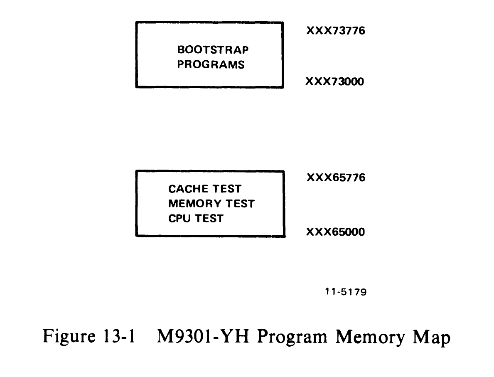
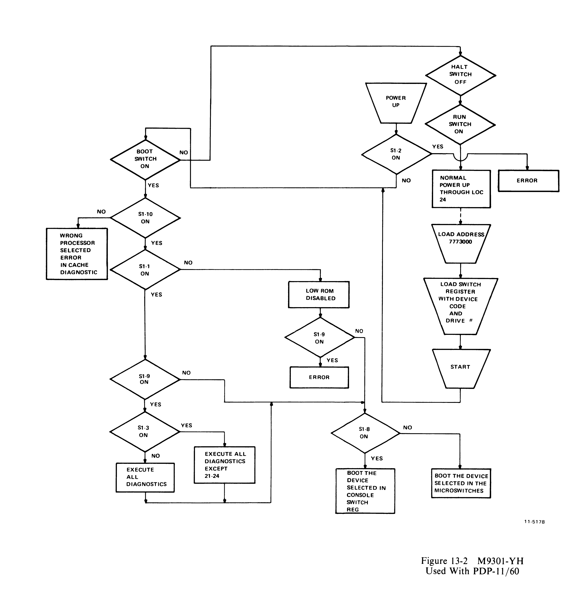
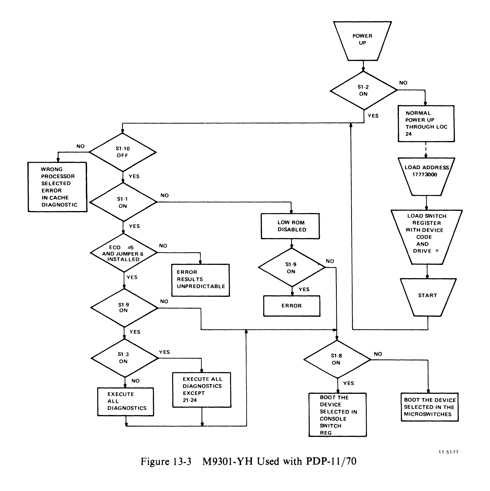

# Chapter 13 -- M9301-YH

## 13.1 Introduction

The M9301-YH has been created to provide bootstrapping capabilities for the PDP-11/60 and PDP-11/70 computers. It also provides basic diagnostic tests for the CPU, memory, and cache.

The M9301-YH provides flexibility of operation via user-settable microswitch options. Its functions can be initiated automatically on power-up, by pressing the console boot switch (PDP-11/60), or by a load-address start sequence.

> **NOTE**
> For the PDP-11/60, jumpers W1--W5 must be out. (W1--W5 provide pull-ups for bus grant lines.) For the PDP-11/70, jumpers W1--W5 must be in.

## 13.2 Memory Map

The four tristate ROMs which contain the program information use two distinct address spaces:

1. XXX65000--XXX65776
2. XXX73000--XXX73776

All the diagnostic tests reside in the first address space. All the bootstrap loaders reside in the second address space (Figure 13-1).



```
                              XXX73776
    ┌─────────────────────┐
    │                     │
    │  BOOTSTRAP PROGRAMS │
    │                     │
    └─────────────────────┘
                              XXX73000


                              XXX65776
    ┌─────────────────────┐
    │  CACHE TEST         │
    │  MEMORY TEST        │
    │  CPU TEST           │
    └─────────────────────┘
                              XXX65000
```

## 13.3 Diagnostic Test Explanation

The diagnostic portion of the program will test the basic CPU including the branches, the registers, all addressing modes, and many of the instructions in the PDP-11 repertoire. It will check memory from virtual address 1000 to the highest available address up to 28K. After main memory has been verified, with the cache off, the cache memory will be tested to verify that hits occur properly. Main memory will be scanned again to ensure that the cache is working properly throughout the 28K of memory to be used in the boot operation.

If one of the cache memory tests fails, the operator can attempt to boot the system anyway by pressing continue. This will cause the program to force misses in both groups of the cache before going to the bootstrap section of the program.

A list of the M9301-YH diagnostic tests follows.

| Test | Description |
|------|-------------|
| TEST 1 | This test verifies the unconditional branch |
| TEST 2 | Test CLR, MODE 0, and BMI, BVS, BHI, BLOS |
| TEST 3 | Test DEC, MODE 0, and BPL, BEQ, BGE, BGT, BLE |
| TEST 4 | Test ROR, MODE 0, and BVC, BHIS, BHI, BNE |
| TEST 5 | Test BHI, BLT, and BLOS |
| TEST 6 | Test BLE and BGT |
| TEST 7 | Test register data path and modes 2, 3, 6 |
| TEST 10 | Test ROL, BCC, BLT, and MODE 6 |
| TEST 11 | Test ADD, INC, COM, and BCS, BLE |
| TEST 12 | Test ROR, BIS, ADD, and BLO, BGE |
| TEST 13 | Test DEC and BLOS, BLT |
| TEST 14 | Test COM, BIC, and BGT, BGE, BLE |
| TEST 15 | Test ADC, CMP, BIT, and BNE, BGT, BEQ |
| TEST 16 | Test MOVB, SOB, CLR, TST and BPL, BNE |
| TEST 17 | Test ASR, ASL |
| TEST 20 | Test ASH, and SWAB |
| TEST 21 | Test JSR, RTS, RTI, and JMP |
| TEST 22 | Test main memory from virtual 1000 to highest available address up to 28K |
| TEST 23 | Test cache data memory |
| TEST 24 | Test memory 28K with cache on |

## 13.4 Diagnostic Test Descriptions

**TEST 1 -- This test verifies the unconditional branch.**
The registers and condition codes are all undefined when this test is entered and they should remain that way upon completion of this test.

**TEST 2 -- Test CLR, MODE 0, and BMI, BVS, BHI, BLOS.**
The registers and condition codes are all undefined when this test is entered. Upon completion of this test the SP (R6) should be zero and only the Z flip-flop will be set.

**TEST 3 -- Test DEC, MODE 0, and BPL, BEQ, BGE, BGT, BLE.**
Upon entering this test the condition codes are: N = 0, Z = 1, V = 0, and C = 0.
The registers are: R0 = ?, R1 = ?, R2 = ?, R3 = ?, R4 = ?, R5 = ?, and SP = 000000.
Upon completion of this test the condition codes will be: N = 1, Z = 0, V = 0, and C = 0.
The registers affected by the test are: SP = 177777.

**TEST 4 -- Test ROR, MODE 0, and BVC, BHIS, BHI, BNE.**
Upon entering this test the condition codes are: N = 1, Z = 0, V = 0, and C = 0.
The registers are: R0 = ?, R1 = ?, R2 = ?, R3 = ?, R4 = ?, R5 = ?, and SP = 177777.
Upon completion of this test the condition codes will be: N = 0, Z = 0, V = 1, and C = 1.
The registers affected by the test are: SP = 077777.

**TEST 5 -- Test BHI, BLT, and BLOS.**
Upon entering this test the condition codes are: N = 0, Z = 0, V = 1, and C = 1.
The registers are: R0 = ?, R1 = ?, R2 = ?, R3 = ?, R4 = ?, R5 = ?, and SP = 077777.
Upon completion of this test the condition codes will be: N = 1, Z = 1, V = 1, and C = 1.
The registers are unaffected by the test.

**TEST 6 -- Test BLE and BGT.**
Upon entering this test the condition codes are: N = 1, Z = 1, V = 1, and C = 1.
The registers are: R0 = ?, R1 = ?, R2 = ?, R3 = ?, R4 = ?, R5 = ?, and SP = 077777.
Upon completion of this test the condition codes will be: N = 0, Z = 0, V = 1, and C = 1.
The registers are unaffected by the test.

**TEST 7 -- Test register data path and modes 2, 3, 6.**
When this test is entered the condition codes are: N = 1, Z = 0, V = 1, and C = 1.
The registers are: R0 = ?, R1 = ?, R2 = ?, R3 = ?, R4 = ?, R5 = ?, and SP = 077777.
Upon completion of this test the condition codes are: N = 0, Z = 1, V = 0, and C = 0.
The registers are left as follows: R0 = 125252, R1 = 000000, R2 = 125252, R3 = 125252, R4 = 125252, R5 = 125252, SP = 125252, and MAPL00 = 125252.

**TEST 10 -- Test ROL, BCC, BLT, and MODE 6.**
When this test is entered the condition codes are: N = 0, Z = 1, V = 0, and C = 0.
The registers are: R0 = 125252, R1 = 000000, R2 = 125252, R3 = 125252, R4 = 125252, R5 = 125252, SP = 125252, and MAPL00 = 125252.
Upon completion of this test the condition codes are: N = 0, Z = 0, V = 1, and C = 1.
The registers are left unchanged except for MAPL00 which should now equal 052524.

**TEST 11 -- Test ADD, INC, COM, and BCS, BLE.**
When this test is entered the condition codes are: N = 0, Z = 0, V = 1, and C = 1.
The registers are: R0 = 125252, R1 = 000000, R2 = 125252, R3 = 125252, R4 = 125252, R5 = 125252, SP = 125252, and MAPL00 = 052524.
Upon completion of this test the condition codes are: N = 1, V = 0, and C = 0.
The registers are left unchanged except for R3 which now equals 000000, and R1 which is also 000000.

**TEST 12 -- Test ROR, BIS, ADD, and BLO, BGE.**
When this test is entered the condition codes are: N = 1, V = 0, and C = 0.
The registers are: R0 = 125252, R1 = 000000, R2 = 125252, R3 = 030000, R4 = 125252, R5 = 125252, and SP = 125252.
Upon completion of this test the condition codes are: N = 0, Z = 1, V = 0, and C = 0.
The registers are left unchanged except for R3 which should be modified back to 000000, and R4 which should now equal 052525.

**TEST 13 -- Test DEC and BLOS, BLT.**
When this test is entered the condition codes are: N = 0, Z = 1, V = 0, and C = 0.
The registers are: R0 = 125252, R1 = 000000, R2 = 125252, R3 = 000000, R4 = 052525, R5 = 125252, and SP = 125252.
Upon completion of this test the condition codes are: N = 1, Z = 0, V = 0, and C = 0.
The registers are left unchanged except for R1 which should now equal 177777.

**TEST 14 -- Test COM, BIC, and BGT, BGE, BLE.**
When this test is entered the condition codes are: N = 1, Z = 0, V = 0, and C = 0.
The registers are: R0 = 125252, R1 = 177777, R2 = 125252, R3 = 000000, R4 = 052525, R5 = 125252, and SP = 125252.
Upon completion of this test the condition codes are: N = 0, Z = 0, V = 1, and C = 1.
The registers are left unchanged except for R0 which should now equal 052525, and R1 which should now equal 052524.

**TEST 15 -- Test ADC, CMP, BIT, and BNE, BGT, BEQ.**
When this test is entered the condition codes are: N = 0, Z = 0, V = 1, and C = 1.
The registers are: R0 = 052525, R1 = 052524, R2 = 125252, R3 = 000000, R4 = 052525, R5 = 125252, and SP = 125252.
Upon completion of this test the condition codes are: N = 0, Z = 1, V = 0, and C = 0.
The registers are now: R0 = 052525, R1 = 000000, R2 = 125252, R3 = 000000, R4 = 052525, R5 = 052525, and SP = 125252.

**TEST 16 -- Test MOVB, SOB, CLR, TST and BPL, BNE.**
When this test is entered the condition codes are: N = 0, Z = 1, V = 0, and C = 0.
The registers are: R0 = 052525, R1 = 000000, R2 = 125252, R3 = 000000, R4 = 052525, R5 = 052525, and SP = 125252.
Upon completion of this test the condition codes are: N = 0, Z = 1, V = 0, and C = 0.
R0 is decremented by an SOB instruction to 000000; R1 is cleared and then incremented around to 000000.

**TEST 17 -- Test ASR, ASL.**
When this test is entered the condition codes are: N = 0, Z = 1, V = 0, and C = 0.
The registers are: R0 = 125252, R1 = 000000, R2 = 125252, R3 = 000000, R4 = 052525, R5 = 052525, and SP = 125252.
Upon completion of this test the condition codes are: N = 0, Z = 0, V = 0, and C = 0.
The registers are left unchanged except for R0 which is now equal to 000000, R1 which is now 000001, and R2 which is now 000000.

**TEST 20 -- Test ASH, and SWAB.**
When this test is entered the condition codes are: N = 0, Z = 0, V = 0, and C = 0.
The registers are: R0 = 000000, R1 = 000001, R2 = 000000, R3 = 000000, R4 = 052525, R5 = 052525, and SP = 125252.
Upon completion of this test the condition codes are: N = 0, Z = 1, V = 0, and C = 1.
The registers are left unchanged except for R1 which should now equal 000000.

**TEST 21 -- Test JSR, RTS, RTI, JMP.**
This test first sets the stack pointer to "KDPAR7" (172376), and then verifies that JSR, RTS, RTI, and JMP all work properly.

On entry to this test the stack pointer (SP) is initialized to 172376 and is left that way on exit.

**TEST 22 -- Test main memory from 1000 to highest available address up to 28K.**
This test will test main memory with the cache disabled, from virtual address 001000 to the last address (up to 28K). The memory is sized before testing begins. If the data does not compare properly, the test will halt at either 165516 or 165536. If a parity error occurs, the test will halt at address 165750, with PC + 2 on the stack.

In this test the registers are initialized as follows: R0 = 001000, R1 = DATA READ, R2 = 001000, R3 = 177746 (cache control register), R5 = last memory address, SP = 000776.

The following two tests are cache memory tests. If either of them fails to run successfully it will come to a halt in the M9301 ROM. If you desire to try to boot your system, or diagnostic anyway, you can press continue and the program will force misses in both groups of the cache and go to the bootstrap that has been selected.

**TEST 23 -- Test cache data memory.**
This test will check the data memory in the cache, first group 0 and then group 1. On the PDP-11/60, group 0 is the top 0.5K of cache and group 1 is the bottom 0.5K of cache. It loads 125252 into an address, complements it twice and reads the data. It then checks that address to ensure the data was a hit. The sequence is repeated on the same address with 052525 as the data. All cache memory data locations are tested in this way. If either group fails and the operator presses continue, the program will try to boot with the cache disabled.

The registers are initialized as follows for this test: R0 = 001000 (address), R1 = 000002 (count), R2 = 001000 (count), R3 = 177746 (CCR), R4 = 125252 (pattern), R5 = last memory address, SP = 000776 (flag of zero pushed on stack).

**TEST 24 -- Test up to 28K of memory with cache on.**
This test checks memory from 001000 through 157776 to ensure that you can get hits all the way up through main memory. It starts with group 1 enabled, then tests group 0, and finally checks memory with both groups enabled. If any one of the three passes fails, the test will halt. Then if the operator presses continue, the program will try to boot with the cache disabled.

Upon entry the registers will be set up as follows: R0 = 001000 (address), R1 = 000003 (pass count), R2 = 001000 (first address), R3 = 177746 (CCR), R5 = last memory address, and SP = 000776.

Upon completion of this test, main memory from address 001000 through 157776 will contain its own address.

## 13.5 Installation

A flat-pack on the M9301 containing 10 microswitches determines what actions the M9301 ROM program will take. The various microswitch options are provided to give the user a flexibility of operation and an ability to use the module in a wide variety of system configurations. Following is a description of the functions provided by the microswitches. Table 13-1 lists the function of each switch, and more detailed explanations follow.

**Table 13-1 Microswitch Functions**

| Switch | Function |
|--------|----------|
| S1-10 | ON selects 11/60, OFF selects 11/70 |
| S1-9 | ON selects diagnostics, OFF selects no diagnostics |
| S1-8 | OFF boot from device selected in microswitches; ON boot from device selected in console switch register |
| S1-7 | LSB |
| S1-6 | device code |
| S1-5 | device code |
| S1-4 | MSB |
| S1-3 | OFF selects all diagnostics; ON selects all diagnostics except 21--24 |
| S1-2 | Power-up reboot enable for 11/70 |
| S1-1 | Low ROM enable |

**Microswitch S1-10**

This switch is used to select the processor type. If the M9301 is used on the PDP-11/60 processor, the switch should be ON. If it is a PDP-11/70 processor, the switch should be OFF. OFF is indicated by a 1 (or light lit) when bit 01 at location 773024 (17773024 for 11/70) is read.

**Microswitch S1-9**

If this switch is OFF, then none of the diagnostic tests can be executed. If the switch is ON, then the ROM program will enter the diagnostic test section. The execution of the memory modifying tests (JSR, RTS, RTI, memory test, cache test) depends on the setting of microswitch S1-3 described later. OFF is a 1 in bit 02 at location 773024.

**Microswitch S1-8**

If this switch is OFF, the ROM program will not check the console switch register, but will boot the device specified in the microswitches <7:4>. If this switch is ON, the ROM program will check the console switch register and boot accordingly (Paragraph 13.5). This microswitch option has been provided for installation environments which cannot assure the integrity of the console switch register contents (on power-up). OFF is a 1 in bit 03 at location 773024.

**Microswitch <S1-7:S1-4>**

These four microswitches should be set up to the device code, to select the desired device to boot from. This device is usually referred to as the default device. Drive 0 of the default device will be used. Paragraph 13.5 gives the various device codes. While setting up switches <7:4> for the device code, it should be remembered that a microswitch in the ON position gives a 0. In the OFF position it gives a 1. Switch 4 is the MSB, and switch 7 is the LSB.

**Microswitch S1-3**

If this switch is OFF, then the memory-modifying tests (tests 21, 22, 23, 24 described previously) will be executed before booting. If the switch is ON, these tests will not be executed, thus saving the previous core image. Microswitch S1-3 is sensed only if microswitch S1-9 is ON. OFF is a 1 for bit 08 at location 773024.

**Microswitch S1-2**

When used with a PDP-11/60 processor switch, S1-2 should be OFF. (On the PDP-11/60, if the boot on power-up option is desired, the slide-switch on the console should be set in the boot position.)

On the PDP-11/70, the boot on power-up option is available if the following conditions are met:

1. ECO 5 is installed
2. Jumper W6 is installed, in accordance with ECO 5.

If these conditions are satisfied, then the boot on power-up option can be selected by putting microswitch S1-2 ON. If the conditions are not met, switch S1-2 should be OFF.

**Microswitch S1-1**

If switch S1-1 is OFF, the low ROM (addresses XXX65000--XXX65776) is disabled. The normal position of switch 1 is ON, since the diagnostic portion of the program resides in the low ROM.

## 13.6 Starting Procedure

The bootstrap test program can be started in one of the following ways:

1. Automatically on power-up
2. Pressing the boot switch on the console (only for PDP-11/60)
3. Load address and start sequence from the console.

### 13.6.1 Power-Up Start

**PDP-11/60**

On the PDP-11/60, a 3-position slide-switch (BOOT/RUN/HALT) is provided on the console. If this switch is in the boot position and power-up occurs, automatic booting will take place from the device specified in the microswitches (Figure 13-2).

**PDP-11/70**

If S1-2 is ON, ECO 5 is installed, and jumper W-6 is installed, an automatic boot on power-up will occur from the device specified in the microswitches or console switch register (Figure 13-3).

**PDP-11/60 and PDP-11/70**

On power-up boot, the default device specified in microswitches <S1-7:S1-4> will be used if:

1. Microswitch S1-8 is OFF or
2. Microswitch S1-8 is ON and the low byte of the console switch register is a zero. (On the PDP-11/60, the console switch register is cleared on power-up.)

Other microswitch options are specified Paragraph 13.4.



### 13.6.2 Power-Up Boot Examples (11/60 only)

A. TU10 -- Set the microswitches as follows:

| S1-1 | S1-2 | S1-3 | S1-4 | S1-5 | S1-6 | S1-7 | S1-8\* | S1-9 | S1-10 |
|------|------|------|------|------|------|------|--------|------|-------|
| ON | OFF | OFF | ON | ON | OFF | OFF | ON | ON | ON |

On power-up, the system will execute all diagnostics and boot the TU10.

B. RK05 -- Set the microswitches as follows:

| S1-1 | S1-2 | S1-3 | S1-4 | S1-5 | S1-6 | S1-7 | S1-8\* | S1-9 | S1-10 |
|------|------|------|------|------|------|------|--------|------|-------|
| ON | OFF | ON | ON | ON | OFF | OFF | OFF | OFF | ON |

On power-up the system will boot drive 0 of the RK05 without executing diagnostics.

\*Note that on the 11/60 the position of S1-8 is irrelevant, because the console switch register is cleared automatically. But if S1-8 is OFF, the program will never look at the console switch register, even if a LOAD ADDRESS and START is attempted. Also, the M9301-YH can default only to drive 0 of any device.



### 13.6.3 Load Address Start Mode

This mode allows the user to boot from any device and unit number specified in the console switch register.

On the PDP-11/60, load address 773000. On the PDP-11/70, load address 17773000. Then the switch register should be loaded with the appropriate device code (Figures 13-2 and 13-3).

SW REG <6:3> contains the device code (0--12). SW REG <2:0> contains the drive unit number (0--7). The device codes are as follows:

| Code | Device | Description |
|------|--------|-------------|
| 0 | | Use the device specified in microswitches <S1-7:S1-4>. |
| 1 | TM11/TU10 | Magnetic Tape |
| 2 | TC11/TU56 | DECtape |
| 3 | RK11/RK05 | Disk |
| 4 | RP11/RP03 | Disk |
| 5 | RK611/RK06 | Disk |
| 6 | RH11-RH70/TU16 | Magnetic Tape |
| 7 | RH11-RH70/RP04 | Disk |
| 10 | RH11-RH70/RS04 | Fixed Head Disk |
| 11 | RX11/RX01 | Floppy Disk |
| 12 | PC11 | Paper Tape Reader |

In order to use the LOAD ADDRESS and START sequence, microswitch S1-8 must be in the ON position.

### 13.6.4 LOAD ADDRESS and START Examples (11/70 only)

C. RS04 -- Set the microswitches as follows:

| S1-1 | S1-2 | S1-3 | S1-4 | S1-5 | S1-6 | S1-7 | S1-8 | S1-9 | S1-10 |
|------|------|------|------|------|------|------|------|------|-------|
| ON | ON | ON | -- | -- | -- | -- | ON | ON | OFF |

Load address 17773000.
Load 103(8) in the console switch register.
Start.

The system will boot from drive number 3 of the RS04 disk drive.

## 13.7 Errors

A list of error halts indexed by the address displayed is shown in Table 13-2.

If the bootstrap operation fails as a result of a hardware error in the peripheral device the program will do a reset instruction and attempt to boot again.

**Table 13-2 Error Halts Indexed**

| Address Displayed | Test Number and Subsystem Under Test |
|-------------------|--------------------------------------|
| XXX65004 | Test 1, Branch Test |
| XXX65020 | Test 2, CLR and Conditional Branch Test |
| XXX65036 | Test 3, DEC and Conditional Branch Test |
| XXX65052 | Test 4, ROR and Conditional Branch Test |
| XXX65066 | Test 5, Conditional Branch Test |
| XXX65076 | Test 6, Conditional Branch Test |
| XXX65126 | Test 7, Register Data Path Test |
| XXX65136 | Test 10, Conditional Branch Test |
| XXX65154 | Test 11, CPU Instruction Test |
| XXX65172 | Test 12, CPU Instruction Test |
| XXX65202 | Test 13, CPU Instruction Test |
| XXX65210 | Test 14, CPU Instruction Test |
| XXX65224 | Test 14, CPU Instruction Test |
| XXX65246 | Test 15, CPU Instruction Test |
| XXX65256 | Test 16, Branch Test |
| XXX65300 | Test 16, CPU Instruction Test |
| XXX65334 | Test 17, CPU Instruction Test |
| XXX65352 | Test 20, CPU Instruction Test |
| XXX65376 | Test 21, JSR Test |
| XXX65406 | Test 21, JSR Test |
| XXX65416 | Test 21, RTS Test |
| XXX65430 | Test 21, RTI Test |
| XXX65436 | Test 21, JMP Test |
| XXX65520 | Test 22, Main Memory Data Compare Error |
| XXX65540 | Test 22, Main Memory Data Compare Error no recovery possible from this error |
| XXX65604 | Test 23, Cache Memory Data Compare Error |
| XXX65614 | Test 23, Cache Memory No Hit (pressing continue here will cause boot attempt, forcing cache misses) |
| XXX65720 | Test 24, Cache Memory Data Compare Error |
| XXX65732 | Test 24, Cache Memory No Hit (pressing continue here will cause boot attempt, forcing misses in the cache) |
| XXX65752 | Test 22, 23, or 24, Cache Memory or Main Memory Parity Error. (Examine memory error register 777744 to find out more.) If cache parity error, pressing continue here will cause boot attempt forcing misses in cache. |

XXX = 001 for PDP-11/60
XXX = 177 for PDP-11/70

## 13.8 Operator Action and Error Recovery

If the diagnostic portion of the ROM program detects an error, the processor will halt. The address displayed should be noted. Paragraph 13.6 contains a cross-reference of address displayed versus test number and subsystem under test. For further details, refer to the listing for the ROM program.

Most of the errors described in Table 13-2 are hard failures, and there may be no recovery from them.

If the processor halts in one of the two cache tests, error recovery is possible. When continue is pressed, the program will either attempt to finish the test (XXX65604 or XXX65720) or force misses in both groups of the cache and attempt to boot with the cache fully disabled (XXX6514, XXX65732, or XXX65752).

If the program fails in an uncontrolled manner, it might be due to an unexpected trap to location 4 or 10. If this is suspected, then load the following:

| LOC | CONTENTS |
|-----|----------|
| 4 | 6 |
| 6 | 0 |
| 10 | 10 |
| 12 | 0 |

The above will cause all traps to vectors 4 and 10 to halt the processor at addresses 6 and 12 respectively (with addresses 10 and 14 in the display); the operator can examine the CPU error register at XXX77766 to get more error information. Bits in CPU error register are defined as follows:

- Bit 02 = Red Zone Stack Limit
- Bit 03 = Yellow Zone Stack Limit (11/70 only)
- Bit 04 = Unibus Timeout
- Bit 05 = Non-Existent Memory (Cache, 11/70 only)
- Bit 06 = Odd Address Error
- Bit 07 = Illegal Halt (11/70 only)
