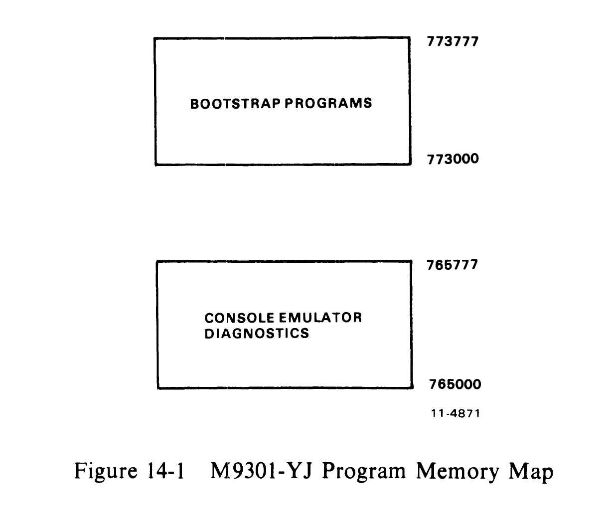
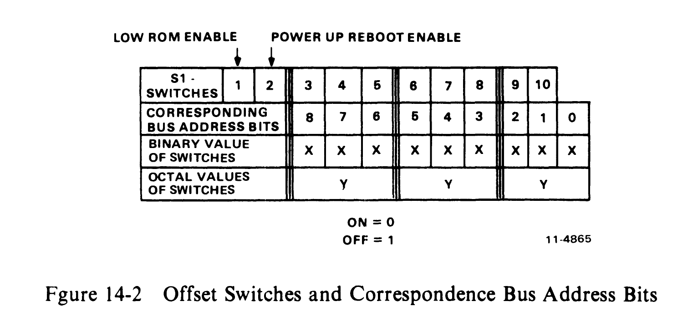
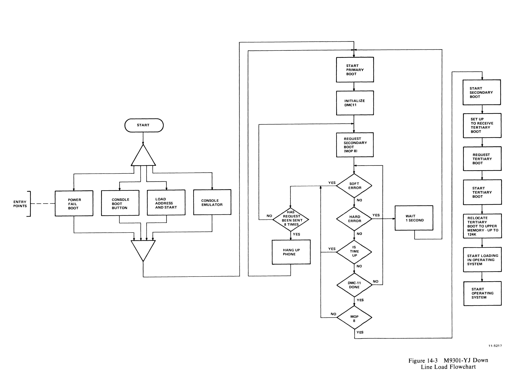
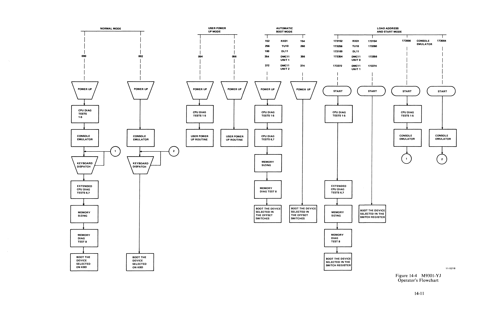

# Chapter 14 -- M9301-YJ

## 14.1 Introduction

The M9301-YJ provides DECnet bootstrapping capabilities for the DMC11 on PDP-11 systems with or without the console switch register. In addition, the M9301-YJ includes a console emulator routine, bootstrap routines for floppy disk, magnetic tape, paper tape, and some basic CPU and memory GO-NO GO diagnostic tests.

This module has been designed for maximum flexibility of operation. Its function may be initiated in any of four ways: automatically at power-up, by pressing the console boot switch, by a LOAD ADDRESS and START sequence, or by using the console terminal while running the console emulator routine.

## 14.2 Program Memory Map

Figure 14-1 is a program memory map for the M9301-YJ.



```
                              773777
    ┌─────────────────────┐
    │                     │
    │  BOOTSTRAP PROGRAMS │
    │                     │
    └─────────────────────┘
                              773000


                              765777
    ┌─────────────────────┐
    │                     │
    │  CONSOLE EMULATOR   │
    │  DIAGNOSTICS        │
    │                     │
    └─────────────────────┘
                              765000
```

The lower addresses (765000--765777) can be disabled by putting switch S1-1 in the OFF position. This would free addresses 765000--765777, allowing the user to occupy this address space. Note that if switch S1-1 is OFF, the console emulator, the low-speed paper tape boot, and diagnostics are no longer available.

Note also that the code in the M9301-YJ is written with the assumption that the processor will trap to Unibus location 24 on power-up if the default boot on power-up feature is to be used. It is also assumed that a power-up trap to Unibus location 24 will be invoked by the assertion and then negation of AC LO if the pushbutton boot feature is to be used.

Note further that the processor priority is left at 7 when the standard boots are exited.

## 14.3 Microswitch Functions

A set of ten microswitches is located on the M9301 module. They determine which ROM routines are selected and give the user automatic access to any function.

The primary activating processes for the M9301-YJ are the power-up sequence and the enabling of the console boot switch. Switch S1-1 must be in the ON position in order to enable activation of the M9301-YJ console emulator and diagnostics. Switch S1-2 is the power-up reboot enable switch. It must be ON to enable to M9301-YJ on power-up. If switch S1-2 is OFF, then the processor will trap to location 24 (as normal) to execute the user power-up routine. When switch S1-2 is ON, the other switches, S1-3 through S1-10, determine what action the M9301-YJ will take on power-up.

If the system supports a console boot switch, then any time that switch is pressed, the M9301-YJ will be activated. Enabling the console boot switch causes the processor to enter a ROM routine by creating a fake power-down/power-up sequence. The user should note that the position of switch S1-2 is irrelevant when the console boot switch is used. Pushing the console boot switch thus results in a power-up sequence in the processor through an M9301-YJ ROM routine.

Prior to the power-up sequence, the M9301-YJ asserts 773000 on the Unibus address lines. This causes the new PC to be taken from ROM location 773024 instead of location 000024. The new PC will be the logical OR of the contents of ROM location 773024 and the eight microswitches on the M9301-YJ module. A switch in the ON position is read as a 0 and a switch in the OFF position is a 1. In this way all the M9301-YJ options are accessible. Each option is given a different address. Note that microswitch S1-10 is ORed with bit 1 of the data in ROM location 773024; S1-9 is ORed with bit 2, etc. No switch is provided for combination with bit 0, because an odd address could result when going through the trap sequence.

The microswitches on the M9301-YJ enable the user either to start a bootstrap operation or to enter the console emulator, simply by pressing the boot switch. Note that a momentary power failure will have the same effect as pushing the boot switch.

The user should also note that he can select any function without diagnostics by adding 2 to the appropriate octal code in the switches. Figure 14-2 shows the relationship of the switches to the bus address bits.



```
 LOW ROM ENABLE    POWER UP REBOOT ENABLE
       ↓                 ↓
 S1-
 SWITCHES   1 | 2 | 3 | 4 | 5 | 6 | 7 | 8 | 9 | 10|
 CORRESPONDING |   |   |   |   |   |   |   |   |   |
 BUS ADDRESS   | 8 | 7 | 6 | 5 | 4 | 3 | 2 | 1 | 0 |
 BITS          |   |   |   |   |   |   |   |   |   |
 BINARY VALUE  | x | x | x | x | x | x | x | x | x |
 OF SWITCHES   |   |   |   |   |   |   |   |   |   |
 OCTAL VALUES  |   y   |       y       |       y       |
 OF SWITCHES   |       |               |               |

 ON = 0
 OFF = 1
```

## 14.4 Bootstrapping Paper Tape, Floppy Disk, and Magnetic Tape

The paper tape boot is unique in that it can do no error checking and the secondary bootstrap (e.g., the absolute loader) is read into the upper part of memory. The actual locations loaded by the paper tape boot are partially determined by the secondary bootstrap itself and by the size routine which determines the highest available memory address within the first 28K. The flexible disk (or floppy) reads sector 1 on track 1 into locations starting at 0. The magnetic tape boot reads the second block into locations starting at zero. If no errors are detected in the device, the bootstraps normally transfer control to location 0 in order to execute the secondary bootstrap just loaded. The only exception to this starting address is with the paper tape boot. It transfers control to location XXX374, where XXX is determined initially by the size routine to be at the top of memory; this is where the absolute loader will have just been loaded.

If a device error is detected, a reset will be executed, and the bootstrap will try again. The bootstrap will be retried indefinitely until it succeeds without error unless the operator intervenes. The advantage of retrying the boot is that if a particular device being booted is not on-line or loaded, because of a power failure and restart for example, the boot will give the device a chance to power-up. For disks this is essential. If a magnetic tape is to be booted, the user must reload the magtape and bring it back on-line and restart the boot.

Note that the only way to bootstrap a non-DECnet drive (unit or transport) other than drive 0 is by entering the console emulator to specify that drive number desired. Otherwise the bootstraps will default to drive 0. This means that only drive 0 of a device can be bootstrapped without operator intervention.

## 14.5 Bootstrapping the DMC11-DECnet

The DMC11 bootstrap routine loads memory in a satellite computer over a communication link, using the maintenance operation protocol (MOP) within the DECnet system. The entire bootstrapping process involves three separate bootstrap programs.

### 14.5.1 Primary Bootstrap

The primary bootstrap is a mode associated with the DMC11 within the M9301-YJ ROM. It requests a secondary boot from the host computer. The primary bootstrap routine will wait approximately 9 seconds for a reply and then make another request for the secondary boot. If, after eight tries, the host has not responded, the satellite will hang up the phone for approximately one half second. Data terminal ready (DTR) is turned OFF and then ON again. After interrupting the communication link, the primary bootstrap will initiate another series of requests for a secondary boot. The M9301-YJ supports two MOP codes, 8 and 0, as follows. The primary boot sends out a MOP 8 message. It expects a MOP 0 message back. The MOP 0 is the secondary boot which loads the tertiary boot with transfer address.

If the primary boot detects any soft errors, it will make the request again. A soft error results from the detection of either a non-fatal hardware error or a counterfeit message. Detection of a fatal error will cause the M9301-YJ to reinitialize, disable DTR for approximately 1 second, reassert DTR, and begin as it would on a power-up boot.

### 14.5.2 Secondary Bootstrap

The secondary bootstrap program, once loaded, requests a tertiary boot. These intermediate steps are important because the boot program which handles the actual loading of the operating system is too long and complex to be stored in the ROM. Detection of an error in the secondary boot will cause a reinitialization of the primary boot.

### 14.5.3 Tertiary Bootstrap

Once the tertiary boot has been requested and loaded, it relocates in upper memory and then begins the down-line loading of the operating system. Figure 14-3 is a flowchart showing the relation of the three bootstrap programs.



### 14.5.4 MOP Message Formats

The current MOP version (1.2, July 1976) operates within DDCMP maintenance envelopes. The current DDCMP version is 3.03-Dec 1975. All MOP messages are sent in a DDCMP maintenance mode envelope. This basic DDCMP message provides a CRC block check on the MOP data but does not provide any acknowledgement of receipt. It is similar to a numbered data message used for conformance with DDCMP formats and hence software/hardware drivers for DDCMP. Its form is as follows.

```
SYN, SYN, DLE, COUNT, Q, S, FILL, FILL, ADDR, CRC1, MOP MSG, CRC2
```

where:

| Field | Description |
|-------|-------------|
| SYN | The DDCMP sync characters: (8 bits) 226-synchronous |
| DLE | The boot message header character: 220 (8 bits) |
| COUNT | The 14-bit count field: number of bytes in MOP message (14 bits) |
| Q | The async link control flag: (1 bit, always = 1) |
| S | The select link control flag: (1 bit, always = 1) |
| FILL | A fill character: 000 (8 bits) |
| ADDR | The tributary station address: (for pt-to-pt = 1) (8 bits) |
| CRC1 | The header CRC on DLE through ADDR (16-bit CRC-16) |
| MOP MSG | The MOP message described below (COUNT 8-bit quantities) |
| CRC2 | The data CRC on MOP message only (16-bit CRC-16) |

Notice that the maintenance messages are preceded by 3 or more SYNC characters appropriate to the link used; synchronous -- 226.

The MOP message resides in the data field of the maintenance envelope. The form of the MOP message is:

```
CODE, INFO
```

where:

| Field | Description |
|-------|-------------|
| CODE | The MOP operation code (8 bits) |
| INFO | The information field (specific to each CODE) |

The form of the MOP 8 program (request secondary boot) follows.

```
CODE (1 byte) = 8
MSG DATA = DEV TYPE 14(8), STA DDR (1), PGM TYPE (0)
```

where:

| Field | Description |
|-------|-------------|
| DEV TYPE (1 byte) | The device type at the requesting system. This is always 14(8) for the DMC11 and the M9301-YJ. |
| STA DDR (1 byte) | The address of the requesting station. For point-to-point this is always 1. This is always 1 for the M9301-YJ. |
| PGM TYPE (1 byte) | The type of secondary program requested. PGM type is always 0 for the M9301-YJ. |

The form of the MOP 0 program (memory load with transfer address) follows.

```
CODE (1 byte) = 0
MSG DATA = LOAD NUM, LOAD ADDR, IMAGE DATA, TRANSFER ADDR
```

where:

| Field | Description |
|-------|-------------|
| LOAD NUM (1 byte) | The load number for multiple load images. It may be preceded by loads without transfer address. This starts at 0 and is incremented for each load. This should always be 0 for the M9301-YJ. |
| LOAD ADDR (4 bytes) | The memory load address (starting address) for the storage of the data image. It should be 0 in MOP 0. This should always be 0 for the M9301-YJ. |
| IMAGE DATA | The image to be stored in the computer memory. The form sent will be machine dependent and may vary with the type and word length of the system [e.g., for PDP-11 systems, each byte represents one memory byte (8 bits)]. |
| TRANSFER ADDR (4 bytes) | The starting address of the image just loaded. This is always 6 for the M9301-YJ. |

DECnet uses two CPU registers. R0 contains the device index code. R1 contains the CSR address of the device.

## 14.6 Power-Up Boot and Console Boot

When the operator performs a system power-up or presses the console boot switch, he causes the M9301 module to react by initiating a bootstrap routine. Table 14-1 shows the correct microswitch settings for the various options.

**Table 14-1 Microswitch Settings**

| Function | S1-1 | 2 | 3 | 4 | 5 | 6 | 7 | 8 | 9 | 10 | Octal Code |
|----------|------|---|---|---|---|---|---|---|---|----|------------|
| Vector 24 | -- | OFF | -- | -- | -- | -- | -- | -- | -- | -- | -- |
| Console Emulator with Diag. | ON | ON | ON | ON | ON | ON | ON | ON | ON | ON | 000 |
| Console Emulator without Diag. | ON | ON | ON | ON | ON | ON | ON | ON | ON | OFF | 002 |
| Run Non-Memory Modifying Diag. then Vector 24 | ON | ON | ON | ON | ON | OFF | ON | OFF | OFF | ON | 054 |
| Vector 24 | ON | ON | ON | ON | ON | OFF | ON | OFF | OFF | OFF | 056 |
| Boot RX01 with Diag. | ON | ON | ON | ON | OFF | OFF | ON | OFF | ON | OFF | 152 |
| Boot RX01 without Diag. | -- | ON | ON | ON | OFF | OFF | ON | OFF | OFF | ON | 154 |
| Boot TU10 with Diag. | ON | ON | ON | OFF | ON | OFF | ON | OFF | OFF | OFF | 256 |
| Boot TU10 without Diag. | -- | ON | ON | OFF | ON | OFF | OFF | ON | ON | ON | 260 |
| Boot DL11 with Diag. | ON | ON | ON | ON | OFF | ON | ON | ON | ON | ON | 100 |
| Boot DMC11 Unit 0 with Diag. | ON | ON | ON | OFF | OFF | OFF | ON | OFF | OFF | ON | 354 |
| Boot DMC11 Unit 0 without Diag. | -- | ON | ON | OFF | OFF | OFF | ON | OFF | OFF | OFF | 356 |
| Boot DMC11 Unit 1 with Diag. | ON | ON | ON | OFF | OFF | OFF | OFF | OFF | ON | OFF | 372 |
| Boot DMC11 Unit 1 without Diag. | -- | ON | ON | OFF | OFF | OFF | OFF | OFF | OFF | ON | 374 |

Note that when using the console boot switch, the state of S1-2 has no relevance.

## 14.7 Load Address and Start Procedure via Console Switch Register

The user who wishes to initiate a function other than the one which he has specified in the microswitches can do so without presetting those microswitches. This involves a load address, placing an option code in the console switch register and pressing start; or simply by doing a load address and then press load address and start. These options and codes are shown in Table 14-2.

The user must load address 173072 and then, before pressing the start switch, he must place a device code or option code in the console switch register. Or the user may place the device code or the option code in the console switch register and then press load address and start. These options and codes are shown in Table 14-2.

**Table 14-2 Load Address and Start Codes**

| Code | Function |
|------|----------|
| 173000\* | To enter console emulator after running primary diagnostics |
| 173004 | To enter console emulator without diagnostics |
| 173152\* | To boot the RX01 with diagnostics |
| 173154\* | To boot the RX01 without diagnostics |
| 173256\* | To boot the TU10 with diagnostics |
| 173260 | To boot the TU10 without diagnostics |
| 173100\* | To boot the DL11 paper tape with diagnostics |
| 173354\* | To boot the DMC11 unit 0 with diagnostics |
| 173356 | To boot the DMC11 unit 0 without diagnostics |
| 173372\* | To boot the DMC11 unit 1 with diagnostics |
| 173374 | To boot the DMC11 unit 1 without diagnostics |

\*Switch S1-1 must be on.

## 14.8 Operation of the M9301-YJ Console Emulator

The user can boot a program from any of four peripheral devices by calling the bootstrap program for that peripheral through the console emulator.

The first routines to be executed (if 000 is the contents of the microswitches) are the primary CPU diagnostics.

The display routine is entered automatically. This routine will type the contents of R0, R4, R6, and R5 (note the sequence) on the Teletype or terminal in octal. Pressing the console boot switch causes the PDP-11/04 and PDP-11/34 systems to copy the PC into R5 before the power-up sequence starts. The console emulator (keyboard dispatch) program is then entered automatically. This routine types a carriage return, a line feed and then the prompt symbol, $. The user can call bootstrap programs at this point by typing the appropriate device code. He then types an octal number following the device code specifying the drive number (default 0) and hits the carriage return key. Table 14-3 lists the peripheral bootstrap programs supported by the M9301-YJ.

Note that 12 console fill characters are used between the carriage return and the line feed in the console emulator routine.

**Table 14-3 Bootstrap Programs**

| Device | Description | Command\* |
|--------|-------------|-----------|
| DL11\*\* | Low Speed Paper Tape Reader | TT |
| DMC11 | Synchronous Line Interface | XM# |
| RX11 | RX01 Floppy Disk Drive | DX# |
| TM11 | TU10 800 BPI Magtape | MT# |

\*The # specifies the unit number (default 0). It can be 0 or 1 for DX, 0--7 for MT, and 0--17(8) for XM.
\*\*This device is not bootable if S1-1 is off.

## 14.9 Restarting at the User Power Fail Routine

If the user wishes to restart his own software on a power-up, he may do so by merely disabling the power fail restart switch in the microswitches (turn S1-2 OFF).

But the user can use the M9301-YJ to run diagnostics (just the primary CPU tests described in Paragraph 14.10.) before running his power-up routine. This will in no way disturb the contents of memory and will in fact verify the machine's basic integrity after the power-down and -up sequence.

To use this option the operator should load the code 054 into the microswitches as described in Paragraph 14.7. Be sure that switch S1-2 is ON. This will result in the running of the primary CPU diagnostics and then a simulated trap through 24 which will start the user's specified power-up routine.

If the code 056 is placed in the microswitches then the simulated trap through 24 is executed without running diagnostics.

Figure 14-4 is an operator's flowchart showing the relation of the various options and codes available to the user.



## 14.10 Diagnostics

An explanation of the eight CPU and memory diagnostic tests follows. Three types of tests are included in the M9301-YJ diagnostics:

1. Primary CPU tests (1--5)
2. Secondary CPU tests (6, 7)
3. Memory test (8)

### 14.10.1 CPU Tests

The primary CPU tests exercise all unary and double operand instructions with all source modes. These tests do not modify memory. If a failure is detected, a branch-self (BR.) will be executed. The run light will stay ON, because the processor will hang in a loop. If no failure is detected in tests 1--5, the processor will emerge from the last test and enter the register display routine (console emulator). Note that the CRC and LRC for diagnostic DZM9A are XXXXXX and XXXXXX.

**TEST 1 -- SINGLE OPERAND TEST**

This test executes all single operand instructions using destination mode 0. The basic objective is to verify that all single operand instructions operate; it also provides a cursory check on the operation of each instruction, while ensuring that the CPU decodes each instruction in the correct manner.

Test 1 tests the destination register in its three possible states: zero, negative, and positive. Each instruction operates on the register contents in one of four ways:

1. Data will be changed via a direct operation, i.e., increment, clear, decrement, etc.
2. Data will be changed via an indirect operation, i.e., arithmetic shifts, add carry, and subtract carry.
3. Data will be unchanged, but operated upon via a direct operation, i.e., clear a register already containing zeros.
4. Data will be unchanged but examined via a non-modifying instruction (TEST).

> **NOTE**
> When operating upon data in an indirect manner, the data is modified by the state of the appropriate condition code. Arithmetic shift will move the C bit into or out of the destination. This operation, when performed correctly, implies that the C bit was set correctly by the previous instruction. There are no checks on the data integrity prior to the end of the test. However, a check is made on the end result of the data manipulation. A correct result implies that all instructions manipulated the data in the correct way. If the data is incorrect, the program will hang in a program loop until the machine is halted.

**TEST 2 -- DOUBLE OPERAND, ALL SOURCE MODES**

This test verifies all double operand, general, and logical instructions, each in one of the seven addressing modes (excludes mode 0). Thus, two operations are checked: the correct decoding of each double operand instruction, and the correct operation of each addressing mode for the source operand.

Each instruction in the test must operate correctly in order for the next instruction to operate. This interdependence is carried through to the last instruction (bit test) where, only through the correct execution of all previous instructions, a data field is examined for a specific bit configuration. Thus, each instruction prior to the last serves to set up the pointer to the test data.

Two checks on instruction operation are made in test 2. One check, a branch on condition, is made following the compare instruction, while the second is made as the last instruction in the test sequence.

Since the GO-NO GO test resides in ROM memory, all data manipulation (modification) must be performed in destination mode 0 (register contains data). The data and addressing constants used by test 2 are contained within the ROM.

It is important to note that two different types of operations must execute correctly in order for this test to operate:

1. Those instructions that participate in computing the final address of the data mask for the final bit test instruction.
2. Those instructions that manipulate the test data within the register to generate the expected bit pattern.

Detection of an error within this test results in a program loop.

**TEST 3 -- JUMP TEST MODES 1, 2, 3**

The purpose of this test is to ensure correct operation of the jump instruction. This test is constructed such that only a jump to the expected instruction will provide the correct pointer for the next instruction.

There are two possible failure modes that can occur in this test:

1. The jump addressing circuitry will malfunction, causing a transfer of execution to an incorrect instruction sequence or non-existent memory.
2. The jump addressing circuitry will malfunction in such a way as to cause the CPU to loop.

The latter case is a logical error indicator. The former, however, may manifest itself as an after-the-fact error. For example, if the jump causes control to be given to other routines within the M9301, the interdependent instruction sequences would probably cause a failure to eventually occur. In any case, the failing of the jump instruction will eventually cause an out of sequence or illogical event to occur. This in itself is a meaningful indicator of a malfunctioning CPU.

This test contains a jump mode 2 instruction which is not compatible across the PDP-11 line. However, it will operate on any PDP-11 within this test, due to the unique programming of the instruction within test 3. Before illustrating the operation, it is important to understand the differences of the jump mode 2 between machines.

On the PDP-11/20, 11/05, 11/15, and 11/10 processors for the jump mode 2 [JMP(R)+] the register (R) is incremented by 2 prior to execution of the jump. On the PDP-11/04, 11/34, 11/35, 11/40, 11/45, 11/50, 11/55, and 11/70 processors, (R) is used as the jump address and incremented by 2 after execution of the jump.

In order to avoid this incompatibility, the jump (R)+ is programmed with (R) pointing back on the jump itself. On 11/20, 11/05, 11/10, and 11/15 processors, execution of the instruction would cause (R) to be incremented to point to the following instruction, effectively continuing a normal execution sequence.

On the PDP-11/04, 11/34, 11/35, 11/40, 11/45, 11/50, 11/55, and 11/70 processors, the use of the initial value of (R) will cause the jump to loop back on itself. However, correct operation of the autoincrement will move (R) to point to the next instruction following the initial jump. The jump will then be executed again. However, the destination address will be the next instruction in sequence.

**TEST 4 -- SINGLE OPERAND, NON-MODIFYING BYTE TEST**

This test focuses on one unique single operand instruction, the TST. TST is a special case in the CPU execution flow since it is a non-modifying operation. Test 4 also tests the byte operation of this instruction. The TSTB instruction will be executed in mode 1 (register deferred) and mode 2 (register deferred, autoincrement).

The TSTB is programmed to operate on data which has a negative value most significant byte and a zero (not negative) least significant byte.

In order for this test to operate properly, the TSTB on the low byte must first be able to access the even addressed byte and then set the proper condition codes. The TSTB is then reexecuted with the autoincrement facility. After the autoincrement, the addressing register should be pointing to the high byte of the test data. Another TSTB is executed on what should be the high byte. The N bit of the condition codes should be set by this operation.

Correct execution of the last TSTB implies that the autoincrement feature recognized that a byte operation was requested, thereby only incrementing the address in the register by one, rather than two. If the correct condition code has not been set by the associated TSTB instruction, the program will loop.

**TEST 5 -- DOUBLE OPERAND, NON-MODIFYING TEST**

Two non-modifying, double-operand instructions -- the compare (CMP) and bit test (BIT) -- operate on test data in source modes 1 and 4, and destination modes 2 and 4.

The BIT and CMP instructions will operate on data consisting of all ones (177777). Two separate fields of ones are used in order to utilize the compare instructions, and to provide a field large enough to handle the autoincrementing of the addressing register.

Since the compare instruction is executed on two fields containing the same data, the expected result is true Z bit, indicating equality.

The BIT instruction will use a mask argument of all ones against another field of all ones. The expected result is a non-zero condition (Z).

Most failures will result in a one instruction loop.

At the end of test 5 the register display routine is enabled, provided the console emulator has been selected in the microswitches. The register display routine prints out the octal contents of the CPU registers R0, R4, SP, and old PC on the console terminal. This sequence will be followed by a prompt character ($) on the next line.

An example of a typical printout follows.

```
            XXXXXX    XXXXXX    XXXXXX    XXXXXX
$

Prompt      R0        R4        R6        R5
Character                       (Stack    (Old PC)
                                Pointer)
```

**NOTES:**

1. Where X signifies an octal number (0--7).
2. Whenever there is a power-up routine or the BOOT switch is released on PDP-11/04 and PDP-11/34 machines, the PC at this time will be stored in R5. The contents of R5 are then printed as the old PC shown in the example.
3. The prompting character string indicates that diagnostics have been run and the processor is operating.

### 14.10.2 Secondary CPU and Memory Tests

The secondary CPU tests modify memory and involve the use of the stack pointer. The JMP and JSR instructions and all destination modes are tested. If a failure is detected, these tests, unlike the primary tests, will execute a halt.

Secondary CPU and memory diagnostics are run immediately after test 5 when they have been evoked by means other than the console emulator, provided that the correct microswitches have been set. If the console emulator has been entered at the completion of test 5, the secondary CPU and memory diagnostics will be run when the appropriate boot command is given.

**TEST 6 -- DOUBLE OPERAND, MODIFYING BYTE TEST**

The objective of this test is to verify that the double-operand, modifying instructions will operate in the byte mode. Test 6 contains three subtests:

1. Test source mode 2, destination mode 1, odd and even bytes
2. Test source mode 3, destination mode 2
3. Test source mode 0, destination mode 3, even byte.

The move byte (MOVB), bit clear byte (BICB), and bit set byte (BISB) are used within test 6 to verify the operation of the modifying double-operand functions.

Since modifying instructions are under test, memory must be used as a destination for the test data. Test 6 uses location 500 as a destination address. Later, in test 7 and the memory test, location 500 is used as the first available storage for the stack.

Note that since test 6 is a byte test, location 500 implies that both 500 and 501 are used for the byte tests (even and odd, respectively). Thus, in the word of data at 500, odd and even bytes are caused to be all 0s and then all 1s alternately throughout the test. Each byte is modified independently of the other.

**TEST 7 -- JSR TEST**

The JSR is the first test in the GO-NO GO sequence that utilizes the stack. The jump subroutine command (JSR) is executed in modes 1 and 6. After the JSR is executed, the subroutine which was given control will examine the stack to ensure that the correct data was placed in the correct stack location (500). The routine will also ensure that the line back register points to the correct address. Any errors detected in this test will result in a halt.

**TEST 8 -- DUAL ADDRESSING AND DATA CHECK**

Finally the memory test performs both dual addressing and a data check of all the available memory on the system below 28K. This test will leave all of memory clear. Like the secondary tests the memory test will halt when an error is detected. At the time the memory error halt is executed, R4 will contain the address at which the failure was detected plus two. R0 will contain the failing data pattern and R6 will contain the expected data pattern. Thus after a memory failure has occurred the user can enter the console emulator and have this information printed out immediately by the display routine (see section on console emulator).

## 14.11 Troubleshooting

When a halt occurs, the user should reboot the system by pressing the BOOT/INIT switch. The registers R0, R4, R6, and R5 will be displayed on the terminal in that order.

| Register | Contents |
|----------|----------|
| R0 | Failing (received) data |
| R4 | Failing address |
| R6 | Expected data |
| R5 | Old PC |

The diagnostic program in the M9301-YJ will cause the processor to halt at one of four addresses: 165600, 165614, 165630, or 165776. The user should consult the diagnostic program listing to find the failing test and begin troubleshooting. Possible causes of the failure include bus errors, a bad M9301 module, and a bad CPU.

## 14.12 Floating Device Priority

The M9301-YJ assumes the following priority of devices in the floating address space.

1. DJ11
2. DH11
3. DQ11
4. DU11
5. DUP11
6. LK11-A
7. DMC11

The M9301-YJ will not function properly unless the above priority and correct Unibus address spacing is followed.
